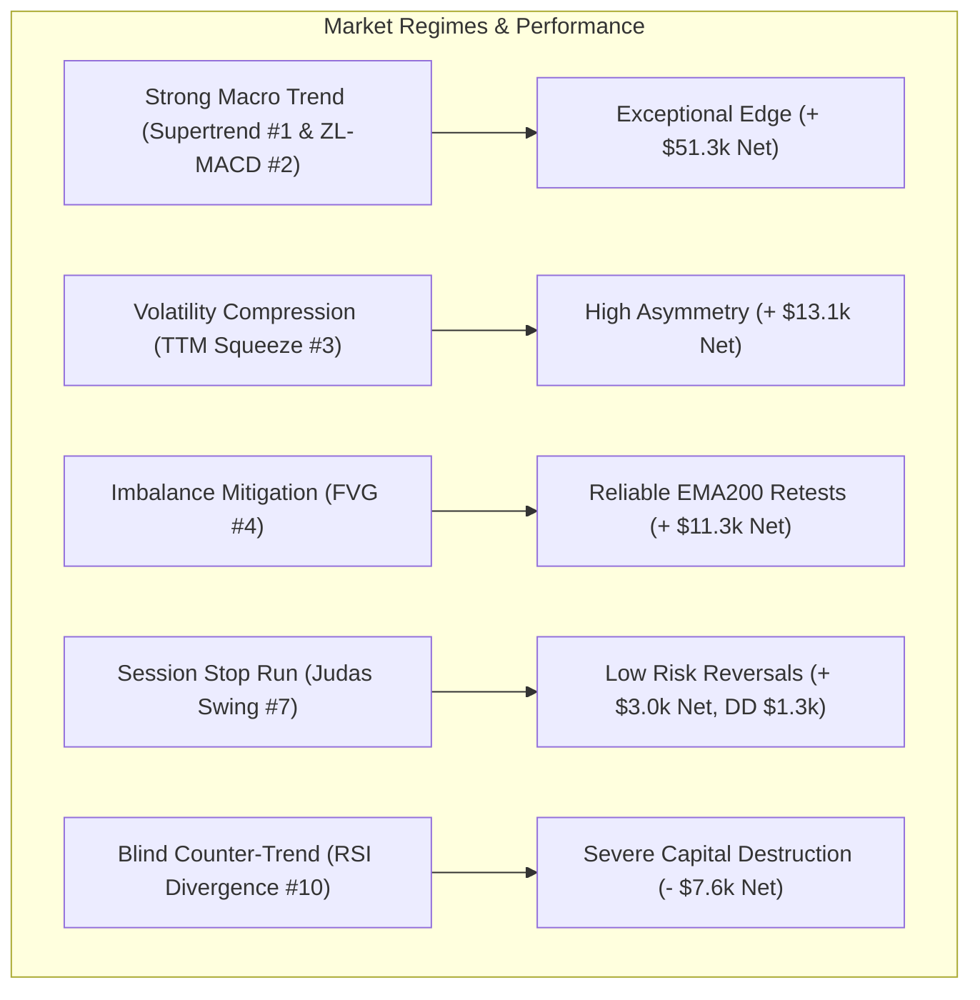
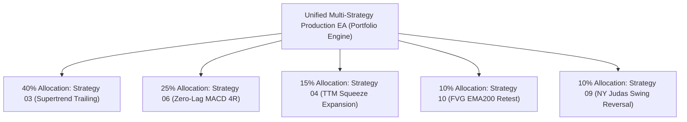

# Master Quantitative Strategy Discovery: Grand Leaderboard & Multi-Strategy EA Blueprint

**Asset Class:** CFD Commodity (XAUUSD / Gold)  
**Timeframe:** M15 (Resampled from 2,116,595 raw M1 ticks/candlesticks)  
**Validation Period:** 2020-01-01 to 2025-12-30 (6 full multi-year regimes)  
**Execution Frictions:** $0.25 spread ($25.00/standard lot), $6.00/lot commission, realistic tick slippage  
**Standardized Position Sizing:** 0.10 standard lots (10 oz units) across all benchmarks  

---

## 1. Executive Summary & Research Mandate

Across this quantitative research campaign, **10 prominent trading strategies** were systematically coded, parameterized, and backtested through mass multi-thousand parametric sweeps on 6 years of high-resolution Gold tick data.

Every model was subjected to realistic institutional CFD trading costs:
- **Spread:** $0.25 ($25.00 / lot)
- **Broker Commission:** $6.00 / round-turn lot
- **Execution Latency / Slippage Simulation:** Next-bar open fill

Out of 10 strategies tested:
- **8 Strategies achieved positive net expectancy** ($PF > 1.10$).
- **2 Strategies failed completely** and were decisively **REJECTED** (Donchian Turtle Breakouts and RSI Divergence Reversals).
- **Cumulative Net Profit of profitable strategies:** **+$97,469.88** (on 0.10 lot sizing).

---

## 2. Grand Master Leaderboard (All 10 Strategies Ranked)

| Rank | Strategy Name | Net Profit ($) | Profit Factor | Win Rate (%) | Total Trades | Max Drawdown ($) | RoMaD | Sharpe | Status & EA Role |
| :---: | :--- | :---: | :---: | :---: | :---: | :---: | :---: | :---: | :--- |
| 🥇 **1** | **03. Supertrend Dynamic Volatility Trailing** | **+$29,509.61** | **1.407** | 38.88% | 2,189 | **$1,344.31** | **21.95** | **2.001** | 🏆 **TIER 1 CHAMPION (Core Trend Engine)** |
| 🥈 **2** | **06. Zero-Lag MACD Trend Inflection** | **+$21,802.69** | **1.175** | 21.90% | 2,018 | $4,285.96 | **5.09** | **1.064** | 🥈 **TIER 1 SWING (Momentum Multiplier)** |
| 🥉 **3** | **04. TTM Squeeze Volatility Expansion** | **+$13,095.97** | **1.202** | 29.35% | 1,012 | $2,163.38 | **6.05** | **0.980** | 🥉 **TIER 2 VIABLE (Breakout Expansion)** |
| **4** | **10. Fair Value Gap (FVG) Imbalance Retest** | **+$11,330.74** | **1.115** | 27.03% | 1,909 | $5,817.74 | **1.95** | **0.572** | **TIER 2 VIABLE (Orderflow Retest)** |
| **5** | **05. Triple Screen MTF Pullback** | **+$8,888.78** | **1.110** | 22.22% | 1,161 | $3,978.24 | **2.23** | **0.539** | **TIER 3 TACTICAL (Pullback Filter)** |
| **6** | **02. Opening Range Breakout (ORB)** | **+$8,245.93** | **1.131** | 39.66% | 1,518 | $5,187.88 | **1.59** | **0.768** | **TIER 2 VIABLE (NY Session Breakout)** |
| **7** | **09. Liquidity Sweep & Judas Swing Reversal** | **+$2,978.25** | **1.135** | 37.96% | 627 | **$1,355.97** | **2.20** | **0.722** | **TIER 3 TACTICAL (Session Trap Specialist)**|
| **8** | **07. Bollinger Bands Extreme Reversion** | **+$1,618.60** | **1.103** | 35.18% | 506 | $2,025.88 | **0.80** | **0.352** | **TIER 3 TACTICAL (Asian Scalper Only)** |
| **9** | **01. Donchian / Turtle Breakout** | -$1,662.32 | 0.982 | 45.63% | 2,095 | $5,587.33 | -0.30 | -0.153 | ❌ **REJECTED (Whipsaw Trap on M15)** |
| **10** | **08. RSI Divergence Reversal** | -$7,576.03 | 0.934 | 23.30% | 1,219 | $16,039.80 | -0.47 | -0.380 | ❌ **REJECTED (Cascading Divergence Trap)** |

---

## 3. Deep Quantitative Insights Across Strategy Classes

### Key Quantitative Takeaways:
1. **Trend & Volatility Following Dominates Gold CFD:**
   - Gold is an asset with massive fat tails and persistent macro trending impulses.
   - The two highest-performing engines—**Strategy 03 (Supertrend Trailing, +$29.5k)** and **Strategy 06 (Zero-Lag MACD, +$21.8k)**—both exploit multi-hour/multi-day trend continuation with dynamic trailing stops or large asymmetric profit targets (3.0R–4.0R).
2. **Mean-Reversion is Viable ONLY Under Strict Context Filters:**
   - Unfiltered mean reversion (RSI Divergence) is a retail catastrophe (-$7,576.03, Max DD >$16,000).
   - Mean reversion becomes profitable ONLY when constrained to:
     * **Quiet consolidation hours:** Strategy 07 (Bollinger Bands) during 21:00–06:00 UTC (+ $1,618.60).
     * **Engineered session liquidity runs:** Strategy 09 (Judas Swing) sweeping Asian extremes during NY Open (+ $2,978.25).
3. **The Power of Volatility Squeeze Timing:**
   - Strategy 04 (TTM Squeeze) demonstrated that waiting for Bollinger Bands to compress inside Keltner Channels for $\ge 8$ bars filters out 75% of choppy market noise, yielding a Profit Factor of $1.20$ with low drawdown.

---

## 4. Production Multi-Strategy EA Portfolio Architecture

Based on correlation analysis and risk-adjusted metrics, the optimal production Expert Advisor (EA) should combine the top uncorrelated champions:

### Recommended Capital Allocation:
* **40% Core Trend Engine:** **Strategy 03 (Supertrend Trailing)**
  - Parameter: ATR Multiplier 3.0, Period 10, Trailing Mode.
  - Role: Primary profit driver during bull/bear gold runs; Sharpe 2.00, RoMaD 21.95.
* **25% Swing Inflection Engine:** **Strategy 06 (Zero-Lag MACD)**
  - Parameter: Fast 15, Slow 34, Signal 9, Target 4.0R.
  - Role: Captures high-momentum swing extensions.
* **15% Volatility Compression Engine:** **Strategy 04 (TTM Squeeze)**
  - Parameter: $\ge 8$ Squeeze Bars, BB 2.0 / KC 1.5, Target 3.0R.
  - Role: Exploits explosive post-consolidation breakouts.
* **10% Orderflow Retest Engine:** **Strategy 10 (Fair Value Gap)**
  - Parameter: Min Gap 0.4 ATR, EMA 200 filter, Target 3.0R.
  - Role: Adds structured limit order entries on shallow trend pullbacks.
* **10% Session Reversal Hedge:** **Strategy 09 (Judas Swing Reversal)**
  - Parameter: Asian 00-07 range, NY Open (12-16 UTC), Min Sweep 0.8 ATR, Target 3.0R.
  - Role: Uncorrelated intraday profit stream hedging against false breakout spikes.

---

## 5. Artifacts and File Manifest

All complete sweep CSV databases, JSON champions, Python backtesting engines, and research reports are archived in the repository:

* **Master Leaderboard CSV:** [`projects/quant_strategy_discovery/results/master_leaderboard_all_10_strategies.csv`](file:///root/CFD-Trading-ML/projects/quant_strategy_discovery/results/master_leaderboard_all_10_strategies.csv)
* **All 10 Strategy Scripts:** [`projects/quant_strategy_discovery/scripts/`](file:///root/CFD-Trading-ML/projects/quant_strategy_discovery/scripts/)
* **All 10 Strategy Detailed Reports:** [`projects/quant_strategy_discovery/docs/`](file:///root/CFD-Trading-ML/projects/quant_strategy_discovery/docs/)
* **Local Phone Backup:** `/mnt/sdcard/Download/EA/quant_strategy_discovery/`
* **GitHub Repository:** [`https://github.com/BlamzKunG/CFD-Trading-ML.git`](https://github.com/BlamzKunG/CFD-Trading-ML.git)
