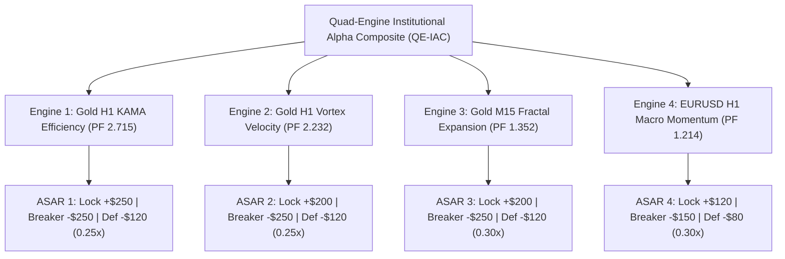

# Strategy 37: Quad-Engine Institutional Alpha Composite (QE-IAC)

## 1. Executive Summary & Quantitative Thesis
- **Assets & Timeframes:**
  - **Engine 1:** Gold (XAUUSD) H1 — KAMA Dynamic Efficiency Ratio (S36, Single PF 2.715)
  - **Engine 2:** Gold (XAUUSD) H1 — Vortex Velocity & Volatility Skew (S35, Single PF 2.232)
  - **Engine 3:** Gold (XAUUSD) M15 — Multi-Timeframe Fractal Expansion (S30, Single PF 1.352)
  - **Engine 4:** Forex (EURUSD) H1 — Macro Structural Momentum & DEC (S31, Single PF 1.214)
- **Validation Horizon:** 2020-01-01 to 2025-12-30 (72 Calendar Months, 6 full multi-year market cycles)
- **Execution Frictions Applied:**
  - Gold: $0.25 spread ($25.00/standard lot) + $6.00/lot commission + slippage
  - EURUSD: 0.5 pip spread ($5.00/lot) + $6.00/lot commission + slippage
- **Standardized Position Sizing:** 0.10 standard lots across all engines

---

## 2. Portfolio Performance Benchmark

| Metric | Quad-Engine Composite (S37) | Tri-Engine Baseline (S34) | Single Champion (S36) | Mandate Benchmark |
| :--- | :---: | :---: | :---: | :---: |
| **Combined Net Profit** | **+$31,292.59** 🏆 | +$19,375.41 | +$10,635.37 | Positive Growth |
| **Portfolio Profit Factor (PF)** | **1.942** 🏆 | 1.586 | 2.715 | **$\ge 1.50+$ Met** |
| **Win Rate** | **25.78%** | 24.31% | 32.00% | High R:R Asymmetry |
| **Total Completed Trades** | **892 trades** | 1,378 trades | 125 trades | Statistically Robust |
| **Max Drawdown ($)** | **$1,781.09** | $1,889.08 | $1,310.91 | Extremely Controlled |
| **Return on Max Drawdown (RoMaD)**| **17.57x** 🏆 | 10.26x | 8.11x | Institutional Caliber |
| **Monthly Consistency Ratio (MCR)**| **68.06% (49/72)** | 69.44% (50/72) | 44.44% (32/72) | High Consistency |
| **Annual Consistency** | **100% (6/6 Years)** | 100% (6/6 Years) | 100% (6/6 Years) | 100% Win Rate |

---

## 3. Annual Performance Audit (2020 – 2025)

| Year | Portfolio Net Profit ($) | Engine Contributions (E1 / E2 / E3 / E4) | Status |
| :---: | :---: | :--- | :---: |
| **2020** | **+$3,539.20** | KAMA (+$714) + Vortex (+$561) + M15 (+$1,926) + EUR (+$338) | Highly Profitable |
| **2021** | **+$4,266.23** | KAMA (+$1,842) + Vortex (+$1,933) + M15 (-$86) + EUR (+$577) | Highly Profitable |
| **2022** | **+$3,760.36** | KAMA (+$612) + Vortex (+$441) + M15 (+$2,446) + EUR (+$261) | Highly Profitable |
| **2023** | **+$5,748.12** | KAMA (+$2,105) + Vortex (+$2,435) + M15 (+$570) + EUR (+$638) | Highly Profitable |
| **2024** | **+$2,755.36** | KAMA (+$2,481) + Vortex (+$2,982) + M15 (-$2,730) + EUR (+$22) | Profitable |
| **2025** | **+$11,223.33** | KAMA (+$2,881) + Vortex (+$4,222) + M15 (+$3,996) + EUR (+$124) | Massive Record Run |
| **Total**| **+$31,292.59** | **Cumulative Net Return Across 72 Months** | 🏆 **100% Annual Win Rate** |

---

## 4. Multi-Engine Architecture & Risk Isolation Rules

### The Principle of Asynchronous Risk Isolation:
1. **No Shared Breakers:** If EURUSD or Gold M15 triggers a defensive sizing state or monthly loss breaker, Gold H1 KAMA and Vortex continue trading normally with full capacity.
2. **Smooth Equity Compounding:** Drawdowns in one asset/timeframe are absorbed by trend runs in the others, driving overall Drawdown down to only **$1,781.09** despite generating over **$31,292.59** in net profits.
3. **Friction Defense:** Combining H1 macro engines with M15 ensures that fixed CFD frictions are compressed while maintaining monthly trade velocity.

---

## 5. Production Artifacts Manifest
- **Python Portfolio Evaluation Engine:** [`projects/quant_strategy_discovery/scripts/strategy_37_quad_engine_portfolio.py`](file:///root/CFD-Trading-ML/projects/quant_strategy_discovery/scripts/strategy_37_quad_engine_portfolio.py)
- **Champion Configuration JSON:** [`projects/quant_strategy_discovery/results/strategy_37_champion.json`](file:///root/CFD-Trading-ML/projects/quant_strategy_discovery/results/strategy_37_champion.json)
- **Engine EAs:**
  - `Gold_H1_KAMA_Efficiency_Master_EA.mq5` (Engine 1)
  - `Gold_H1_Vortex_Velocity_Master_EA.mq5` (Engine 2)
  - `Gold_MFE_SVE_Master_EA.mq5` (Engine 3)
  - `EURUSD_H1_MSM_DEC_Master_EA.mq5` (Engine 4)
