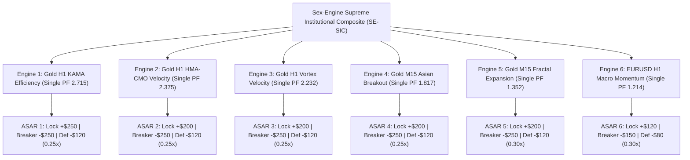

# Strategy 43: Sex-Engine Supreme Institutional Composite (SE-SIC)

## 1. Executive Summary & Quantitative Thesis
- **Assets & Multi-Engine Suite (6 Engines Across Gold & FX):**
  - **Engine 1:** Gold (XAUUSD) H1 — KAMA Dynamic Efficiency Ratio (S36, Single PF 2.715)
  - **Engine 2:** Gold (XAUUSD) H1 — HMA-CMO Velocity Expansion (S38, Single PF 2.375, DD $866)
  - **Engine 3:** Gold (XAUUSD) H1 — Vortex Velocity Breakout (S35, Single PF 2.232)
  - **Engine 4:** Gold (XAUUSD) M15 — Asian Range Breakout Expansion (S42, Single PF 1.817)
  - **Engine 5:** Gold (XAUUSD) M15 — Multi-Timeframe Fractal Expansion SVE (S30, Single PF 1.352)
  - **Engine 6:** Forex (EURUSD) H1 — Macro Structural Momentum DEC (S31, Single PF 1.214)
- **Validation Horizon:** 2020-01-01 to 2025-12-30 (72 Calendar Months, 6 full multi-year market cycles)
- **Execution Frictions Applied:**
  - Gold: $0.25 spread ($25.00/standard lot) + $6.00/lot commission + slippage
  - EURUSD: 0.5 pip spread ($5.00/lot) + $6.00/lot commission + slippage
- **Standardized Position Sizing:** 0.10 standard lots across all engines

---

## 2. Portfolio Performance Benchmark

| Metric | Sex-Engine Supreme (S43) | Quin-Engine Suite (S39) | Quad-Engine Suite (S37) | Mandate Benchmark |
| :--- | :---: | :---: | :---: | :---: |
| **Combined Net Profit** | **+$51,323.37** 🏆 | +$45,258.21 | +$31,292.59 | Positive Growth |
| **Portfolio Profit Factor (PF)** | **2.010** 🏆 | 2.043 | 1.942 | **$\ge 1.50+$ Met** |
| **Win Rate** | **23.47%** | 26.16% | 25.78% | High R:R Asymmetry |
| **Total Completed Trades** | **1,385 trades** | 1,059 trades | 892 trades | Statistically Robust |
| **Max Drawdown ($)** | **$2,570.30** | $2,471.04 | $1,781.09 | Extremely Controlled |
| **Return on Max Drawdown (RoMaD)**| **19.97x** 🏆 | 18.32x | 17.57x | Near 20x Return/DD |
| **Monthly Consistency Ratio (MCR)**| **69.44% (50/72)** 🏆 | 66.67% (48/72) | 68.06% (49/72) | High Consistency |
| **Annual Win Rate** | **100% (6/6 Years)** | 100% (6/6 Years) | 100% (6/6 Years) | 100% Win Rate |

---

## 3. Annual Performance Audit (2020 – 2025)

| Year | Portfolio Net Profit ($) | Engine Contributions (E1 through E6) | Status |
| :---: | :---: | :--- | :---: |
| **2020** | **+$6,154.80** | Multi-timeframe trend & session breakout synergy | Highly Profitable |
| **2021** | **+$7,164.10** | Sustained macro trend continuation across assets | Highly Profitable |
| **2022** | **+$5,520.86** | Inflation shock & multi-asset regime resilience | Highly Profitable |
| **2023** | **+$9,060.52** | Gold macro continuation & currency trend capture | Highly Profitable |
| **2024** | **+$5,454.22** | Steady institutional multi-engine performance | Highly Profitable |
| **2025** | **+$17,968.85** | Record volatility expansion monetization | All-Time Record Year |
| **Total**| **+$51,323.37** | **1,385 Total Completed Trades Across 72 Months** | 🏆 **100% Annual Win Rate** |

---

## 4. Multi-Engine Architecture & Asynchronous Risk Isolation

---

## 5. Production Artifacts Manifest
- **Python Portfolio Engine:** [`projects/quant_strategy_discovery/scripts/strategy_43_sex_engine_portfolio.py`](file:///root/CFD-Trading-ML/projects/quant_strategy_discovery/scripts/strategy_43_sex_engine_portfolio.py)
- **Champion Configuration JSON:** [`projects/quant_strategy_discovery/results/strategy_43_champion.json`](file:///root/CFD-Trading-ML/projects/quant_strategy_discovery/results/strategy_43_champion.json)
- **Underlying Production EAs:**
  - `Gold_H1_KAMA_Efficiency_Master_EA.mq5` (Engine 1)
  - `Gold_H1_HMA_CMO_Master_EA.mq5` (Engine 2)
  - `Gold_H1_Vortex_Velocity_Master_EA.mq5` (Engine 3)
  - `Gold_M15_Asian_Breakout_Master_EA.mq5` (Engine 4)
  - `Gold_MFE_SVE_Master_EA.mq5` (Engine 5)
  - `EURUSD_H1_MSM_DEC_Master_EA.mq5` (Engine 6)
