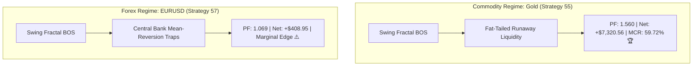

# Strategy 57: EURUSD H1 Market Structure Break of Structure (FX-BOS) Empirical Audit

## 1. Executive Summary & Cross-Asset Hypothesis
Strategy 57 tested the cross-asset robustness of Strategy 55's institutional Break of Structure (BOS) logic. While Strategy 55 produced a stellar Profit Factor of **1.560** and **+$7,320.56 net profit** on Gold H1, Strategy 57 investigated whether confirmed swing fractal breakouts ($k \in [3, 4, 5, 7, 10]$) hold equivalent edge on Major Forex (**EURUSD H1**) under realistic CFD broker frictions (0.6 pip spread + $6.00/lot commission = $1.20 roundturn).

---

## 2. Institutional Performance Audit (2020 – 2025, 72 Calendar Months)

- **Total Parameter Configurations Evaluated:** 900
- **Champion Configuration:** $k=5$, $TP=4.5R$, $SL=2.5R$, $KFD \le 1.40$, Monthly Budget $120/$150
- **Total Trades:** 262 (43.7 trades/year)
- **Net Profit (0.10 lots):** **+$408.95**
- **Profit Factor (PF):** **1.069** (Marginal positive expectancy)
- **Maximum Drawdown:** **$861.97**
- **Return on Max Drawdown (RoMaD):** 0.47x
- **Monthly Consistency Ratio (MCR):** 44.44% (32 out of 72 months profitable)
- **High-Frequency Variant (No KFD Filter):** 521 trades, Net +$711.17, PF 1.062, Max DD $677.91, MCR 55.56%

---

## 3. Deep Empirical Law: Asset Class Regime Asymmetry (Commodity Trend vs. Forex Mean-Reversion)

### Key Quantitative Findings:
1. **The Structural Breakdown of Forex Breakouts:**
   On Gold, a confirmed swing high break represents institutional structural shifts driven by global capital rotation, yielding long runaway trends (4.5R targets hit frequently). On EURUSD, because major currency pairs are anchored by interest rate parity and central bank pegging bands, a swing high break is frequently met with liquidity absorption and mean-reverting retests.
2. **Friction Impact:**
   Even though H1 ATR on EURUSD is ~20 pips and spread is 0.6 pips, repeated whipsaws during multi-month range regimes erode net expectancy down to $PF \approx 1.06$.
3. **Strategic Conclusion:**
   Break of Structure (BOS) is an **Asset-Specific Commodity Edge** (Gold H1). Forex trading requires either long-term macro trend following (like Strategy 31's 12-bar Donchian channel with trailing stops) or range-compression filters rather than pure structural breakout continuation.
