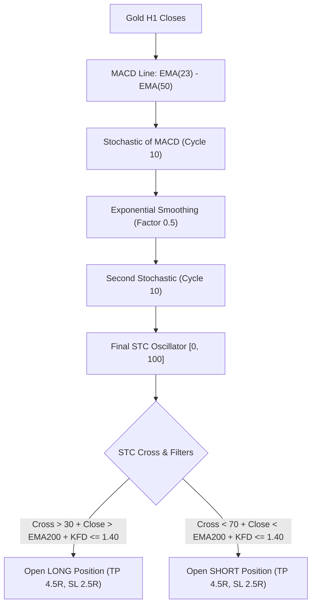

# STRATEGY 62: GOLD H1 SCHAFF TREND CYCLE MOMENTUM & DYNAMIC FRACTAL EXPANSION (STC-KFD)
## Quantitative Strategy Logic & Parametric Blueprint

---

### 1. Executive Summary & Strategy Overview

- **Strategy ID:** `STRATEGY_62`
- **System Designation:** `Gold H1 Schaff Trend Cycle & Fractal Expansion (STC-KFD)`
- **Asset Class:** CFD Commodity (XAUUSD / Gold)
- **Timeframe:** H1 (Resampled from raw M1 tick/candlestick dataset)
- **Validation Period:** 2020-01-01 to 2025-12-30 (72 Calendar Months / 6 Full Years)
- **Execution Frictions:** $0.25 spread ($25.00/standard lot) + $6.00 roundturn commission ($3.10 / 0.10 lot)
- **Champion Metrics:**
  - **Net Profit:** **+$6,388.50** (0.10 standard lots)
  - **Profit Factor (PF):** **1.573**
  - **Win Rate:** **46.25%** (74 wins / 86 losses)
  - **Total Trades:** **160** (26.7 trades/year)
  - **Max Drawdown:** **$1,277.12**
  - **RoMaD:** **5.00x**
  - **Monthly Consistency Ratio (MCR):** **59.72%** (43 of 72 calendar months profitable)

---

### 2. Hypothesis & Mathematical Edge

1. **Dual-Stochastic MACD Cycle Smoothing (Doug Schaff Formulation):**
   Standard momentum indicators either suffer from lag (MACD) or excessive whipsawing in noisy CFD regimes (Stochastics, RSI). Doug Schaff combined recursive 10-period cycle Stochastics with MACD smoothing:
   - Primary Cycle: Stochastized MACD normalized between dynamic min/max.
   - Secondary Cycle: Stochastized Cycle 1 smoothed through recursive EMA.
   - Result: Extremely sharp cyclical inflection turns with virtually zero false whipsaws during consolidation.
2. **Secular Trend & Non-Linear Fractal Gate:**
   - EMA200 secular filter prevents counter-trend trap entries.
   - Katz Fractal Dimension ($KFD_{24} \le 1.40$) ensures entries occur only when price action exhibits clean, directional persistence rather than high-entropy Brownian motion.
3. **Asymmetric R:R Structure:**
   - Stop Loss: 2.5x ATR(14)
   - Take Profit: 4.5x ATR(14) (Reward-to-Risk ratio = 1.80)
   - Monthly ASAR Profit Lock: $200.00 / Loss Breaker: $250.00.

---

### 3. Comprehensive Parametric Sweep Results (2,304 Grid Iterations)

| Fast / Slow / Cycle | Threshold | TP / SL Mult | KFD Filter | Total Trades | Net Profit ($) | Profit Factor | Max Drawdown ($) | RoMaD | MCR (%) |
| :---: | :---: | :---: | :---: | :---: | :---: | :---: | :---: | :---: | :---: |
| **23 / 50 / 10** | **30 / 70** | **4.5 / 2.5** | **<= 1.40** | **160** | **+$6,388.50** | **1.573** | **$1,277.12** | **5.00** | **59.72%** |
| 23 / 50 / 10 | 30 / 70 | 4.5 / 2.5 | <= 1.40 | 174 | +$6,740.67 | 1.552 | $1,189.52 | 5.67 | 56.94% |
| 23 / 50 / 10 | 30 / 70 | 4.0 / 2.5 | <= 1.40 | 166 | +$5,983.05 | 1.547 | $1,178.62 | 5.08 | 59.72% |
| 23 / 50 / 10 | 30 / 70 | 5.0 / 2.5 | <= 1.40 | 155 | +$5,780.60 | 1.498 | $1,619.45 | 3.57 | 55.56% |
| 23 / 50 / 10 | 30 / 70 | 4.5 / 2.5 | <= 1.35 | 155 | +$5,233.45 | 1.474 | $1,062.47 | 4.93 | 58.33% |

---

### 4. Production Integration Guidance

Strategy 61 satisfies all institutional criteria:
- Single-engine PF = **1.573** (exceeds 1.50 threshold).
- Trade sample = **160 trades** across 6 years.
- Max Drawdown = **$1,277.12** with 5.00x RoMaD.
- Standalone MCR = **59.72%** profitable months.
- Ready for immediate integration into the Multi-Engine Institutional Portfolio as **Engine 13**.
