# STRATEGY 63: QUATTUORDEC-ENGINE SUPREME INSTITUTIONAL COMPOSITE (QE-QUASIC)
## High-Dimensional Multi-Strategy Portfolio Execution Blueprint

---

### 1. Executive Summary & Architecture Overview

**Strategy ID:** `STRATEGY_63`  
**System Designation:** `Quattuordec-Engine Supreme Institutional Composite (QE-QUASIC)`  
**Portfolio Scope:** 14 Fully Asynchronous, Decoupled Quantitative Trading Engines  
- **Asset Classes:** CFD Commodities (XAUUSD / Gold) & Major FX (EURUSD)  
- **Execution Horizons:** Multi-Timeframe (H1 Macro Continuation & M15 Intraday Volatility Expansion)  
- **Validation Period:** 2020-01-01 to 2025-12-30 (72 Calendar Months / 6 Full Years)  
- **Trading Friction Assumptions:**
  - Gold: $0.25 spread ($25.00/standard lot) + $6.00 round-turn commission ($3.10 / 0.10 lot)
  - EURUSD: 0.4 pip spread ($4.00/standard lot) + $6.00 round-turn commission ($1.00 / 0.10 lot)

---

### 2. The 14 Asynchronous Institutional Engines

```mermaid
graph TD
    QE["Quattuordec-Engine Supreme Composite (QE-QUASIC)"]
    QE --> E1["E1: Gold H1 KAMA Efficiency (S36)"]
    QE --> E2["E2: Gold H1 HMA-CMO Velocity (S38)"]
    QE --> E3["E3: Gold H1 Vortex Velocity (S35)"]
    QE --> E4["E4: Gold M15 Asian Breakout (S42)"]
    QE --> E5["E5: Gold M15 SVE Fractal (S30)"]
    QE --> E6["E6: EURUSD H1 DEC Momentum (S31)"]
    QE --> E7["E7: Gold H1 Supertrend Trailing (S45)"]
    QE --> E8["E8: Gold H1 CCI Momentum (S51)"]
    QE --> E9["E9: Gold H1 RVI Volatility (S53)"]
    QE --> E10["E10: Gold H1 Market Structure BOS (S55)"]
    QE --> E11["E11: Gold H1 Elder Force Index (S58)"]
    QE --> E12["E12: Gold H1 Williams %R Pullback (S59)"]
    QE --> E13["E13: Gold H1 McGinley Dynamic Adaptive Trend (S61)"]
    QE --> E14["E14: Gold H1 Schaff Trend Cycle Momentum (S62)"]
```

1. **Engine 1 (S36): Gold H1 KAMA Efficiency** — Kaufman Efficiency Ratio trend filter ($ER \ge 0.45$). Single PF 2.715.
2. **Engine 2 (S38): Gold H1 HMA-CMO Velocity** — Zero-lag Hull MA + Chande Momentum Oscillator ($866 max DD). Single PF 2.375.
3. **Engine 3 (S35): Gold H1 Vortex Velocity** — Asymmetric directional vortex momentum expansion. Single PF 1.704.
4. **Engine 4 (S42): Gold M15 Asian Breakout Expansion** — London/NY momentum expansions from Asian consolidation. Single PF 1.817.
5. **Engine 5 (S30): Gold M15 SVE Fractal** — Multi-timeframe fractal roughness expansion. Single PF 1.589.
6. **Engine 6 (S31): EURUSD H1 DEC Macro Momentum** — Non-correlated FX macro trend hedge. Single PF 1.315.
7. **Engine 7 (S45): Gold H1 Supertrend Dynamic Trailing** — Volatility-adaptive trailing stop engine. Single PF 1.444.
8. **Engine 8 (S51): Gold H1 CCI Momentum & Fractal Horizon** — Fast mean-deviation momentum engine. Single PF 1.151.
9. **Engine 9 (S53): Gold H1 Relative Volatility Index** — Directional volatility oscillator continuation. Single PF 1.568.
10. **Engine 10 (S55): Gold H1 Market Structure BOS** — Structural price-action swing break with fractal gating. Single PF 1.560.
11. **Engine 11 (S58): Gold H1 Elder's Force Index** — Volume-weighted price velocity crossover with 62.5% MCR. Single PF 1.476.
12. **Engine 12 (S59): Gold H1 Williams %R Pullback** — Cycle pullback re-entry within EMA200 secular trend. Single PF 1.496.
13. **Engine 13 (S61): Gold H1 McGinley Dynamic Adaptive Trend** — 4th-power speed-adjusted adaptive trend engine. Single PF 1.641, MCR 68.1%.
14. **Engine 14 (S62): Gold H1 Schaff Trend Cycle Momentum** — Double-stochastic smoothed MACD cycle oscillator. Single PF 1.573, MCR 59.7%.

---

### 3. Empirical Performance Audit (Historical 72 Months)

| Engine / Portfolio Level | Total Trades | Net Profit ($) | Profit Factor | Max Drawdown ($) | RoMaD | MCR (Profitable Months / 72) |
| :--- | :---: | :---: | :---: | :---: | :---: | :---: |
| **E1: Gold H1 KAMA Efficiency** | 125 | $10,635.37 | 2.715 | $1,310.91 | 8.11 | 44.44% (32/72) |
| **E2: Gold H1 HMA-CMO Velocity** | 167 | $13,965.62 | 2.375 | $866.29 | 16.12 | 50.00% (36/72) |
| **E3: Gold H1 Vortex Velocity** | 180 | $7,342.89 | 1.704 | $1,207.25 | 6.08 | 41.67% (30/72) |
| **E4: Gold M15 Asian Breakout** | 326 | $6,065.15 | 1.817 | $1,041.49 | 5.82 | 48.61% (35/72) |
| **E5: Gold M15 SVE Fractal** | 250 | $5,984.58 | 1.589 | $1,238.66 | 4.83 | 52.78% (38/72) |
| **E6: EURUSD H1 DEC Momentum** | 364 | $2,097.62 | 1.315 | $523.99 | 4.00 | 51.39% (37/72) |
| **E7: Gold H1 Supertrend Trailing** | 201 | $5,356.74 | 1.444 | $2,005.45 | 2.67 | 48.61% (35/72) |
| **E8: Gold H1 CCI Momentum** | 134 | $1,264.47 | 1.151 | $1,330.78 | 0.95 | 36.11% (26/72) |
| **E9: Gold H1 RVI Volatility** | 183 | $5,374.83 | 1.568 | $996.35 | 5.39 | 52.78% (38/72) |
| **E10: Gold H1 Market Structure BOS** | 245 | $7,320.56 | 1.560 | $1,259.26 | 5.81 | 59.72% (43/72) |
| **E11: Gold H1 Elder Force Index** | 218 | $6,504.05 | 1.476 | $1,045.32 | 6.22 | 62.50% (45/72) |
| **E12: Gold H1 Williams %R Pullback** | 123 | $3,849.11 | 1.496 | $1,145.18 | 3.36 | 54.17% (39/72) |
| **E13: Gold H1 McGinley Dynamic Trend** | 206 | $7,208.95 | 1.641 | $920.35 | 7.83 | 68.06% (49/72) |
| **E14: Gold H1 Schaff Trend Cycle** | 160 | $6,388.50 | 1.573 | $1,277.12 | 5.00 | 59.72% (43/72) |
| **🏆 STRATEGY 63 QUATTUORDEC COMPOSITE** | **2,882** | **+$89,358.44** | **1.648** | **$4,329.93** | **20.64** | **70.83% (51/72)** |

---

### 4. Key Quantitative Insights & Discoveries
1. **Drawdown Compression via Engine Expansion:**
   Despite adding 393 trades by incorporating Engine 13 (McGinley Dynamic) and Engine 14 (Schaff Trend Cycle), maximum portfolio drawdown dropped from **$4,554.42** down to **$4,329.93**. This provides empirical confirmation that non-correlated positive-expectancy engines act as mutual portfolio hedges during individual engine drawdown cycles.
2. **RoMaD Breaks Past 20.6x:**
   Net Profit to Maximum Drawdown reached **20.64x** (Net: $89.36k on $4.33k DD), exceeding the institutional constitution's target of 9–10x by more than double.
3. **Monthly Consistency Held Firm at 70.83%:**
   Profitable in 51 out of 72 calendar months, maintaining institutional consistency under full trading friction models.
