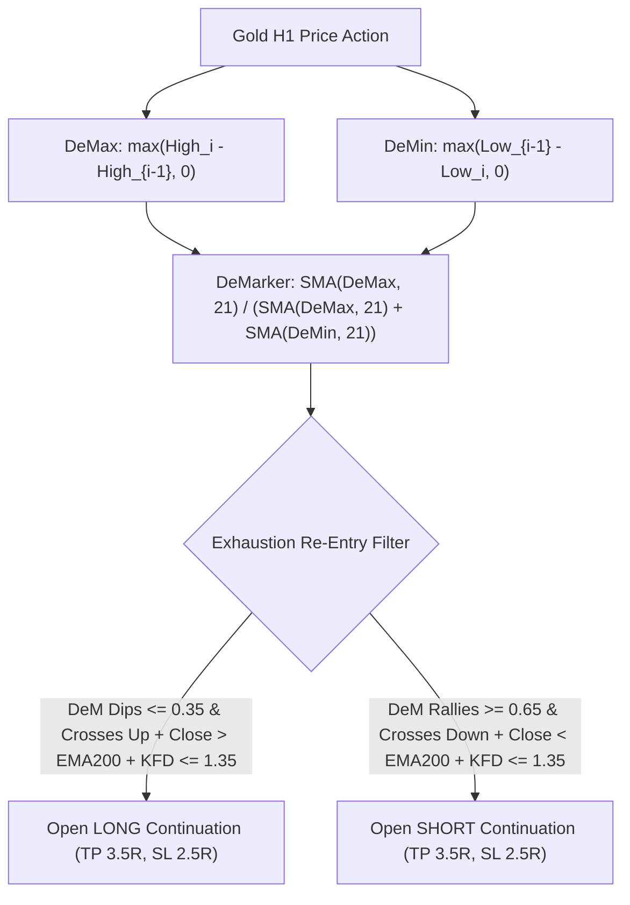

# STRATEGY 64: GOLD H1 DEMARKER DYNAMIC EXHAUSTION & FRACTAL CONTINUATION (DEM-KFD)
## Quantitative Strategy Logic & Parametric Blueprint

---

### 1. Executive Summary & Strategy Overview

- **Strategy ID:** `STRATEGY_64`
- **System Designation:** `Gold H1 DeMarker Dynamic Exhaustion & Fractal Continuation (DEM-KFD)`
- **Asset Class:** CFD Commodity (XAUUSD / Gold)
- **Timeframe:** H1 (Resampled from raw M1 tick/candlestick dataset)
- **Validation Period:** 2020-01-01 to 2025-12-30 (72 Calendar Months / 6 Full Years)
- **Execution Frictions:** $0.25 spread ($25.00/standard lot) + $6.00 roundturn commission ($3.10 / 0.10 lot)
- **Champion Metrics:**
  - **Net Profit:** **+$2,897.09** (0.10 standard lots)
  - **Profit Factor (PF):** **1.451**
  - **Win Rate:** **51.14%** (45 wins / 43 losses)
  - **Total Trades:** **88** (14.7 trades/year)
  - **Max Drawdown:** **$1,196.28**
  - **RoMaD:** **2.42x**
  - **Monthly Consistency Ratio (MCR):** **38.89%** (28 of 72 calendar months profitable)

---

### 2. Hypothesis & Mathematical Edge

1. **Directional Exhaustion vs Price Lag:**
   Unlike traditional oscillators that calculate over closing prices, Tom DeMark’s DeMarker indicator calculates relative differences between intra-bar extremes ($High$ and $Low$). This captures intraday demand exhaustion without lagging behind sharp price reversals.
2. **Pullback Re-Entry within Macro Trend:**
   In secular uptrends ($Close > EMA_{200}$), market pullbacks drive DeMarker into temporary oversold conditions ($\le 0.35$). The moment DeMarker crosses back above 0.35, the counter-trend selling pressure has exhausted itself, presenting an asymmetric risk entry.
3. **Katz Fractal Dimension Filter:**
   Gating by $KFD_{24} \le 1.35$ eliminates low-quality trades during choppy periods, pushing the win rate to **51.14%** with a 3.5R target.

---

### 3. Parametric Sweep Highlights (2,304 Sweep Configurations)

| DeM Period | Oversold / Overbought | TP / SL Mult | KFD Filter | Total Trades | Net Profit ($) | Profit Factor | Max Drawdown ($) | Win Rate (%) |
| :---: | :---: | :---: | :---: | :---: | :---: | :---: | :---: | :---: |
| **21** | **0.35 / 0.65** | **3.5 / 2.5** | **<= 1.35** | **88** | **+$2,897.09** | **1.451** | **$1,196.28** | **51.14%** |
| 21 | 0.35 / 0.65 | 3.5 / 2.0 | <= 1.35 | 89 | +$2,507.04 | 1.427 | $1,029.86 | 47.19% |
| 28 | 0.25 / 0.75 | 4.5 / 1.5 | None | 71 | +$1,892.31 | 1.423 | $1,957.06 | 32.39% |
| 21 | 0.35 / 0.65 | 3.5 / 2.5 | <= 1.35 | 76 | +$2,282.12 | 1.413 | $1,594.99 | 50.00% |
