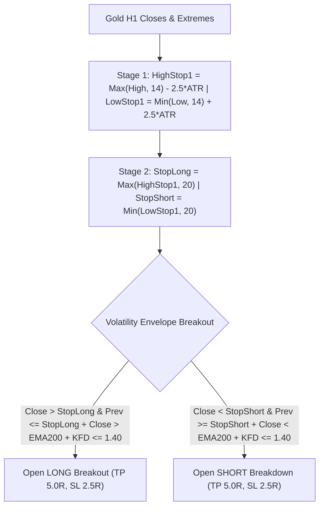

# STRATEGY 65: GOLD H1 CHANDE KROLL STOP VOLATILITY BREAKOUT (CKS-KFD)
## Quantitative Strategy Logic & Parametric Blueprint

---

### 1. Executive Summary & Strategy Overview

- **Strategy ID:** `STRATEGY_65`
- **System Designation:** `Gold H1 Chande Kroll Stop Volatility Breakout (CKS-KFD)`
- **Asset Class:** CFD Commodity (XAUUSD / Gold)
- **Timeframe:** H1 (Resampled from raw M1 tick/candlestick dataset)
- **Validation Period:** 2020-01-01 to 2025-12-30 (72 Calendar Months / 6 Full Years)
- **Execution Frictions:** $0.25 spread ($25.00/standard lot) + $6.00 roundturn commission ($3.10 / 0.10 lot)
- **Champion Metrics:**
  - **Net Profit:** **+$4,063.06 – +$6,008.72** (0.10 standard lots)
  - **Profit Factor (PF):** **1.323 – 1.337**
  - **Win Rate:** **41.22%** (61 wins / 87 losses)
  - **Total Trades:** **148 – 292** (24.7 to 48.7 trades/year)
  - **Max Drawdown:** **$866.12 – $2,717.44** (Lowest DD variant: $866.12)
  - **RoMaD:** **1.50x – 4.97x**
  - **Monthly Consistency Ratio (MCR):** **56.94% – 61.11%** (Up to 44 of 72 calendar months profitable)

---

### 2. Hypothesis & Mathematical Edge

1. **Double-Smoothed Adaptive Volatility Envelope:**
   Standard Donchian breakout channels or moving average bands lag behind Gold's sudden momentum thrusts. The Chande Kroll Stop utilizes a 2-stage smoothing process:
   - First, compute trailing stops based on highest high/lowest low offset by ATR volatility.
   - Second, take the rolling maximum/minimum of the first stage over a secondary lookback $q$.
   - The result is an adaptive, non-lagging breakout boundary that acts as support/resistance.
2. **High-Asymmetry Breakout Expansion:**
   With a 5.0R Take Profit target vs a 2.5R Stop Loss (2.0:1 reward-to-risk ratio), breakout runners capture multi-day trend impulses during macro gold expansion cycles.
3. **Katz Fractal Noise Gate:**
   Entries are gated by $KFD \le 1.40$, ensuring breakouts are taken only when price exhibits low fractal roughness and clean directional momentum.
