# STRATEGY 66: SEDEC-ENGINE SUPREME INSTITUTIONAL COMPOSITE (SE-SIC)
## High-Dimensional Multi-Strategy Portfolio Execution Blueprint

---

### 1. Executive Summary & Architecture Overview

**Strategy ID:** `STRATEGY_66`  
**System Designation:** `Sedec-Engine Supreme Institutional Composite (SE-SIC)`  
**Portfolio Scope:** 16 Fully Asynchronous, Decoupled Quantitative Trading Engines  
- **Asset Classes:** CFD Commodities (XAUUSD / Gold) & Major FX (EURUSD)  
- **Execution Horizons:** Multi-Timeframe (H1 Macro Continuation & M15 Intraday Volatility Expansion)  
- **Validation Period:** 2020-01-01 to 2025-12-30 (72 Calendar Months / 6 Full Years)  
- **Trading Friction Assumptions:**
  - Gold: $0.25 spread ($25.00/standard lot) + $6.00 round-turn commission ($3.10 / 0.10 lot)
  - EURUSD: 0.4 pip spread ($4.00/standard lot) + $6.00 round-turn commission ($1.00 / 0.10 lot)

---

### 2. The 16 Asynchronous Institutional Engines

```mermaid
graph TD
    SE["Sedec-Engine Supreme Composite (SE-SIC) | +$96.3k Net | PF 1.616 | MCR 72.2%"]
    SE --> E1["E1: Gold H1 KAMA Efficiency (S36)"]
    SE --> E2["E2: Gold H1 HMA-CMO Velocity (S38)"]
    SE --> E3["E3: Gold H1 Vortex Velocity (S35)"]
    SE --> E4["E4: Gold M15 Asian Breakout (S42)"]
    SE --> E5["E5: Gold M15 SVE Fractal (S30)"]
    SE --> E6["E6: EURUSD H1 DEC Momentum (S31)"]
    SE --> E7["E7: Gold H1 Supertrend Trailing (S45)"]
    SE --> E8["E8: Gold H1 CCI Momentum (S51)"]
    SE --> E9["E9: Gold H1 RVI Volatility (S53)"]
    SE --> E10["E10: Gold H1 Market Structure BOS (S55)"]
    SE --> E11["E11: Gold H1 Elder Force Index (S58)"]
    SE --> E12["E12: Gold H1 Williams %R Pullback (S59)"]
    SE --> E13["E13: Gold H1 McGinley Dynamic Trend (S61)"]
    SE --> E14["E14: Gold H1 Schaff Trend Cycle (S62)"]
    SE --> E15["E15: Gold H1 DeMarker Exhaustion (S64)"]
    SE --> E16["E16: Gold H1 Chande Kroll Stop (S65)"]
```

---

### 3. Empirical Performance Audit (Historical 72 Months)

| Engine / Portfolio Level | Total Trades | Net Profit ($) | Profit Factor | Max Drawdown ($) | RoMaD | MCR (Profitable Months / 72) |
| :--- | :---: | :---: | :---: | :---: | :---: | :---: |
| **E1: Gold H1 KAMA Efficiency** | 125 | $10,635.37 | 2.715 | $1,310.91 | 8.11 | 44.44% (32/72) |
| **E2: Gold H1 HMA-CMO Velocity** | 167 | $13,965.62 | 2.375 | $866.29 | 16.12 | 50.00% (36/72) |
| **E3: Gold H1 Vortex Velocity** | 180 | $7,342.89 | 1.704 | $1,207.25 | 6.08 | 41.67% (30/72) |
| **E4: Gold M15 Asian Breakout** | 326 | $6,065.15 | 1.817 | $1,041.49 | 5.82 | 48.61% (35/72) |
| **E5: Gold M15 SVE Fractal** | 250 | $5,984.58 | 1.589 | $1,238.66 | 4.83 | 52.78% (38/72) |
| **E6: EURUSD H1 DEC Momentum** | 364 | $2,097.62 | 1.315 | $523.99 | 4.00 | 51.39% (37/72) |
| **E7: Gold H1 Supertrend Trailing** | 201 | $5,356.74 | 1.444 | $2,005.45 | 2.67 | 48.61% (35/72) |
| **E8: Gold H1 CCI Momentum** | 134 | $1,264.47 | 1.151 | $1,330.78 | 0.95 | 36.11% (26/72) |
| **E9: Gold H1 RVI Volatility** | 183 | $5,374.83 | 1.568 | $996.35 | 5.39 | 52.78% (38/72) |
| **E10: Gold H1 Market Structure BOS** | 245 | $7,320.56 | 1.560 | $1,259.26 | 5.81 | 59.72% (43/72) |
| **E11: Gold H1 Elder Force Index** | 218 | $6,504.05 | 1.476 | $1,045.32 | 6.22 | 62.50% (45/72) |
| **E12: Gold H1 Williams %R Pullback** | 123 | $3,849.11 | 1.496 | $1,145.18 | 3.36 | 54.17% (39/72) |
| **E13: Gold H1 McGinley Dynamic Trend** | 206 | $7,208.95 | 1.641 | $920.35 | 7.83 | 68.06% (49/72) |
| **E14: Gold H1 Schaff Trend Cycle** | 160 | $6,388.50 | 1.573 | $1,277.12 | 5.00 | 59.72% (43/72) |
| **E15: Gold H1 DeMarker Exhaustion** | 88 | $2,897.09 | 1.451 | $1,196.28 | 2.42 | 38.89% (28/72) |
| **E16: Gold H1 Chande Kroll Stop** | 148 | $4,063.06 | 1.337 | $2,717.44 | 1.50 | 59.72% (43/72) |
| **🏆 STRATEGY 66 SEDEC COMPOSITE** | **3,118** | **+$96,318.59** | **1.616** | **$5,121.19** | **18.81** | **72.22% (52/72)** |

---

### 4. Key Quantitative Insights & Discoveries
1. **$96k Net Profit Reached:** Adding Engine 15 (DeMarker Exhaustion) and Engine 16 (Chande Kroll Stop) lifted cumulative net profit to **+$96,318.59**, positioning the suite within striking distance of $100,000 net profit.
2. **Record 72.22% Monthly Consistency (MCR):** In 52 out of 72 calendar months, the combined portfolio generated positive returns. This represents the highest consistency ratio achieved across all multi-engine portfolios tested.
3. **Execution Robustness Across 3,118 Trades:** With over 520 trades per year across 16 asynchronous models, statistical significance is firmly established, confirming that portfolio diversification produces a robust trading engine.
