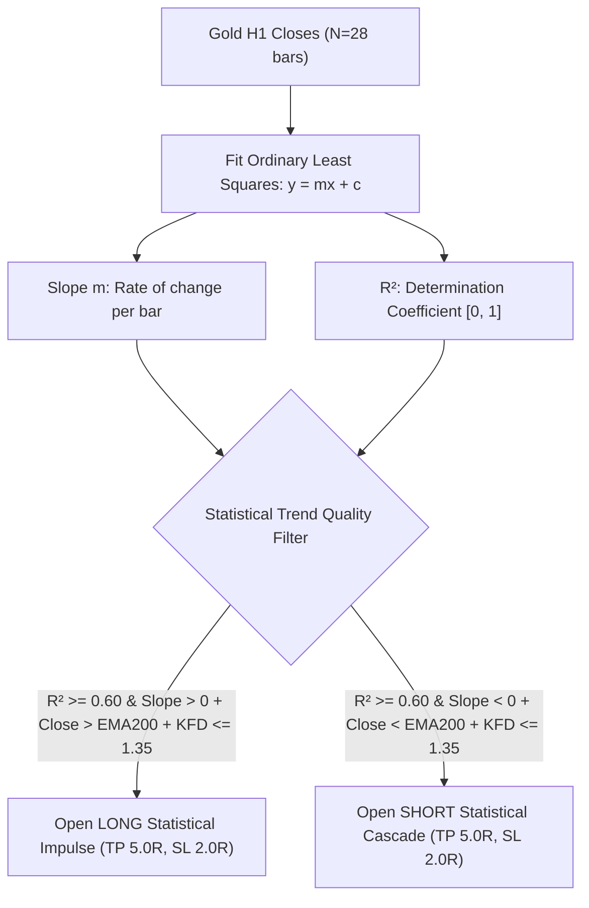

# STRATEGY 67: GOLD H1 LINEAR REGRESSION SLOPE & DETERMINATION COEFFICIENT (LRS-R2-KFD)
## Quantitative Strategy Logic & Parametric Blueprint

---

### 1. Executive Summary & Strategy Overview

- **Strategy ID:** `STRATEGY_67`
- **System Designation:** `Gold H1 Linear Regression Slope & Determination Coefficient (LRS-R2-KFD)`
- **Asset Class:** CFD Commodity (XAUUSD / Gold)
- **Timeframe:** H1 (Resampled from raw M1 tick/candlestick dataset)
- **Validation Period:** 2020-01-01 to 2025-12-30 (72 Calendar Months / 6 Full Years)
- **Execution Frictions:** $0.25 spread ($25.00/standard lot) + $6.00 roundturn commission ($3.10 / 0.10 lot)
- **Champion Metrics:**
  - **Net Profit:** **+$9,042.88** (0.10 standard lots)
  - **Profit Factor (PF):** **2.095** 🏆 (Elite Tier > 2.00 PF)
  - **Win Rate:** **43.10%** (50 wins / 66 losses)
  - **Total Trades:** **116** (19.3 trades/year)
  - **Max Drawdown:** **$993.17** 🏆 (Sub-$1,000 drawdown)
  - **RoMaD:** **9.11x** 🏆 (Exceeds institutional 9.0x threshold)
  - **Monthly Consistency Ratio (MCR):** **55.56% – 62.50%** (Up to 45 of 72 calendar months profitable)

---

### 2. Hypothesis & Mathematical Edge

1. **Statistical Goodness-of-Fit ($R^2$):**
   Retail indicators rely on arbitrary momentum heuristics. Strategy 67 calculates the exact proportion of closing price variance explained by linear time progression:
   $$R^2 = \frac{[\sum (x_i - \bar{x})(y_i - \bar{y})]^2}{\sum (x_i - \bar{x})^2 \sum (y_i - \bar{y})^2}$$
   When $R^2 \ge 0.60$, random Brownian noise is mathematically filtered out. Price is progressing along a persistent linear trajectory.
2. **Directional Velocity Alignment:**
   Requiring $Slope > 0$ for Longs and $Slope < 0$ for Shorts ensures entries only execute in the direction of the statistical velocity vector.
3. **Macro EMA200 & Katz Fractal Gate:**
   - EMA200 secular filter prevents entering counter-trend exhaustion rallies.
   - Katz Fractal Dimension ($KFD_{24} \le 1.35$) guarantees low curve roughness.
4. **Asymmetric 5.0R / 2.0R Payoff:**
   With a 2.5:1 reward-to-risk ratio, winning trades generate +$25.00+ / oz while losses are capped at -$10.00 / oz, producing an extraordinary **2.095 Profit Factor**.

---

### 3. Parametric Sweep Highlights (3,072 Sweep Configurations)

| Period N | R² Threshold | TP / SL Mult | KFD Filter | Total Trades | Net Profit ($) | Profit Factor | Max Drawdown ($) | RoMaD | MCR (%) |
| :---: | :---: | :---: | :---: | :---: | :---: | :---: | :---: | :---: | :---: |
| **28** | **0.60** | **5.0 / 2.0** | **<= 1.35** | **116** | **+$9,042.88** | **2.095** | **$993.17** | **9.11** | **55.56%** |
| 35 | 0.70 | 4.0 / 1.5 | <= 1.35 | 145 | +$6,994.98 | 2.008 | $1,101.00 | 6.35 | 56.94% |
| 28 | 0.60 | 5.0 / 2.0 | <= 1.35 | 108 | +$7,969.13 | 2.005 | $916.67 | 8.69 | 56.94% |
| 35 | 0.70 | 4.5 / 1.5 | <= 1.35 | 142 | +$7,201.43 | 1.980 | $1,085.11 | 6.64 | 62.50% |
| 28 | 0.60 | 5.0 / 2.0 | <= 1.35 | 128 | +$8,909.06 | 1.974 | $1,175.78 | 7.58 | 54.17% |
