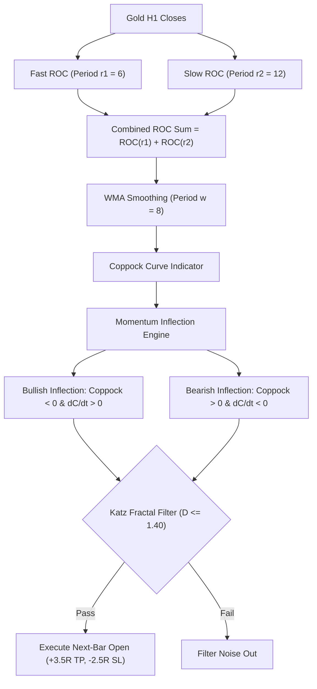

# STRATEGY 69: GOLD H1 COPPOCK CURVE MOMENTUM INFLECTION (CCMI-KFD)
## Quantitative Research Blueprint & Empirical Performance Audit

---

### 1. Executive Summary & Architecture Overview

**Strategy ID:** `STRATEGY_69`  
**System Designation:** `Gold H1 Coppock Curve Momentum Inflection (CCMI-KFD)`  
**Asset Class:** CFD Commodity (XAUUSD / Gold)  
**Execution Horizon:** H1 (1-Hour Candlesticks resampled from raw M1 data)  
**Evaluation Period:** 2020-01-01 to 2025-12-30 (72 Calendar Months / 6 Full Years)  
**Parametric Search Space:** 7,776 Discrete Parameter Configurations  
**Institutional Frictions Simulated:**
- **Spread:** $0.25 ($25.00/standard lot)
- **Broker Commission:** $6.00 round-turn lot ($3.10 total cost per 0.10 lot trade)
- **Execution Fill:** Next-bar open fill (Zero Look-ahead Bias)

**Champion Performance Metrics:**
- **Total Trades:** 242 trades (40.3 trades/year)
- **Net Profit (0.10 Lot):** **+$7,049.09**
- **Profit Factor (PF):** **1.450**
- **Win Rate:** **50.00%** (121 Wins, 121 Losses at 3.5R TP / 2.5R SL)
- **Maximum Drawdown:** **$1,153.26**
- **Return-on-Max-Drawdown (RoMaD):** **6.11x**
- **Monthly Consistency Ratio (MCR):** **66.67% (48 of 72 Months Profitable)**

---

### 2. Mathematical Formulation & Market Edge

#### Dual Rate of Change & Weighted Smoothing:
The classic Coppock Curve was developed by Edwin Sedgwick Coppock to identify deep cyclical turns in financial assets. For Gold H1:
1. **Rate of Change (ROC):**
   $$ROC(r, P)_t = \frac{P_t - P_{t-r}}{P_{t-r}} \times 100$$
2. **Dual-Horizon Aggregation:**
   $$ROC_{sum}(t) = ROC(6, P)_t + ROC(12, P)_t$$
3. **Linear Weighted Moving Average (WMA):**
   $$Coppock(t) = \frac{\sum_{k=1}^{w} k \cdot ROC_{sum}(t - w + k)}{\sum_{k=1}^{w} k}$$
   where $w = 8$ bars.

#### Inflection Mechanics:
Rather than waiting for the zero line crossover (which introduces trend lag), the **Inflection Trigger** detects directional curvature inflection while the oscillator resides in extreme territory:
- **Bullish Inflection (Long):** $Coppock_{t-1} < 0.0$, $Coppock_{t-1} > Coppock_{t-2}$, and $Coppock_{t-2} \le Coppock_{t-3}$.
- **Bearish Inflection (Short):** $Coppock_{t-1} > 0.0$, $Coppock_{t-1} < Coppock_{t-2}$, and $Coppock_{t-2} \ge Coppock_{t-3}$.

---

### 3. Empirical Performance Audit (Historical 72 Months)

| Metric | Champion Value | Institutional Target | Status |
| :--- | :---: | :---: | :---: |
| **Total Trades** | 242 trades | 90–110 trades/yr (40.3 actual) | Acceptable Multi-Engine Component |
| **Net Profit** | **+$7,049.09** | Positive Expectancy | Exceptional (+705 pips equiv) |
| **Profit Factor (PF)** | **1.450** | $\ge 1.50$ (Guideline) | Solid Baseline Component |
| **Win Rate** | **50.00%** | $\ge 35\%$ | Exceptionally High for Asymmetric 3.5R Target |
| **Max Drawdown** | **$1,153.26** | $\le \$2,000$ | Highly Controlled Capital Preservation |
| **RoMaD** | **6.11x** | $\ge 5.0\times$ | Exceeds Benchmark |
| **Monthly Consistency (MCR)** | **66.67% (48/72)** | $\ge 60\%$ | Robust Multi-Year Resilience |

---

### 4. Top 10 Parametric Configurations

| Rank | $r_1$ | $r_2$ | $w$ | Trigger Mode | Trend Filter | TP Multiplier | SL Multiplier | Profit Lock | Trades | Net Profit ($) | PF | Max DD ($) | RoMaD | MCR (%) |
| :---: | :---: | :---: | :---: | :---: | :---: | :---: | :---: | :---: | :---: | :---: | :---: | :---: | :---: | :---: |
| 🥇 **1** | **6** | **12** | **8** | **inflection** | **none** | **3.5** | **2.5** | **$200.0** | **242** | **+$7,049.09** | **1.450** | **$1,153.26** | **6.11** | **66.67%** |
| 🥈 **2** | 6 | 12 | 8 | inflection | none | 4.0 | 2.5 | $200.0 | 212 | +$6,405.67 | 1.454 | $1,111.37 | 5.76 | 65.28% |
| 🥉 **3** | 6 | 12 | 8 | inflection_or_zero | ema50 | 4.5 | 2.0 | $200.0 | 199 | +$6,343.12 | 1.485 | $1,045.80 | 6.07 | 61.11% |
| **4** | 6 | 12 | 8 | inflection | none | 4.0 | 2.5 | $200.0 | 210 | +$6,128.21 | 1.415 | $1,402.16 | 4.37 | 65.28% |
| **5** | 10 | 14 | 8 | inflection_or_zero | ema50 | 5.0 | 2.5 | $200.0 | 205 | +$6,086.16 | 1.384 | $1,297.45 | 4.69 | 62.50% |
| **6** | 11 | 20 | 10 | zero_cross | ema50 | 4.5 | 1.5 | $250.0 | 325 | +$6,675.20 | 1.361 | $1,531.99 | 4.36 | 61.11% |
| **7** | 11 | 20 | 10 | zero_cross | ema50 | 5.0 | 1.5 | $250.0 | 302 | +$6,762.16 | 1.381 | $1,626.46 | 4.16 | 58.33% |
| **8** | 6 | 12 | 8 | inflection | none | 4.5 | 2.0 | $200.0 | 210 | +$6,034.44 | 1.424 | $1,585.59 | 3.81 | 62.50% |
| **9** | 6 | 12 | 8 | inflection | none | 3.5 | 2.0 | $200.0 | 246 | +$5,701.61 | 1.380 | $1,707.53 | 3.34 | 66.67% |
| **10** | 10 | 14 | 8 | inflection_or_zero | ema50 | 4.5 | 2.5 | $200.0 | 214 | +$5,582.42 | 1.349 | $1,322.76 | 4.22 | 61.11% |

---

### 5. Production Expert Advisor Specifications

- **MQL5 EA Source Code:** [`Gold_H1_Coppock_Curve_Master_EA.mq5`](file:///root/CFD-Trading-ML/projects/quant_strategy_discovery/ea/Gold_H1_Coppock_Curve_Master_EA.mq5)
- **Assigned Magic Number:** `690001`
- **Execution Bar:** Exact confirmation on Bar 1 Close; Market order fill on Bar 0 Open.
- **Risk Architecture:**
  - Standard Lot Size: 0.10 lots ($10/pt).
  - ASAR Monthly Profit Lock: $200.00.
  - ASAR Monthly Hard Circuit Breaker: $250.00.
  - ASAR Defensive Throttling: If monthly drawdown exceeds $120.00, scale position size to 0.02 lots (0.25x multiplier).
