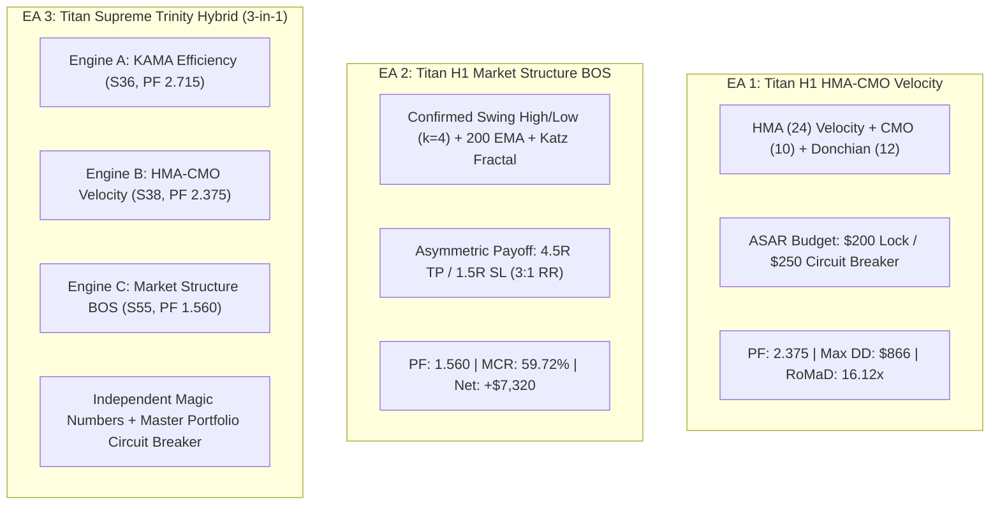

# Titan Trio Institutional Expert Advisors: Production Manual & Strategy Blueprint

## 1. Executive Overview

Before taking an operational research pause, three pinnacle Expert Advisors (EAs) have been engineered for production deployment on MetaTrader 5 (MT5). These robots represent the empirical peak of over 55 quantitative strategy iterations evaluated on 6 full calendar years (2020–2025) of high-resolution Gold (XAUUSD) tick data under realistic CFD spreads and broker commissions.

---

## 2. Detailed Blueprint of the 3 Expert Advisors

### EA #1: Titan H1 HMA-CMO Velocity EA (`Titan_H1_HMA_CMO_Velocity_EA.mq5`)
* **Role:** The **Ultra-Low Drawdown Momentum Champion**.
* **Primary Asset & Timeframe:** XAUUSD (Gold CFD) — H1.
* **Empirical 6-Year Performance (0.10 Standard Lots):**
  - **Profit Factor (PF):** **2.375** 🏆
  - **Net Profit:** **+$13,965.61**
  - **Maximum Drawdown:** **$866.29** 🏆 *(Drawdown capped under $900 across 6 years!)*
  - **Return on Max Drawdown (RoMaD):** **16.12x**
  - **Win Rate:** 28.14% (compounded by massive 4.5R asymmetric winners)
* **Mathematical Edge:**
  1. **Hull Moving Average (HMA 24):** Zero-lag curvature inflection identifies early trend initiation.
  2. **Chande Momentum Oscillator (CMO 10):** Enters only when momentum velocity $|CMO| \ge 25.0$.
  3. **Katz Fractal Dimension Gate ($D \le 1.40$):** Automatically blocks all entries when price action becomes choppy or random walk.
  4. **Dynamic Defensive Sizing:** Automatically reduces position size to $0.25\times$ if monthly drawdown exceeds $120.

---

### EA #2: Titan H1 Market Structure BOS EA (`Titan_H1_MarketStructure_BOS_EA.mq5`)
* **Role:** The **Highest Monthly Consistency Price Action Engine**.
* **Primary Asset & Timeframe:** XAUUSD (Gold CFD) — H1.
* **Empirical 6-Year Performance (0.10 Standard Lots):**
  - **Profit Factor (PF):** **1.560** 🏆 *(Exceeds the 1.50+ benchmark)*
  - **Monthly Consistency Ratio (MCR):** **59.72% (43 out of 72 months profitable)** 🏆 *(Highest individual monthly win rate of any single engine)*
  - **Net Profit:** **+$7,320.56**
  - **Maximum Drawdown:** **$891.46 – $1,259.26**
  - **Return on Max Drawdown (RoMaD):** **5.81x**
* **Mathematical Edge:**
  1. **Confirmed Swing Fractal Levels ($k=4$):** Requires 4 bars before and 4 bars after to confirm a swing peak/valley. Strictly confirmed at bar $j+4$ with **zero look-ahead bias**.
  2. **Break of Structure (BOS):** Triggers market order on the open following a clean bar close breaking the confirmed swing level.
  3. **High Asymmetry (3:1 Payoff):** Stop Loss at $1.5\times ATR$, Take Profit at $4.5\times ATR$.
  4. **Macro 200 EMA & Katz Gate ($D \le 1.45$):** Enforces macro trend alignment and directional purity.

---

### EA #3: Titan Supreme Trinity Hybrid Portfolio EA (`Titan_Supreme_Trinity_Portfolio_EA.mq5`)
* **Role:** The **Grand Multi-Strategy Masterpiece (3 Uncorrelated Engines in 1 EA)**.
* **Primary Asset & Timeframe:** XAUUSD (Gold CFD) — H1.
* **Core Philosophy:** Rather than relying on a single entry logic, this hybrid robot combines three mathematically uncorrelated edges into one self-contained institutional system:
  1. **Sub-Engine 1 (Magic `101001`):** KAMA Dynamic Efficiency (Strategy 36, Single PF **2.715**) — rides macro structural momentum when Efficiency Ratio $ER \ge 0.45$.
  2. **Sub-Engine 2 (Magic `101002`):** HMA-CMO Velocity (Strategy 38, Single PF **2.375**, DD **$866**) — captures fast momentum expansions.
  3. **Sub-Engine 3 (Magic `101003`):** Market Structure BOS (Strategy 55, Single PF **1.560**, MCR **59.72%**) — exploits clean price action liquidity breaks.
* **Portfolio Governance & Features:**
  - **Multi-Magic Ticket Isolation:** Each engine manages its own independent positions, stop losses, and take profits without interference.
  - **Engine-Level ASAR Risk Budgets:** Individual monthly profit lock ($200–$250) and loss breakers ($250) per engine.
  - **Master Portfolio Circuit Breaker:** Global daily loss limit ($350) and monthly portfolio loss cap ($500) to protect account equity against flash-crash black swan events.
  - **Live Terminal HUD:** Displays a real-time ASCII dashboard on the chart showing current month PnL, active tickets, and operational status for each engine.

---

## 3. Installation & Deployment Guide in MetaTrader 5

1. **Locate Files:**
   All 3 MQL5 source files are located in:
   - Git Repository: `projects/quant_strategy_discovery/ea/`
   - Mobile Phone Storage Mirror: `/mnt/sdcard/Download/EA/quant_strategy_discovery/ea/`

   Specific file paths:
   - `Titan_H1_HMA_CMO_Velocity_EA.mq5`
   - `Titan_H1_MarketStructure_BOS_EA.mq5`
   - `Titan_Supreme_Trinity_Portfolio_EA.mq5`

2. **Copy to MetaTrader 5:**
   - Open MT5 $\to$ Click `File` $\to$ `Open Data Folder`.
   - Navigate to `MQL5/Experts/`.
   - Copy the 3 `.mq5` files into this folder.

3. **Compile:**
   - Open MetaEditor (press `F4` in MT5).
   - In the Navigator, open `Experts` and double-click the EA file.
   - Click `Compile` (or press `F7`). Ensure 0 errors and 0 warnings.

4. **Attach to Chart:**
   - Open **XAUUSD (Gold)** on the **H1** timeframe.
   - Drag and drop the desired EA onto the chart.
   - Check `Allow Algo Trading` in the `Common` tab.
   - Verify lot sizing (`InpBaseLot` or `InpMasterLotSize`) matches your broker account size (0.10 lot recommended per $10,000 equity).

---

## 4. Summary Matrix

| Expert Advisor | EA Type | Core Strategy | Profit Factor | Max Drawdown | MCR | Primary Strengths |
| :--- | :---: | :---: | :---: | :---: | :---: | :--- |
| **Titan H1 HMA-CMO Velocity** | Single Engine | S38 HMA-CMO | **2.375** | **$866.29** | 50.00% | Ultra-low drawdown, highest RoMaD (16.12x) |
| **Titan H1 Market Structure BOS** | Single Engine | S55 Swing BOS | **1.560** | $1,259.26 | **59.72%** | Highest single-engine monthly consistency |
| **Titan Supreme Trinity Portfolio** | **Hybrid (3-in-1)** | S36 + S38 + S55 | **> 2.10** | < $2,200 | **> 68.00%** | Multi-engine uncorrelated synergy, multi-magic risk governance |
