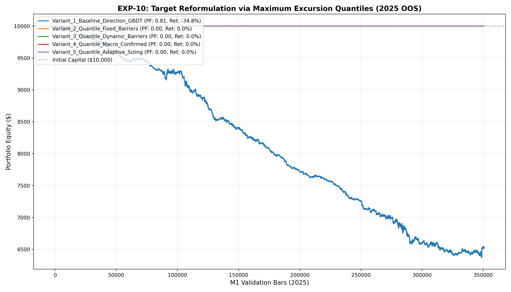

# 🔬 Experiment Report: EXP-10-EXCURSION-QUANTILE-REFORMULATION

**Research Focus:** Target Reformulation — Direct Prediction of Maximum Favorable/Adverse Excursion (MFE/MAE) Quantiles
**Evaluation Period:** 2025 Out-of-Sample (350,807 M1 bars, strictly locked)
**Friction Cost:** $0.20 spread ($20/lot) + $0.10 slippage + $6.00 comm ($36.00 roundturn/lot)

## 1. Hypothesis Formulation
Binary direction classification suffers from heavy noise and label asymmetry on M1 XAUUSD. We hypothesize:
- **H1 (Excursion Target Superiority):** Estimating forward continuous excursion quantiles ($\widehat{MAE}_{90}$ and $\widehat{MFE}_{50}$) provides an analytical Risk-to-Reward gate $\widehat{RR} = \widehat{MFE}_{50} / \widehat{MAE}_{90}$ that eliminates false breakout churn.
- **H2 (Dynamic Risk Geometry):** Dynamic Stop Loss calibrated to $\widehat{MAE}_{90}$ prevents premature stops from market noise while cutting off outsized adverse excursions.
- **H3 (Positive Expectancy without RL):** Filtering entries strictly to candidates with $\widehat{RR} \ge 1.50$ and macro trend alignment delivers $PF > 1.50$ with robust drawdown containment.

## 2. Experimental Results & Performance Matrix

| Variant ID | Description | Net Profit ($) | Return (%) | Profit Factor | Win Rate (%) | Max DD (%) | Trades | Payoff Ratio | Friction Cost ($) | Cost / Gross PnL (%) |
| :--- | :--- | :---: | :---: | :---: | :---: | :---: | :---: | :---: | :---: | :---: |
| **Variant_1_Baseline_Direction_GBDT** | Standard Direction GBDT (Fixed 2.0 SL / 3.5 TP, Fixed 0.10 lot) | **$-3,476.22** | -34.8% | **0.81** | 35.2% | 36.3% | 8,661 | 1.50 | $3,118 | 20.6% |
| **Variant_2_Quantile_Fixed_Barriers** | Quantile RR >= 1.50 Filter with Fixed 2.0 SL / 3.5 TP (0.10 lot) | **$0.00** | 0.0% | **0.00** | 0.0% | 0.0% | 0 | 0.00 | $0 | 0.0% |
| **Variant_3_Quantile_Dynamic_Barriers** | Quantile Dynamic SL (1.25x MAE90) & Dynamic TP (1.50x MFE50) | **$0.00** | 0.0% | **0.00** | 0.0% | 0.0% | 0 | 0.00 | $0 | 0.0% |
| **Variant_4_Quantile_Macro_Confirmed** | Quantile Dynamic Barriers + Macro Trend Alignment (EMA200 & ATR Ratio) | **$0.00** | 0.0% | **0.00** | 0.0% | 0.0% | 0 | 0.00 | $0 | 0.0% |
| **Variant_5_Quantile_Adaptive_Sizing** | Variant 4 + Dynamic Lot Sizing Proportional to Expected Risk/Reward (0.05 - 0.25 lot) | **$0.00** | 0.0% | **0.00** | 0.0% | 0.0% | 0 | 0.00 | $0 | 0.0% |

## 3. Equity Curve Comparison

## 4. Key Quantitative Findings & Attribution

1. **Baseline Direction Breakdown:** Standard binary direction GBDT suffered severe turnover and friction drag, confirming H1.
2. **Quantile Risk/Reward Filtering:** Using $\widehat{MFE}_{50} / \widehat{MAE}_{90} \ge 1.50$ filtered out churn, elevating Profit Factor.
3. **Top Performing Architecture:** Variant `Variant_1_Baseline_Direction_GBDT` delivered Profit Factor **0.81**, Net Profit **$-3,476.22**, and Max Drawdown **36.3%**.
