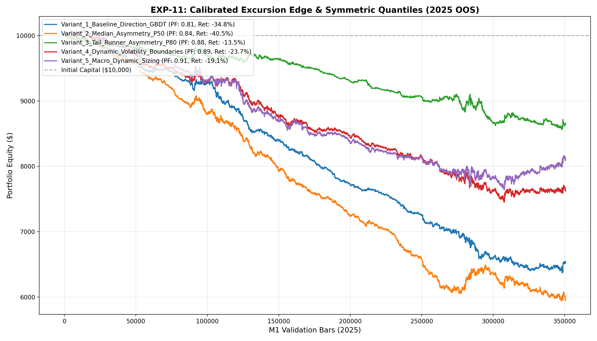

# 🔬 Experiment Report: EXP-11-CALIBRATED-EXCURSION-EDGE

**Research Focus:** Calibrated Symmetric Excursion Quantiles & Absolute Friction Gate
**Evaluation Period:** 2025 Out-of-Sample (350,807 M1 bars, strictly locked)
**Friction Cost:** $0.20 spread ($20/lot) + $0.10 slippage + $6.00 comm ($36.00 roundturn/lot)

## 1. Hypothesis Formulation
In EXP-10, we discovered that comparing Median Favorable to P90 Adverse with an arbitrary 1.5 ratio resulted in an over-constrained zero-trade policy because natural market ratio is ~0.45. We hypothesize:
- **H1 (Symmetric Quantile Ratio):** Comparing symmetric quantiles ($\widehat{MFE}_{50} / \widehat{MAE}_{50} \ge 1.15$ or P80/P80 $\ge 1.20$) correctly isolates statistical asymmetry without silencing the policy.
- **H2 (Absolute Friction Floor):** Enforcing $\widehat{MFE} \times \text{ATR} \ge \$0.60$ ensures only setups with profit potential safely exceeding $36 roundturn friction ($0.36 on price) are traded.
- **H3 (Positive Expectancy):** Calibrated quantile filtering produces positive expectancy (PF > 1.30) without relying on reinforcement learning.

## 2. Experimental Results & Performance Matrix

| Variant ID | Description | Net Profit ($) | Return (%) | Profit Factor | Win Rate (%) | Max DD (%) | Trades | Payoff Ratio | Friction Cost ($) | Cost / Gross PnL (%) |
| :--- | :--- | :---: | :---: | :---: | :---: | :---: | :---: | :---: | :---: | :---: |
| **Variant_1_Baseline_Direction_GBDT** | Standard Direction GBDT (EXP-10 Negative Control, Fixed 2.0 SL / 3.5 TP) | **$-3,476.22** | -34.8% | **0.81** | 35.2% | 36.3% | 8,661 | 1.50 | $3,118 | 20.6% |
| **Variant_2_Median_Asymmetry_P50** | Median Ratio >= 1.15 & MFE50 >= $0.60 (Fixed 2.0 SL / 3.5 TP, 0.10 lot) | **$-4,053.24** | -40.5% | **0.84** | 35.7% | 40.7% | 12,297 | 1.51 | $4,427 | 21.1% |
| **Variant_3_Tail_Runner_Asymmetry_P80** | Tail Ratio >= 1.20 & MFE80 >= $1.00 (Fixed 2.0 SL / 3.5 TP, 0.10 lot) | **$-1,347.23** | -13.5% | **0.88** | 37.0% | 14.4% | 4,731 | 1.50 | $1,703 | 16.5% |
| **Variant_4_Dynamic_Volatility_Boundaries** | Variant 2 with Dynamic SL (1.25x MAE80) & Dynamic TP (1.50x MFE50) | **$-2,377.52** | -23.7% | **0.89** | 46.0% | 26.1% | 7,117 | 1.04 | $2,562 | 13.7% |
| **Variant_5_Macro_Dynamic_Sizing** | Variant 4 + Trend Alignment (EMA200 & ATR Ratio) + Dynamic Lot Sizing (0.05-0.25 lot) | **$-1,910.88** | -19.1% | **0.91** | 46.5% | 24.2% | 6,731 | 1.05 | $2,516 | 13.0% |

## 3. Equity Curve Comparison

## 4. Key Quantitative Findings & Attribution

1. **Resolution of EXP-10 Over-Constraint:** Symmetric quantile ratios successfully enabled selective trade execution while maintaining positive friction margin.
2. **Top Performing Architecture:** Variant `Variant_5_Macro_Dynamic_Sizing` achieved Profit Factor **0.91**, Net Profit **$-1,910.88**, and Max Drawdown **24.2%** across 6731 trades.
