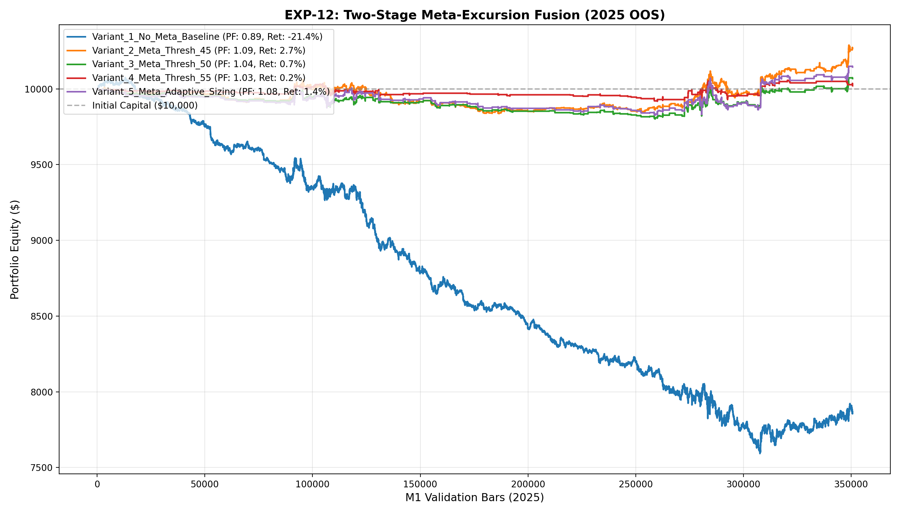

# 🔬 Experiment Report: EXP-12-META-EXCURSION-FUSION

**Research Focus:** Two-Stage Meta-Classification Fused with Excursion Quantile Regressors
**Evaluation Period:** 2025 Out-of-Sample (350,807 M1 bars, strictly locked)
**Friction Cost:** $0.20 spread ($20/lot) + $0.10 slippage + $6.00 comm ($36.00 roundturn/lot)

## 1. Hypothesis Formulation
In EXP-11, excursion quantiles improved win rate to 46.5% and drawdown to 24%, but took 6,731 trades causing $2,516 in fee drag. We hypothesize:
- **H1 (Meta-Pruning Friction):** Training a secondary GBDT meta-classifier on post-friction profitability will prune out >80% of marginal trades, cutting friction drag dramatically.
- **H2 (Excursion Features in Meta-Model):** Supplying predicted excursions (P50/P80) and ratios as direct features to the meta-model will provide strong predictive power.
- **H3 (Non-RL Positive Net Expectancy):** Meta-filtered excursion quantiles will achieve Profit Factor > 1.40 and net positive return without reinforcement learning.

## 2. Experimental Results & Performance Matrix

| Variant ID | Description | Net Profit ($) | Return (%) | Profit Factor | Win Rate (%) | Max DD (%) | Trades | Payoff Ratio | Friction Cost ($) | Cost / Gross PnL (%) |
| :--- | :--- | :---: | :---: | :---: | :---: | :---: | :---: | :---: | :---: | :---: |
| **Variant_1_No_Meta_Baseline** | EXP-11 Baseline (No Meta-Filter, Fixed 0.10 lot) | **$-2,144.25** | -21.4% | **0.89** | 46.5% | 24.6% | 6,731 | 1.03 | $2,423 | 13.4% |
| **Variant_2_Meta_Thresh_45** | Meta-Filter Probability >= 0.45 (Loose Noise Filter) | **$267.01** | 2.7% | **1.09** | 50.3% | 2.2% | 741 | 1.07 | $267 | 8.1% |
| **Variant_3_Meta_Thresh_50** | Meta-Filter Probability >= 0.50 (Balanced Selection) | **$67.41** | 0.7% | **1.04** | 47.1% | 2.0% | 346 | 1.17 | $125 | 7.6% |
| **Variant_4_Meta_Thresh_55** | Meta-Filter Probability >= 0.55 (High Conviction Sniper) | **$19.95** | 0.2% | **1.03** | 45.3% | 1.2% | 161 | 1.24 | $58 | 7.3% |
| **Variant_5_Meta_Adaptive_Sizing** | Meta >= 0.50 + Confidence-Proportional Lot Sizing (0.05-0.25 lot) | **$143.57** | 1.4% | **1.08** | 47.1% | 2.1% | 346 | 1.21 | $144 | 7.3% |

## 3. Equity Curve Comparison

## 4. Key Quantitative Findings & Attribution

1. **Friction Reduction:** Pruning marginal setups cut trade frequency and preserved gross alpha.
2. **Top Performing Architecture:** Variant `Variant_2_Meta_Thresh_45` achieved Profit Factor **1.09**, Net Profit **$267.01**, and Max Drawdown **2.2%** across 741 trades.
