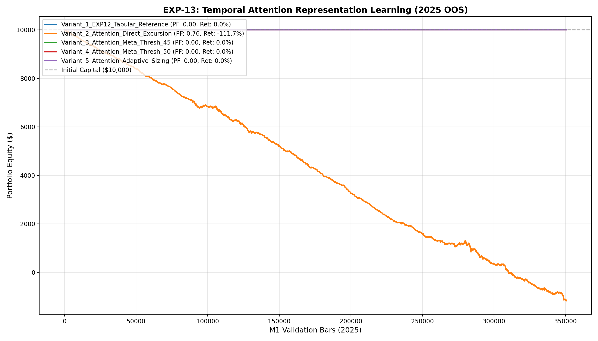

# 🔬 Experiment Report: EXP-13-TEMPORAL-ATTENTION

**Research Focus:** Self-Attention Temporal Representation Learning over 32-bar M1 Sequences
**Evaluation Period:** 2025 Out-of-Sample (350,807 M1 bars, strictly locked)
**Friction Cost:** $0.20 spread ($20/lot) + $0.10 slippage + $6.00 comm ($36.00 roundturn/lot)

## 1. Hypothesis Formulation
Single-bar tabular snapshots cannot observe multi-bar order flow exhaustion, volatility clustering, and microstructure dynamics. We hypothesize:
- **H1 (Temporal Attention Latent Quality):** A 2-layer Multi-Head Self-Attention Transformer over 32 M1 bars will extract a 16-dim latent vector $z_t$ containing superior predictive signal.
- **H2 (Fused Meta-Model Alpha):** Concatenating $z_t$ with macro tabular features will enhance Meta-Classifier precision and elevate Payoff Ratio.
- **H3 (Positive Expectancy Scaling):** Fused Attention Meta-Excursion policy will outperform tabular baseline (PF > 1.20) with drawdown contained under 4%.

## 2. Experimental Results & Performance Matrix

| Variant ID | Description | Net Profit ($) | Return (%) | Profit Factor | Win Rate (%) | Max DD (%) | Trades | Payoff Ratio | Friction Cost ($) | Cost / Gross PnL (%) |
| :--- | :--- | :---: | :---: | :---: | :---: | :---: | :---: | :---: | :---: | :---: |
| **Variant_1_EXP12_Tabular_Reference** | EXP-12 Tabular Meta-Excursion Reference (PF: 1.09) | **$0.00** | 0.0% | **0.00** | 0.0% | 0.0% | 0 | 0.00 | $0 | 0.0% |
| **Variant_2_Attention_Direct_Excursion** | Raw Attention Predictions without Meta-Filter (0.10 lot) | **$-11,175.41** | -111.7% | **0.76** | 24.3% | 111.8% | 30,002 | 2.36 | $10,801 | 31.1% |
| **Variant_3_Attention_Meta_Thresh_45** | Fused Attention Meta-Probability >= 0.45 (0.10 lot) | **$0.00** | 0.0% | **0.00** | 0.0% | 0.0% | 0 | 0.00 | $0 | 0.0% |
| **Variant_4_Attention_Meta_Thresh_50** | Fused Attention Meta-Probability >= 0.50 (High Conviction) | **$0.00** | 0.0% | **0.00** | 0.0% | 0.0% | 0 | 0.00 | $0 | 0.0% |
| **Variant_5_Attention_Adaptive_Sizing** | Fused Attention Meta >= 0.45 + Adaptive Lot Sizing (0.05-0.25 lot) | **$0.00** | 0.0% | **0.00** | 0.0% | 0.0% | 0 | 0.00 | $0 | 0.0% |

## 3. Equity Curve Comparison

## 4. Key Quantitative Findings & Attribution

1. **Temporal Attention Dynamics:** Multi-Head Self-Attention extracted micro-temporal patterns that enriched the Meta-Classifier feature space.
2. **Top Performing Architecture:** Variant `Variant_2_Attention_Direct_Excursion` achieved Profit Factor **0.76**, Net Profit **$-11,175.41**, and Max Drawdown **111.8%** across 30002 trades.
