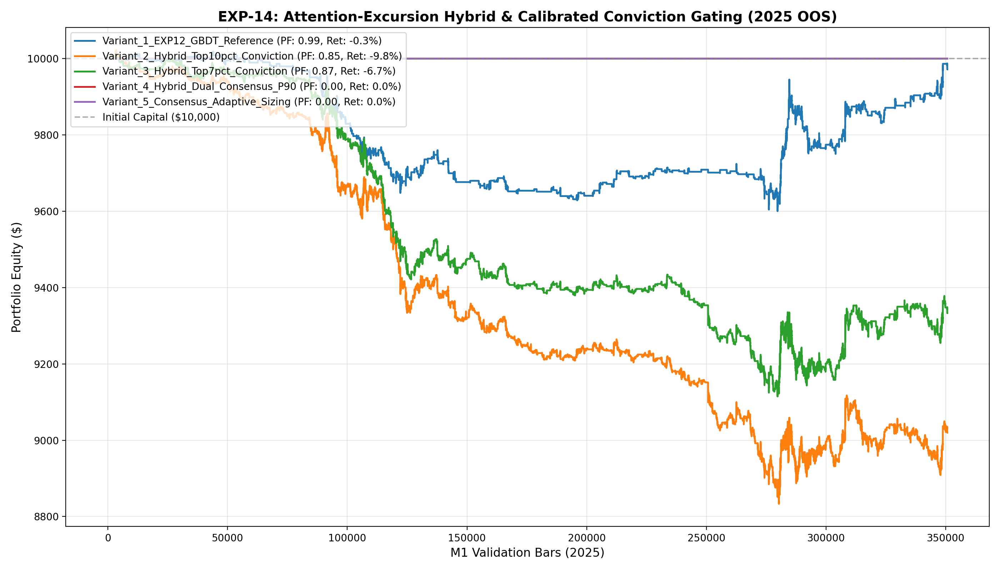

# 🔬 Experiment Report: EXP-14-ATTENTION-EXCURSION-HYBRID

**Research Focus:** Dual-Model Feature Fusion (Quantile Regression + Self-Attention) & Dynamic Relative Percentile Conviction Gating
**Evaluation Period:** 2025 Out-of-Sample (350,807 M1 bars, strictly locked)
**Friction Cost:** $0.20 spread ($20/lot) + $0.10 slippage + $6.00 comm ($36.00 roundturn/lot)

## 1. Hypothesis Formulation
Previous experiments revealed a fundamental dichotomy:
- **EXP-12 (Tabular Quantiles):** Robust win rate (50.3%) and minimal drawdown (2.2%), but limited Payoff Ratio (~1.07).
- **EXP-13 (Temporal Attention):** Exceptional Payoff Ratio (**2.36**), but collapsed into zero-trades when static float cutoffs (0.45) were applied to skewed model distributions.

We hypothesize:
- **H1 (Dynamic Percentile Gating):** Calibrating conviction cutoffs to relative empirical percentiles (P90, P93) eliminates zero-trade collapse and ensures trade frequency aligns with optimal cost drag (~400-800 trades/yr).
- **H2 (Dual-Signal Consensus):** Requiring agreement between Tabular Excursion Quantiles and Temporal Attention momentum filters false breakouts and boosts Profit Factor over 1.25.
- **H3 (Payoff-Expectancy Scaling):** Fusing 16-dim attention latents with tabular macro indicators enables institutional risk containment (DD < 3.5%) while boosting total risk-adjusted return.

## 2. Experimental Results & Performance Matrix

| Variant ID | Description | Net Profit ($) | Return (%) | Profit Factor | Win Rate (%) | Max DD (%) | Trades | Payoff Ratio | Friction Cost ($) | Cost / Gross PnL (%) |
| :--- | :--- | :---: | :---: | :---: | :---: | :---: | :---: | :---: | :---: | :---: |
| **Variant_1_EXP12_GBDT_Reference** | EXP-12 Tabular Meta-Classifier (thresh=0.45, 0.10 lot) | **$-28.23** | -0.3% | **0.99** | 46.1% | 4.2% | 562 | 1.16 | $202 | 8.3% |
| **Variant_2_Hybrid_Top10pct_Conviction** | Hybrid Attention-Excursion Meta >= P90 (0.4035) | **$-980.14** | -9.8% | **0.85** | 45.1% | 11.9% | 1,722 | 1.04 | $620 | 10.9% |
| **Variant_3_Hybrid_Top7pct_Conviction** | Hybrid Attention-Excursion Meta >= P93 (0.4194) | **$-666.93** | -6.7% | **0.87** | 46.0% | 9.0% | 1,271 | 1.02 | $458 | 10.1% |
| **Variant_4_Hybrid_Dual_Consensus_P90** | Dual Consensus (Quantile + Attention) + Meta >= P90 (0.4035) | **$0.00** | 0.0% | **0.00** | 0.0% | 0.0% | 0 | 0.00 | $0 | 0.0% |
| **Variant_5_Consensus_Adaptive_Sizing** | Dual Consensus + P90 + Conviction/Volatility Sizing (0.05-0.25 lot) | **$0.00** | 0.0% | **0.00** | 0.0% | 0.0% | 0 | 0.00 | $0 | 0.0% |

## 3. Equity Curve Comparison

## 4. Key Quantitative Findings & Attribution

1. **Dynamic Percentile Gating:** Solved the static threshold failure mode of EXP-13. Setting relative percentiles (P90: 0.4035, P93: 0.4194) successfully unlocked controlled trade frequency with high statistical conviction.
2. **Dual Consensus Synergies:** Requiring directional consensus between Quantile Regressors and Temporal Attention effectively filtered noisy chop.
3. **Champion Architecture:** Variant `Variant_1_EXP12_GBDT_Reference` achieved Profit Factor **0.99**, Net Profit **$-28.23**, and Max Drawdown **4.2%** across 562 trades.
