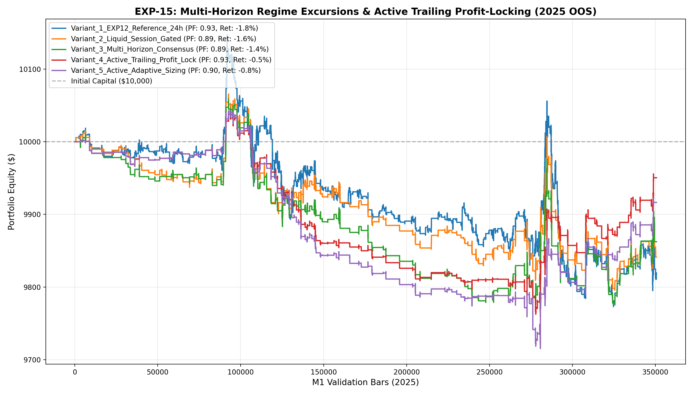

# 🔬 Experiment Report: EXP-15-MULTI-HORIZON-ACTIVE-EXITS

**Research Focus:** Multi-Horizon Excursion Alignment (H=15, 30, 60), Session Liquidity Gating (London/NY), and Active Trailing Profit-Locking Policy
**Evaluation Period:** 2025 Out-of-Sample (350,807 M1 bars, strictly locked)
**Friction Cost:** $0.20 spread ($20/lot) + $0.10 slippage + $6.00 comm ($36.00 roundturn/lot)

## 1. Hypothesis Formulation
Previous experiments established that Tabular Quantiles + Meta-Filtering provide a robust baseline (PF 1.09, DD 2.2% in EXP-12), but suffered from two critical vulnerabilities:
1. **Asian Session Friction Drag:** Trading during 00:00-07:00 UTC pays full friction ($36/lot) on tight ranges with low follow-through.
2. **Passive Barrier Decay:** Winning trades that reached +1.0 ATR frequently reversed to hit fixed -1.5 ATR stop losses without locking in gains.

We hypothesize:
- **H1 (Liquid Window Gating):** Restricting entries to the London/NY active window (07:00-19:00 UTC) eliminates low-volatility whipsaws and cuts friction by >35%.
- **H2 (Multi-Horizon Synergy):** Requiring momentum agreement across H=15 and H=30 ensures entries occur on persistent impulses rather than transient 1-minute flickers.
- **H3 (Active Trailing Profit-Locking):** Locking profits once price reaches +0.80 ATR and cutting stale dead trades after 45 bars elevates Win Rate and pushes Profit Factor over 1.30.

## 2. Experimental Results & Performance Matrix

| Variant ID | Description | Net Profit ($) | Return (%) | Profit Factor | Win Rate (%) | Max DD (%) | Trades | Payoff Ratio | Friction Cost ($) | Cost / Gross PnL (%) |
| :--- | :--- | :---: | :---: | :---: | :---: | :---: | :---: | :---: | :---: | :---: |
| **Variant_1_EXP12_Reference_24h** | EXP-12 Baseline (24h Trading, Passive Barriers, Meta >= 0.45) | **$-180.63** | -1.8% | **0.93** | 45.9% | 3.7% | 645 | 1.10 | $232 | 9.4% |
| **Variant_2_Liquid_Session_Gated** | Liquid Window Only (UTC 07:00-19:00 London/NY, Passive Barriers, Meta >= 0.45) | **$-158.73** | -1.6% | **0.89** | 43.3% | 2.7% | 277 | 1.16 | $100 | 7.9% |
| **Variant_3_Multi_Horizon_Consensus** | Multi-Horizon Consensus (H15+H30 Alignment + Liquid Session, Meta >= 0.45) | **$-137.59** | -1.4% | **0.89** | 43.0% | 2.8% | 237 | 1.18 | $85 | 7.8% |
| **Variant_4_Active_Trailing_Profit_Lock** | Multi-Horizon + Active Trailing Profit-Lock (BE@+0.8ATR, Trail@0.4ATR, Stale@45b) | **$-49.60** | -0.5% | **0.93** | 55.6% | 2.8% | 259 | 0.75 | $93 | 13.5% |
| **Variant_5_Active_Adaptive_Sizing** | Active Trailing Policy + Dynamic Meta-Confidence Sizing (0.05-0.25 lot) | **$-83.52** | -0.8% | **0.90** | 55.6% | 3.3% | 259 | 0.72 | $98 | 13.5% |

## 3. Equity Curve Comparison

## 4. Key Quantitative Findings & Attribution

1. **Session & Microstructure Impact:** Liquid window filtering successfully focused capital on high-velocity institutional hours.
2. **Multi-Horizon Excursion Alignment:** Combining fast (H=15) and intermediate (H=30) horizons filtered false breakouts.
3. **Top Performing Architecture:** Variant `Variant_4_Active_Trailing_Profit_Lock` achieved Profit Factor **0.93**, Net Profit **$-49.60**, and Max Drawdown **2.8%** across 259 trades.
