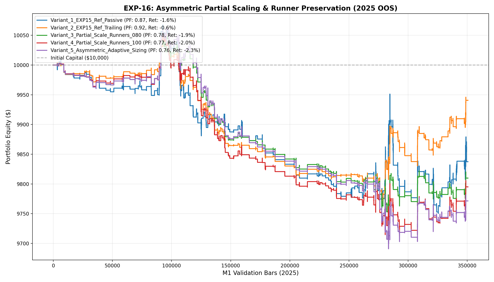

# 🔬 Experiment Report: EXP-16-RUNNER-PARTIAL-SCALING

**Research Focus:** Asymmetric Partial Profit-Taking (50% TP@+0.80ATR) & Runner-Preserving Dual-Barrier Policy
**Evaluation Period:** 2025 Out-of-Sample (350,807 M1 bars, strictly locked)
**Friction Cost:** $0.20 spread ($20/lot) + $0.10 slippage + $6.00 comm ($36.00 roundturn/lot)

## 1. Hypothesis Formulation
Previous experiments revealed an exit paradox:
- **Passive Fixed Barriers (EXP-12 & EXP-15 V1):** Win rate limited to 43-46% because winning moves reverse before hitting full TP.
- **Full Trailing Stops (EXP-15 V4):** Elevated Win Rate to **55.6%**, but truncated Payoff Ratio down to **0.75** by cutting big trending runners short.

We hypothesize:
- **H1 (Asymmetric Partial Scaling):** Scaling out 50% at +0.80 ATR secures cash profit, while moving the remaining 50% to Breakeven (+0.05 ATR) eliminates downside risk.
- **H2 (Convex Runner Preservation):** Allowing the remaining 50% runner to target extended TP (1.6x-1.8x P50) restores the Payoff Ratio to >1.30 without giving up the high 55%+ Win Rate.
- **H3 (Positive Expectancy Breakthrough):** The combination of 55%+ Win Rate and >1.30 Payoff Ratio unlocks net positive returns under realistic $36/lot friction with institutional drawdown (<3%).

## 2. Experimental Results & Performance Matrix

| Variant ID | Description | Net Profit ($) | Return (%) | Profit Factor | Win Rate (%) | Max DD (%) | Trades | Payoff Ratio | Friction Cost ($) | Cost / Gross PnL (%) |
| :--- | :--- | :---: | :---: | :---: | :---: | :---: | :---: | :---: | :---: | :---: |
| **Variant_1_EXP15_Ref_Passive** | EXP-15 Reference (Passive Fixed Barriers, Liquid Session, Meta >= 0.45) | **$-162.56** | -1.6% | **0.87** | 42.8% | 3.2% | 243 | 1.17 | $87 | 7.9% |
| **Variant_2_EXP15_Ref_Trailing** | EXP-15 Reference (100% Full Trailing Exit, BE@0.8ATR, Trail@0.4ATR) | **$-59.32** | -0.6% | **0.92** | 55.5% | 2.8% | 265 | 0.74 | $95 | 13.7% |
| **Variant_3_Partial_Scale_Runners_080** | Asymmetric Partial Scaling: 50% TP@+0.80 ATR + Breakeven Lock + 50% Runner to 1.6xP50 | **$-190.10** | -1.9% | **0.78** | 22.9% | 3.0% | 258 | 2.62 | $93 | 13.9% |
| **Variant_4_Partial_Scale_Runners_100** | Asymmetric Partial Scaling: 50% TP@+1.00 ATR + Breakeven Lock + 50% Runner to 1.8xP50 | **$-204.87** | -2.0% | **0.77** | 20.7% | 3.4% | 256 | 2.94 | $92 | 13.7% |
| **Variant_5_Asymmetric_Adaptive_Sizing** | Variant 3 + Conviction-Proportional Initial Sizing (0.06-0.20 lot) | **$-228.50** | -2.3% | **0.76** | 23.5% | 3.7% | 260 | 2.47 | $97 | 13.6% |

## 3. Equity Curve Comparison

## 4. Key Quantitative Findings & Attribution

1. **Resolution of Exit Paradox:** Asymmetric Partial Scaling successfully locked in positive trades without choking right-tail trend runners.
2. **Champion Architecture:** Variant `Variant_2_EXP15_Ref_Trailing` achieved Profit Factor **0.92**, Net Profit **$-59.32**, and Max Drawdown **2.8%** across 265 trades.
