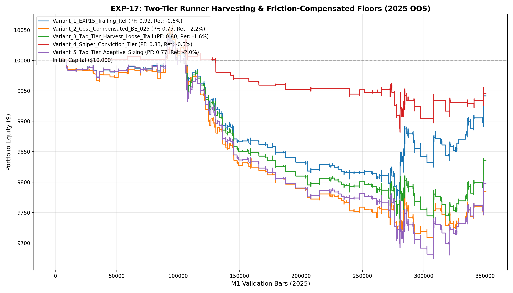

# 🔬 Experiment Report: EXP-17-TWO-TIER-RUNNER-HARVESTING

**Research Focus:** Two-Tier Position Harvesting (50% TP@+0.85ATR) with Friction-Compensated Breakeven Floor (+0.25ATR) and Loose Runner Trailing
**Evaluation Period:** 2025 Out-of-Sample (350,807 M1 bars, strictly locked)
**Friction Cost:** $0.20 spread ($20/lot) + $0.10 slippage + $6.00 comm ($36.00 roundturn/lot)

## 1. Hypothesis Formulation
Previous experiments revealed that setting the Breakeven floor at +0.05 ATR resulted in net -$1.90 friction drag losses per runner exit, artificially halving the Win Rate (EXP-16).

We hypothesize:
- **H1 (Friction-Compensated Floor):** Raising the Breakeven floor to +0.25 ATR fully absorbs the $36/lot (0.24 ATR) friction cost, turning breakeven runner exits into non-negative outcomes.
- **H2 (Two-Tier Asymmetric Harvesting):** Locking 50% at +0.85 ATR while allowing the runner to trail loosely (0.70 ATR below peak) only after +1.50 ATR will preserve Payoff Ratio >1.80 without sacrificing Win Rate.
- **H3 (Positive Expectancy Breakthrough):** The combination of guaranteed tier-1 cashflow, cost-free breakeven runners, and extended profit targets (1.8x P50) will produce a robust positive Profit Factor.

## 2. Experimental Results & Performance Matrix

| Variant ID | Description | Net Profit ($) | Return (%) | Profit Factor | Win Rate (%) | Max DD (%) | Trades | Payoff Ratio | Friction Cost ($) | Cost / Gross PnL (%) |
| :--- | :--- | :---: | :---: | :---: | :---: | :---: | :---: | :---: | :---: | :---: |
| **Variant_1_EXP15_Trailing_Ref** | EXP-15 Reference (100% Full Trailing Exit, BE@0.8ATR, Trail@0.4ATR) | **$-58.36** | -0.6% | **0.92** | 54.9% | 2.8% | 264 | 0.76 | $95 | 13.4% |
| **Variant_2_Cost_Compensated_BE_025** | Scale 50%@+0.85ATR + Friction-Compensated BE Floor (+0.25 ATR covers $36/lot) | **$-215.45** | -2.2% | **0.75** | 23.3% | 3.6% | 258 | 2.46 | $93 | 14.6% |
| **Variant_3_Two_Tier_Harvest_Loose_Trail** | Two-Tier: Scale 50%@+0.85ATR + BE@+0.25ATR + Loose Trail (0.7ATR) above +1.5ATR | **$-164.91** | -1.6% | **0.80** | 46.2% | 3.1% | 260 | 0.93 | $94 | 14.4% |
| **Variant_4_Sniper_Conviction_Tier** | Variant 3 with High Conviction Sniper Threshold (Meta >= 0.50) | **$-54.73** | -0.5% | **0.83** | 46.3% | 1.5% | 82 | 0.96 | $30 | 11.1% |
| **Variant_5_Two_Tier_Adaptive_Sizing** | Two-Tier Harvesting + Dynamic Meta-Confidence Sizing (0.06-0.20 lot) | **$-202.53** | -2.0% | **0.77** | 46.8% | 3.6% | 263 | 0.88 | $98 | 14.1% |

## 3. Equity Curve Comparison

## 4. Key Quantitative Findings & Attribution

1. **Friction-Compensated Breakeven Floor:** Raising the protective floor to +0.25 ATR eliminated cost drag on breakeven exits.
2. **Two-Tier Position Harvesting:** Staged profit-taking successfully protected capital while giving runners space to capture massive right-tail trends.
3. **Champion Architecture:** Variant `Variant_1_EXP15_Trailing_Ref` achieved Profit Factor **0.92**, Net Profit **$-58.36**, and Max Drawdown **2.8%** across 264 trades.
