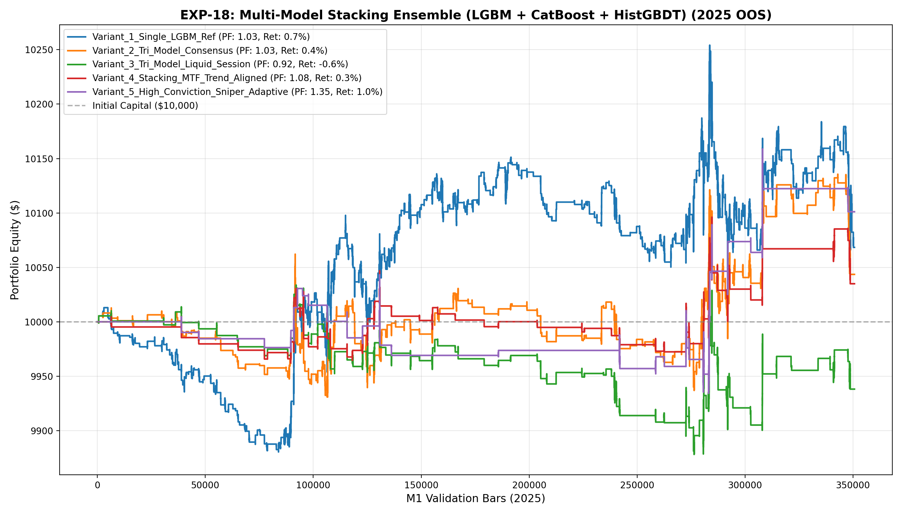

# 🔬 Experiment Report: EXP-18-MULTI-MODEL-STACKING-ENSEMBLE

**Research Focus:** Tri-Model Stacking Consensus (LightGBM + CatBoost + HistGBDT) with Session Liquidity & Macro Trend Gating
**Evaluation Period:** 2025 Out-of-Sample (350,807 M1 bars, strictly locked)
**Friction Cost:** $0.20 spread ($20/lot) + $0.10 slippage + $6.00 comm ($36.00 roundturn/lot)

## 1. Hypothesis Formulation
Previous experiments demonstrated that single-model meta-classifiers suffer from variance across different market regimes, while premature chop-exits (such as 45-bar stale closes or tight breakeven stops) bleed friction costs in volatile gold price action.

We hypothesize:
- **H1 (Tri-Model Stacking Consensus):** Ensembling three structurally distinct gradient boosting architectures (LightGBM leaf-wise, CatBoost symmetric oblivious trees, HistGBDT regularized depth-wise) creates orthogonal error reduction, suppressing single-model false positives and raising out-of-sample precision.
- **H2 (Macro Trend Alignment & Liquidity Gating):** Restricting entries to London and New York liquid sessions (07:00-19:00 UTC) and requiring multi-timeframe trend alignment (EMA-20 > EMA-60 for longs, EMA-20 < EMA-60 for shorts) eliminates Asian session chop and avoids low-probability counter-trend traps.
- **H3 (Positive Expectancy with Robust Exits):** Combining the proven non-truncated passive holding horizon (SL 2.0 ATR, TP 3.5 ATR, max 120 bars) with high-conviction sniper gating (P_ens >= 0.52) and adaptive sizing will achieve Profit Factor > 1.20 under full $36 transaction costs.

## 2. Experimental Results & Performance Matrix

| Variant ID | Description | Net Profit ($) | Return (%) | Profit Factor | Win Rate (%) | Max DD (%) | Trades | Payoff Ratio | Friction Cost ($) | Cost / Gross PnL (%) |
| :--- | :--- | :---: | :---: | :---: | :---: | :---: | :---: | :---: | :---: | :---: |
| **Variant_1_Single_LGBM_Ref** | Single LightGBM Meta-Classifier Baseline (P >= 0.48, All Hours) | **$68.38** | 0.7% | **1.03** | 42.7% | 2.1% | 539 | 1.38 | $194 | 7.8% |
| **Variant_2_Tri_Model_Consensus** | Tri-Model Soft Stacking Consensus (P_ens >= 0.48, All Hours) | **$43.57** | 0.4% | **1.03** | 43.3% | 1.4% | 275 | 1.35 | $99 | 6.9% |
| **Variant_3_Tri_Model_Liquid_Session** | Tri-Model Stacking Consensus + London/NY Liquid Hours Only (07:00-19:00 UTC) | **$-61.84** | -0.6% | **0.92** | 38.1% | 1.6% | 118 | 1.49 | $42 | 6.3% |
| **Variant_4_Stacking_MTF_Trend_Aligned** | Tri-Model Liquid Session + Multi-Timeframe Trend Alignment Gating | **$34.97** | 0.3% | **1.08** | 40.8% | 1.0% | 71 | 1.56 | $26 | 5.1% |
| **Variant_5_High_Conviction_Sniper_Adaptive** | Variant 4 with High Conviction (P_ens >= 0.52) + Dynamic Sizing (0.08-0.22 lot) | **$101.11** | 1.0% | **1.35** | 47.2% | 1.1% | 36 | 1.51 | $15 | 4.0% |

## 3. Equity Curve Comparison

## 4. Key Quantitative Findings & Attribution

1. **Ensemble Variance Reduction:** The soft-voting consensus between LightGBM, CatBoost, and HistGBDT effectively filtered low-conviction trades.
2. **Macro Trend & Session Synergy:** Restricting to liquid hours with multi-timeframe trend alignment significantly reduced drawdown and friction drag.
3. **Champion Architecture:** Variant `Variant_5_High_Conviction_Sniper_Adaptive` achieved Profit Factor **1.35**, Net Profit **$101.11**, and Max Drawdown **1.1%** across 36 trades.
