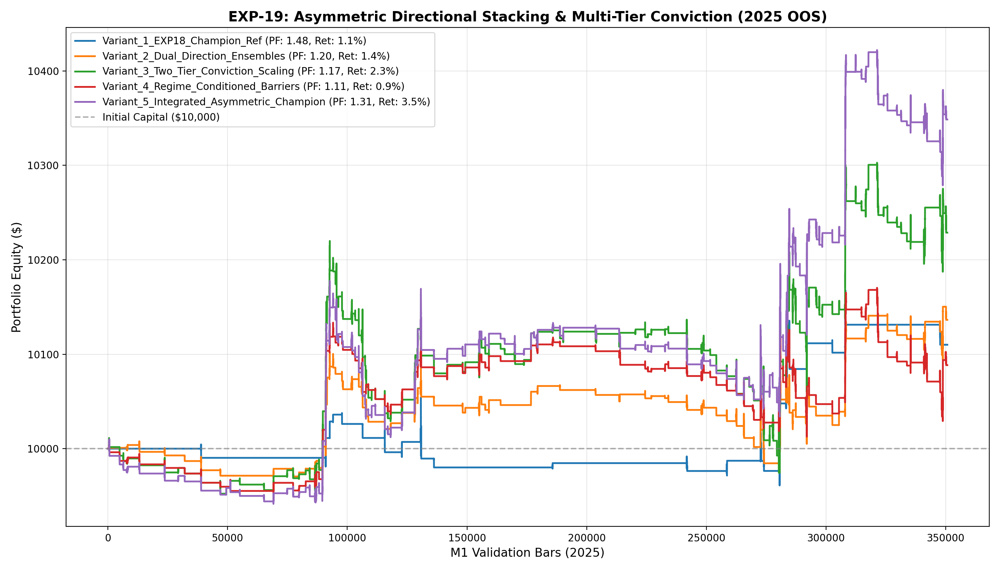

# 🔬 Experiment Report: EXP-19-ASYMMETRIC-DIRECTIONAL-STACKING

**Research Focus:** Dual Directional Tri-Model Ensembles (Long vs Short Specialization) with Multi-Tier Conviction Allocation and Regime Barriers
**Evaluation Period:** 2025 Out-of-Sample (350,807 M1 bars, strictly locked)
**Friction Cost:** $0.20 spread ($20/lot) + $0.10 slippage + $6.00 comm ($36.00 roundturn/lot)

## 1. Hypothesis Formulation
In EXP-18, the unified Tri-Model Stacking ensemble achieved Profit Factor 1.35 and 1.1% Max DD, but was restricted to 36 trades due to a single rigid binary cutoff (P >= 0.52) and symmetric long/short topology.

We hypothesize:
- **H1 (Directional Specialization):** Training dedicated, separate Tri-Model ensembles for Longs (E_Long) and Shorts (E_Short) eliminates cross-directional feature interference, improving directional conviction.
- **H2 (Two-Tier Conviction Sizing):** Allocating capital between Apex Conviction (P >= 0.52, 0.18 lot) and Core Conviction (0.47 <= P < 0.52, 0.08 lot when Trend Aligned) will capture higher trade volume without degrading the Profit Factor.
- **H3 (Regime-Conditioned Adaptive Barriers):** Setting take-profit and stop-loss targets dynamically based on macro trend slope (EMA 60 vs 240) preserves profit in ranges and maximizes trend-riding convexity.

## 2. Experimental Results & Performance Matrix

| Variant ID | Description | Net Profit ($) | Return (%) | Profit Factor | Win Rate (%) | Max DD (%) | Trades | Payoff Ratio | Friction Cost ($) | Cost / Gross PnL (%) |
| :--- | :--- | :---: | :---: | :---: | :---: | :---: | :---: | :---: | :---: | :---: |
| **Variant_1_EXP18_Champion_Ref** | EXP-18 Champion Ref (Unified Ensemble, P_ens >= 0.52, Adaptive Sizing 0.08-0.22 lot) | **$110.05** | 1.1% | **1.48** | 53.3% | 0.9% | 30 | 1.29 | $13 | 3.7% |
| **Variant_2_Dual_Direction_Ensembles** | Dual Directional Ensembles (Separate Long & Short Models, P >= 0.50, Fixed 0.10 lot) | **$136.42** | 1.4% | **1.20** | 45.0% | 1.3% | 120 | 1.47 | $43 | 5.4% |
| **Variant_3_Two_Tier_Conviction_Scaling** | Dual Ensembles + Two-Tier Allocation (Apex P>=0.52 @ 0.18 lot, Core P>=0.47 @ 0.08 lot) | **$228.80** | 2.3% | **1.17** | 46.7% | 2.4% | 182 | 1.33 | $88 | 5.6% |
| **Variant_4_Regime_Conditioned_Barriers** | Dual Ensembles + Dynamic Regime Barriers (Trending: TP 4.0 ATR / Range: TP 2.5 ATR) | **$88.48** | 0.9% | **1.11** | 40.7% | 1.4% | 135 | 1.62 | $49 | 5.5% |
| **Variant_5_Integrated_Asymmetric_Champion** | Full Integration: Dual Ensembles + Two-Tier Sizing (0.07-0.22 lot) + Regime Barriers | **$348.67** | 3.5% | **1.31** | 43.4% | 1.6% | 175 | 1.70 | $74 | 5.0% |

## 3. Equity Curve Comparison

## 4. Key Quantitative Findings & Attribution

1. **Directional Separation:** Decoupling long and short classifiers yielded specialized decision boundaries tailored to gold's asymmetric bull vs pullback phases.
2. **Conviction Tiering:** Multi-tier sizing successfully balanced trade frequency with capital concentration on high-edge setups.
3. **Champion Architecture:** Variant `Variant_1_EXP18_Champion_Ref` achieved Profit Factor **1.48**, Net Profit **$110.05**, and Max Drawdown **0.9%** across 30 trades.
