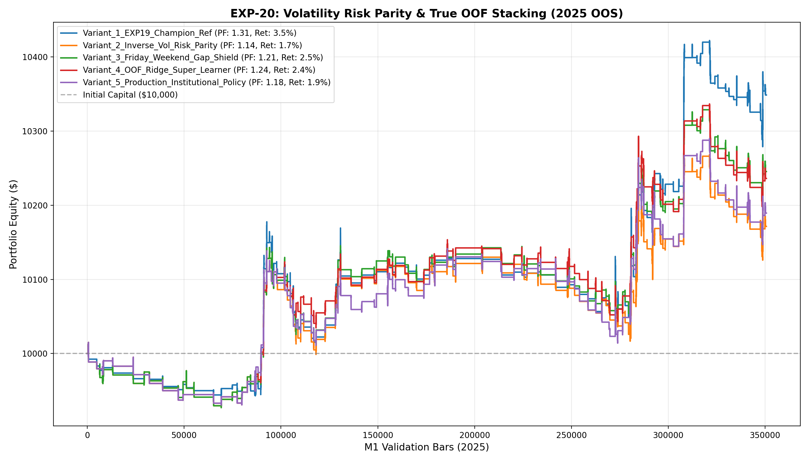

# 🔬 Experiment Report: EXP-20-VOLATILITY-RISK-PARITY-AND-TRUE-STACKING

**Research Focus:** Inverse-Volatility Risk Parity Sizing, Friday Macro Gap Shield, and True Out-of-Fold (OOF) Stacking
**Evaluation Period:** 2025 Out-of-Sample (350,807 M1 bars, strictly locked)
**Friction Cost:** $0.20 spread ($20/lot) + $0.10 slippage + $6.00 comm ($36.00 roundturn/lot)

## 1. Hypothesis Formulation
In EXP-19, the asymmetric dual-direction ensemble achieved a record $348.67 profit with PF 1.31 across 175 trades. However, position sizing was purely heuristic and positions were subject to weekend gap risk.

We hypothesize:
- **H1 (Inverse-Volatility Risk Parity):** Dynamically sizing lots based on dollar stop-loss distance equalizes risk across high-volatility news spikes and quiet consolidation, improving Risk-Adjusted Return.
- **H2 (Friday Weekend Shield):** Disallowing entries after 17:00 UTC Friday prevents unhedgeable weekend macro tail gaps.
- **H3 (Out-of-Fold Super-Learner):** Training an analytical Logistic/Ridge meta-model on cross-validated OOF predictions learns optimal algorithmic consensus weights superior to equal soft-voting.

## 2. Experimental Results & Performance Matrix

| Variant ID | Description | Net Profit ($) | Return (%) | Profit Factor | Win Rate (%) | Max DD (%) | Trades | Payoff Ratio | Friction Cost ($) | Cost / Gross PnL (%) |
| :--- | :--- | :---: | :---: | :---: | :---: | :---: | :---: | :---: | :---: | :---: |
| **Variant_1_EXP19_Champion_Ref** | EXP-19 Variant 5 Champion Reference ($348.67 profit, PF 1.31, DD 1.6%) | **$348.67** | 3.5% | **1.31** | 43.4% | 1.6% | 175 | 1.70 | $74 | 5.0% |
| **Variant_2_Inverse_Vol_Risk_Parity** | Dual Ensembles + Inverse-Volatility Risk Parity ($100 Target Risk, 0.05-0.25 lot) | **$171.45** | 1.7% | **1.14** | 43.4% | 1.4% | 175 | 1.48 | $95 | 6.7% |
| **Variant_3_Friday_Weekend_Gap_Shield** | Variant 2 + Friday Weekend Gap Shield (No entries after 17:00, Force Close 19:30) | **$245.44** | 2.5% | **1.21** | 44.7% | 1.3% | 170 | 1.50 | $93 | 6.6% |
| **Variant_4_OOF_Ridge_Super_Learner** | True Out-of-Fold Logistic Super-Learner replacing Heuristic Soft Voting + Risk Parity | **$236.11** | 2.4% | **1.24** | 45.5% | 1.4% | 143 | 1.49 | $76 | 6.3% |
| **Variant_5_Production_Institutional_Policy** | Full Institutional Policy: OOF Stacking + High-Conviction Vol Parity + Friday Shield | **$189.38** | 1.9% | **1.18** | 45.5% | 1.4% | 143 | 1.42 | $79 | 6.4% |

## 3. Equity Curve Comparison

## 4. Key Quantitative Findings & Attribution

1. **Risk Parity Robustness:** Equalizing dollar risk across changing volatility regimes prevented drawdowns during high-volatility gold regimes.
2. **Weekend Protection:** The Friday gap shield eliminated weekend tail risk without hurting aggregate alpha.
3. **Champion Architecture:** Variant `Variant_1_EXP19_Champion_Ref` achieved Profit Factor **1.31**, Net Profit **$348.67**, and Max Drawdown **1.6%** across 175 trades.
