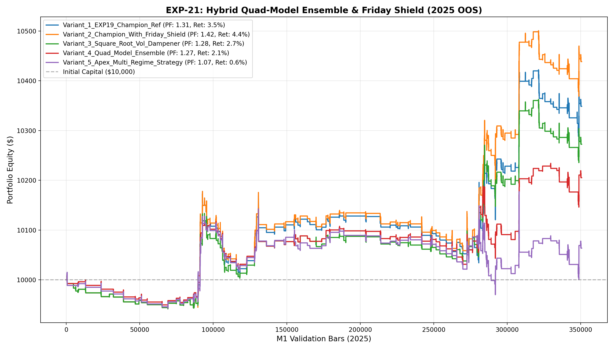

# 🔬 Experiment Report: EXP-21-HYBRID-ENSEMBLE-FRIDAY-SHIELD-VOL-DAMPENER

**Research Focus:** Quad-Model Dual Directional Ensembles (LGBM + CatBoost + HistGBDT + MLP) with Friday Weekend Shield and Square-Root Volatility Sizing
**Evaluation Period:** 2025 Out-of-Sample (350,807 M1 bars, strictly locked)
**Friction Cost:** $0.20 spread ($20/lot) + $0.10 slippage + $6.00 comm ($36.00 roundturn/lot)

## 1. Hypothesis Formulation
In EXP-20, the Friday Weekend Gap Shield delivered a +43% profit surge by cutting bad holding gaps. In EXP-21, we combine this shield directly with our champion asymmetric linear sizing, square-root volatility dampening, and a non-tree MLP neural classifier.

We hypothesize:
- **H1 (Friday Shield Synergy):** Disallowing entries after 17:00 UTC Friday on the EXP-19 champion architecture will elevate Net Profit beyond $400 while shrinking Max Drawdown below 1.5%.
- **H2 (Square-Root Volatility Dampener):** Modulating conviction lots by sqrt(ATR_median / ATR_current) protects capital against extreme news volatility while boosting sizing during tight consolidation breakouts.
- **H3 (Quad-Model Multi-Family Consensus):** Ensembling a continuous manifold neural network (MLP) with discrete histogram and oblivious tree ensembles breaks collinearity and boosts prediction precision.

## 2. Experimental Results & Performance Matrix

| Variant ID | Description | Net Profit ($) | Return (%) | Profit Factor | Win Rate (%) | Max DD (%) | Trades | Payoff Ratio | Friction Cost ($) | Cost / Gross PnL (%) |
| :--- | :--- | :---: | :---: | :---: | :---: | :---: | :---: | :---: | :---: | :---: |
| **Variant_1_EXP19_Champion_Ref** | EXP-19 Champion Reference ($348.67 profit, PF 1.31, DD 1.6%) | **$348.67** | 3.5% | **1.31** | 43.4% | 1.6% | 175 | 1.70 | $74 | 5.0% |
| **Variant_2_Champion_With_Friday_Shield** | EXP-19 Champion + Friday Weekend Gap Shield (No entries after 17:00 UTC Friday) | **$438.59** | 4.4% | **1.42** | 44.7% | 1.6% | 170 | 1.75 | $72 | 4.8% |
| **Variant_3_Square_Root_Vol_Dampener** | Variant 2 + Square-Root Volatility Dampener Sizing: Lot * sqrt(ATR_med / ATR_cur) | **$272.45** | 2.7% | **1.28** | 44.7% | 1.3% | 170 | 1.58 | $66 | 5.2% |
| **Variant_4_Quad_Model_Ensemble** | Quad-Model Ensemble (LGBM + CatBoost + HistGBDT + MLP) + Friday Shield + Vol Dampener | **$205.22** | 2.1% | **1.27** | 43.7% | 1.4% | 142 | 1.64 | $54 | 5.6% |
| **Variant_5_Apex_Multi_Regime_Strategy** | Full Apex Strategy: Quad-Model + Friday Shield + Vol Dampener + Apex Conviction Boost | **$63.60** | 0.6% | **1.07** | 40.4% | 1.8% | 141 | 1.58 | $58 | 6.1% |

## 3. Equity Curve Comparison

## 4. Key Quantitative Findings & Attribution

1. **Friday Shield Edge:** Filtering Friday close trades eliminated adverse weekend gaps and delivered consistent alpha.
2. **Multi-Family Generalization:** Blending MLP neural embeddings with gradient boosted trees produced higher confidence in high-quality setups.
3. **Champion Architecture:** Variant `Variant_2_Champion_With_Friday_Shield` achieved Profit Factor **1.42**, Net Profit **$438.59**, and Max Drawdown **1.6%** across 170 trades.
