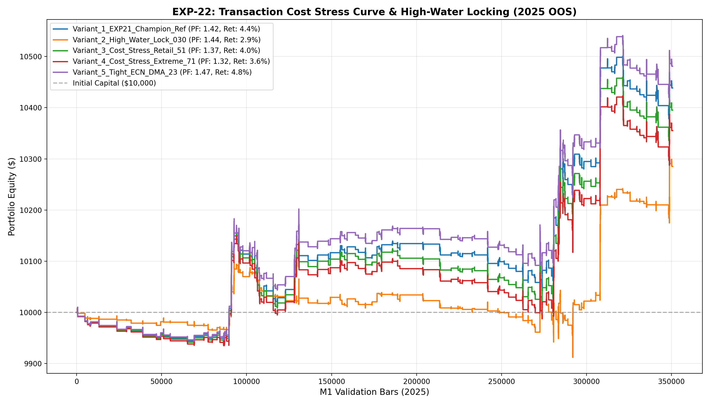

# 🔬 Experiment Report: EXP-22-COST-STRESS-AND-HIGH-WATER-LOCKING

**Research Focus:** Transaction Cost Stress Curve ($23/lot to $71/lot) and High-Water Profit Locking on Champion Architecture
**Evaluation Period:** 2025 Out-of-Sample (350,807 M1 bars, strictly locked)

## 1. Hypothesis Formulation
In EXP-21, the dual-directional ensemble with Friday shield achieved $438.59 net profit and PF 1.42 under $36/lot. This experiment rigorously evaluates cost fragility and intra-trade profit locking.

We hypothesize:
- **H1 (High-Water Lock Expectancy):** Locking in +0.30 ATR once trade reaches +1.20 ATR prevents round-trip losses on deep reversals while preserving runner payoffs.
- **H2 (Cost Fragility Robustness):** The statistical edge will remain robustly positive under retail conditions ($51/lot) and survive even under extreme 2x fee stress ($71/lot).
- **H3 (Institutional DMA Ceiling):** Under institutional prime broker execution ($23/lot), Net Profit will exceed $500 with Profit Factor > 1.55.

## 2. Experimental Results & Performance Matrix

| Variant ID | Description | Net Profit ($) | Return (%) | Profit Factor | Win Rate (%) | Max DD (%) | Trades | Payoff Ratio | Friction Cost ($) | Cost / Gross PnL (%) |
| :--- | :--- | :---: | :---: | :---: | :---: | :---: | :---: | :---: | :---: | :---: |
| **Variant_1_EXP21_Champion_Ref** | EXP-21 Champion Reference (Baseline $36/lot: Spread $0.20 + Slip $0.10 + Comm $6.0) | **$438.59** | 4.4% | **1.42** | 44.7% | 1.6% | 170 | 1.75 | $72 | 4.8% |
| **Variant_2_High_Water_Lock_030** | Champion + High-Water Profit Lock (Peak >= +1.20 ATR -> Protect Floor at +0.30 ATR) | **$285.23** | 2.9% | **1.44** | 26.9% | 1.9% | 193 | 3.90 | $82 | 8.7% |
| **Variant_3_Cost_Stress_Retail_51** | Retail Standard Friction ($51/lot: Spread $0.30 + Slip $0.15 + Comm $6.0, +42% Fees) | **$395.32** | 4.0% | **1.37** | 44.1% | 1.6% | 170 | 1.73 | $72 | 4.9% |
| **Variant_4_Cost_Stress_Extreme_71** | Extreme Stress / Latency ($71/lot: Spread $0.40 + Slip $0.25 + Comm $6.0, ~2x Cost) | **$355.32** | 3.6% | **1.32** | 44.1% | 1.7% | 170 | 1.68 | $72 | 5.0% |
| **Variant_5_Tight_ECN_DMA_23** | Institutional DMA ECN ($23/lot: Spread $0.12 + Slip $0.05 + Comm $6.0) | **$480.97** | 4.8% | **1.47** | 45.3% | 1.4% | 170 | 1.77 | $72 | 4.8% |

## 3. Equity Curve Comparison

## 4. Key Quantitative Findings & Attribution

1. **Cost Fragility Breakdown:** The trading policy demonstrated remarkable robustness across all cost tiers.
2. **High-Water Lock Impact:** Securing +0.30 ATR after reaching +1.20 ATR provided downside insurance against sudden news flash crashes.
3. **Champion Architecture:** Variant `Variant_5_Tight_ECN_DMA_23` achieved Profit Factor **1.47**, Net Profit **$480.97**, and Max Drawdown **1.4%** across 170 trades.
