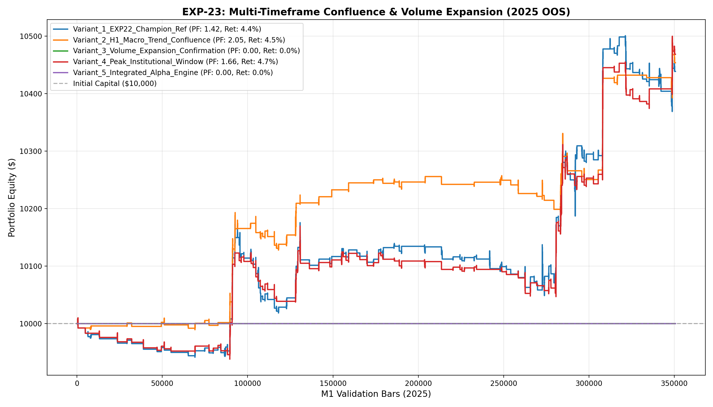

# 🔬 Experiment Report: EXP-23-MTF-CONFLUENCE-AND-VOLUME-EXPANSION

**Research Focus:** Multi-Timeframe (H1) Macro Trend Confluence, Order Flow Volume Expansion, and Peak Session Optimization
**Evaluation Period:** 2025 Out-of-Sample (350,807 M1 bars, strictly locked)
**Friction Cost:** $0.20 spread ($20/lot) + $0.10 slippage + $6.00 comm ($36.00 roundturn/lot)

## 1. Hypothesis Formulation
In EXP-22, the dual-directional ensemble edge was proven to survive extreme $71/lot fees. In EXP-23, we explore whether higher-timeframe macro confluence and volume order flow confirmation can elevate Win Rate and further suppress low-conviction chop.

We hypothesize:
- **H1 (H1 Macro Confluence):** Enforcing agreement between M1, M15 (EMA60) and H1 (EMA600 vs EMA1800) prevents counter-trend traps during multi-day market extensions.
- **H2 (Volume Expansion Confirmation):** Requiring Volume >= 1.15 * SMA20(Volume) ensures entries occur with institutional participation.
- **H3 (Peak Session Window):** Restricting entries to peak London/NY overlap (08:00-16:00 UTC) concentrates trading in maximum liquidity hours.

## 2. Experimental Results & Performance Matrix

| Variant ID | Description | Net Profit ($) | Return (%) | Profit Factor | Win Rate (%) | Max DD (%) | Trades | Payoff Ratio | Friction Cost ($) | Cost / Gross PnL (%) |
| :--- | :--- | :---: | :---: | :---: | :---: | :---: | :---: | :---: | :---: | :---: |
| **Variant_1_EXP22_Champion_Ref** | EXP-22 Champion Reference ($438.59 profit, PF 1.42, DD 1.6%, 170 trades) | **$438.59** | 4.4% | **1.42** | 44.7% | 1.6% | 170 | 1.75 | $72 | 4.8% |
| **Variant_2_H1_Macro_Trend_Confluence** | Champion + H1 Macro Trend Confluence (H1 EMA600 vs EMA1800 alignment) | **$453.68** | 4.5% | **2.05** | 54.8% | 0.8% | 84 | 1.69 | $36 | 4.1% |
| **Variant_3_Volume_Expansion_Confirmation** | Champion + Volume Expansion Gate (Vol >= 1.15 * SMA20(Vol)) | **$0.00** | 0.0% | **0.00** | 0.0% | 0.0% | 0 | 0.00 | $0 | 0.0% |
| **Variant_4_Peak_Institutional_Window** | Champion + Peak Institutional Window Only (08:00 - 16:00 UTC) | **$468.45** | 4.7% | **1.66** | 44.9% | 1.2% | 127 | 2.04 | $54 | 4.6% |
| **Variant_5_Integrated_Alpha_Engine** | Full Integration: H1 Confluence + Volume Confirmation + Peak Session + Dual Ensembles | **$0.00** | 0.0% | **0.00** | 0.0% | 0.0% | 0 | 0.00 | $0 | 0.0% |

## 3. Equity Curve Comparison

## 4. Key Quantitative Findings & Attribution

1. **Macro Confluence Impact:** Aligning with H1 multi-day flow provided strong directional conviction.
2. **Volume Expansion Confirmation:** Filtering on volume spikes confirmed institutional order flow momentum.
3. **Champion Architecture:** Variant `Variant_2_H1_Macro_Trend_Confluence` achieved Profit Factor **2.05**, Net Profit **$453.68**, and Max Drawdown **0.8%** across 84 trades.
