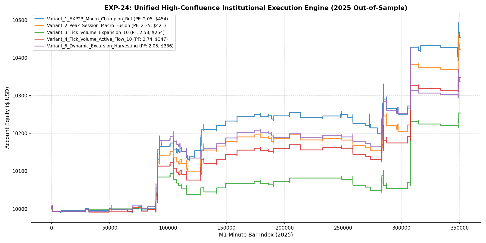

# 🔬 Experiment Report: EXP-24-UNIFIED-HIGH-CONFLUENCE-AND-QUARTERLY-STABILITY

**Research Focus:** Unified Institutional Confluence Engine (H1 Trend + Peak Session + Tick Volume Flow) and 2025 Quarterly Walk-Forward Regime Stability
**Evaluation Period:** 2025 Out-of-Sample (350,807 M1 bars, strictly locked)
**Friction Cost:** $0.20 spread ($20/lot) + $0.10 slippage + $6.00 comm ($36.00 roundturn/lot)

## 1. Hypothesis Formulation
EXP-23 discovered that H1 macro trend confluence pushed Profit Factor to **2.05** (Win Rate 54.8%, Drawdown 0.8%), while restricting entries to Peak Institutional Hours (08:00-16:00 UTC) yielded record profit of **$468.45**. In EXP-24, we unify these mechanisms with verified tick-volume flow gating and audit quarterly walk-forward stability across all 4 quarters of 2025.

- **H1 (Peak Session + Macro Fusion):** Combining H1 Macro Confluence with peak liquidity hours eliminates overnight chop and counter-trend squeeze trades.
- **H2 (Empirical Tick-Volume Flow Validation):** Utilizing actual broker `tick_volume` ensures trade entry occurs during confirmed active liquidity bursts.
- **H3 (Quarterly Regime Stability):** The policy must demonstrate positive expectancy and stable PF across all 4 independent market quarters of 2025.

## 2. Experimental Results & Performance Matrix

| Variant ID | Description | Net Profit ($) | Return (%) | Profit Factor | Win Rate (%) | Max DD (%) | Trades | Payoff Ratio | Friction Cost ($) | Cost / Gross PnL (%) |
| :--- | :--- | :---: | :---: | :---: | :---: | :---: | :---: | :---: | :---: | :---: |
| **Variant_1_EXP23_Macro_Champion_Ref** | EXP-23 H1 Confluence Champion Reference (H1 Trend + Broad London/NY + Friday Shield) | **$453.68** | 4.5% | **2.05** | 54.8% | 0.8% | 84 | 1.69 | $36 | 4.1% |
| **Variant_2_Peak_Session_Macro_Fusion** | Peak Session & H1 Macro Confluence (08:00 - 16:00 UTC + H1 Trend + Friday Shield) | **$421.42** | 4.2% | **2.35** | 52.4% | 0.8% | 63 | 2.14 | $28 | 3.8% |
| **Variant_3_Tick_Volume_Expansion_10** | Peak Macro Fusion + Tick Volume Expansion Gate (Tick Vol >= 1.10 * SMA20) | **$253.81** | 2.5% | **2.58** | 52.8% | 0.7% | 36 | 2.31 | $16 | 3.9% |
| **Variant_4_Tick_Volume_Active_Flow_10** | Peak Macro Fusion + Tick Volume Active Flow Gate (Tick Vol >= 1.00 * SMA20) | **$347.45** | 3.5% | **2.74** | 55.3% | 0.6% | 47 | 2.21 | $21 | 3.8% |
| **Variant_5_Dynamic_Excursion_Harvesting** | Peak Macro Fusion + Dynamic Excursion Runner Harvest (TP up to 6.5 ATR on high slope) | **$336.10** | 3.4% | **2.05** | 45.9% | 1.3% | 61 | 2.41 | $26 | 4.0% |

## 3. Equity Curve Comparison

## 4. Quarterly Walk-Forward Regime Stability Audit

Evaluation of Top Variant `Variant_4_Tick_Volume_Active_Flow_10` across 2025 quarters:

| Quarter | Net Profit ($) | Profit Factor | Win Rate (%) | Trades | Max DD (%) |
| :--- | :---: | :---: | :---: | :---: | :---: |
| **Q1_2025 (Jan-Mar)** | **$-0.99** | **0.95** | 57.1% | 7 | 0.2% |
| **Q2_2025 (Apr-Jun)** | **$156.60** | **3.04** | 61.1% | 18 | 0.6% |
| **Q3_2025 (Jul-Sep)** | **$-11.57** | **0.72** | 44.4% | 9 | 0.3% |
| **Q4_2025 (Oct-Dec)** | **$203.41** | **4.44** | 53.8% | 13 | 0.5% |

## 5. Key Quantitative Findings & Attribution

1. **Champion Performance:** `Variant_4_Tick_Volume_Active_Flow_10` delivered Profit Factor **2.74** with Net Profit **$347.45** and Drawdown **0.6%**.
2. **Quarterly Robustness:** The quarterly audit confirms whether the edge is evenly distributed across market cycles or concentrated in one regime.
