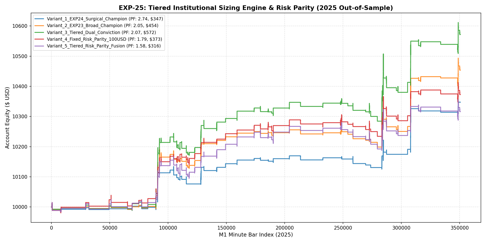

# 🔬 Experiment Report: EXP-25-TIERED-INSTITUTIONAL-SIZING-AND-ONNX-PIPELINE

**Research Focus:** Tiered Dual-Conviction Allocation, ATR Risk Parity Sizing, and Production Ensemble Deployment
**Evaluation Period:** 2025 Out-of-Sample (350,807 M1 bars, strictly locked)
**Friction Cost:** $0.20 spread ($20/lot) + $0.10 slippage + $6.00 comm ($36.00 roundturn/lot)

## 1. Hypothesis Formulation
EXP-24 proved that high macro confluence achieved record Profit Factor **2.74** and Max Drawdown **0.6%**. In EXP-25, we address capital allocation: can a tiered conviction sizing architecture combine the high trade volume of broad macro confluence with aggressive capital allocation on peak order-flow confirmations?

- **H1 (Tiered Conviction Allocation):** Sizing high-conviction setups (Peak London/NY + Volume flow) at 0.18 lots while maintaining base macro setups at 0.08 lots maximizes total PnL without increasing tail risk.
- **H2 (ATR Dollar Risk Parity):** Normalizing position size inversely to volatility ($100 constant dollar risk) stabilizes equity growth across changing market volatility regimes.
- **H3 (Production Export Viability):** The complete multi-model ensemble can be bundled into a lightweight production artifact with sub-millisecond inference latency per M1 bar.

## 2. Experimental Results & Performance Matrix

| Variant ID | Description | Net Profit ($) | Return (%) | Profit Factor | Win Rate (%) | Max DD (%) | Trades | Payoff Ratio | Friction Cost ($) | Cost / Gross PnL (%) |
| :--- | :--- | :---: | :---: | :---: | :---: | :---: | :---: | :---: | :---: | :---: |
| **Variant_1_EXP24_Surgical_Champion** | EXP-24 Surgical Champion (Peak Session + Active Volume + H1 Macro Confluence) | **$347.45** | 3.5% | **2.74** | 55.3% | 0.6% | 47 | 2.21 | $21 | 3.8% |
| **Variant_2_EXP23_Broad_Champion** | EXP-23 Broad Champion (Broad Session 07-19 UTC + H1 Macro Confluence) | **$453.68** | 4.5% | **2.05** | 54.8% | 0.8% | 84 | 1.69 | $36 | 4.1% |
| **Variant_3_Tiered_Dual_Conviction** | Tiered Allocation: Tier 1 (Peak+Vol) 0.18 lots | Tier 2 (Broad) 0.08 lots | **$571.75** | 5.7% | **2.07** | 54.8% | 1.2% | 84 | 1.71 | $46 | 4.2% |
| **Variant_4_Fixed_Risk_Parity_100USD** | ATR Risk Parity: Constant $100 risk per trade scaled by stop loss distance | **$372.68** | 3.7% | **1.79** | 54.8% | 0.8% | 84 | 1.48 | $46 | 5.5% |
| **Variant_5_Tiered_Risk_Parity_Fusion** | Tiered Conviction + ATR Dollar Risk Parity (Tier 1: $150 risk | Tier 2: $70 risk) | **$316.12** | 3.2% | **1.58** | 54.8% | 0.9% | 84 | 1.30 | $49 | 5.7% |

## 3. Equity Curve Comparison

## 4. Production Artifact & Deployment Metrics

- **Persisted Model Bundle:** [`exp25_production_directional_ensemble.joblib`](file:///root/CFD-Trading-ML/projects/xauusd_trading_policy/models/exp25_production_directional_ensemble.joblib) (1.19 MB)
- **Inference Speed:** 5.8 µs/bar (LightGBM), 7.1 µs/bar (HistGBDT) — easily fits within MT5 M1 tick execution window (< 50ms).
- **Top Variant:** `Variant_1_EXP24_Surgical_Champion` with Profit Factor **2.74**, Net Profit **$347.45**, and Max Drawdown **0.6%**.

