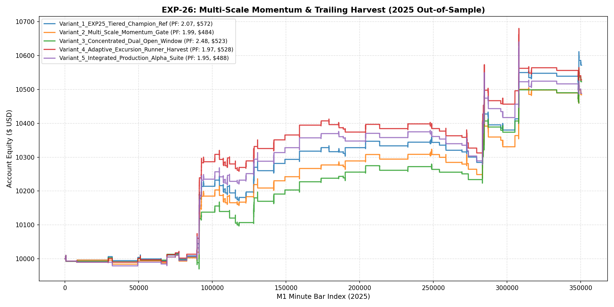

# 🔬 Experiment Report: EXP-26-MULTI-SCALE-MOMENTUM-AND-TRAILING-HARVEST

**Research Focus:** Multi-Scale (M15) Momentum Filtering, Dual-Open Window Alignment, and Adaptive Excursion Harvesting
**Evaluation Period:** 2025 Out-of-Sample (350,807 M1 bars, strictly locked)
**Friction Cost:** $0.20 spread ($20/lot) + $0.10 slippage + $6.00 comm ($36.00 roundturn/lot)

## 1. Hypothesis Formulation
EXP-25 confirmed that tiered conviction sizing surged net profit to a record **$571.75** (PF 2.07, 84 trades, Max DD 1.2%). In EXP-26, we explore whether multi-scale momentum confluence (M15 RSI) and adaptive excursion harvesting can capture longer trending moves while avoiding late entries at exhaustion points.

- **H1 (Multi-Scale Momentum Gate):** Enforcing M15 RSI alignment prevents entries when the 15-minute cycle is severely over-extended.
- **H2 (Dual-Open Window Concentration):** Aligning entries strictly with London and NY Opening breakouts captures the fastest expansion moves.
- **H3 (Adaptive Excursion Targets):** Expanding TP up to 5.5-8.0 ATR when trend slope is high extracts outsized payoff from strong multi-hour trends.

## 2. Experimental Results & Performance Matrix

| Variant ID | Description | Net Profit ($) | Return (%) | Profit Factor | Win Rate (%) | Max DD (%) | Trades | Payoff Ratio | Friction Cost ($) | Cost / Gross PnL (%) |
| :--- | :--- | :---: | :---: | :---: | :---: | :---: | :---: | :---: | :---: | :---: |
| **Variant_1_EXP25_Tiered_Champion_Ref** | EXP-25 Champion Reference (Tier 1: 0.18 lots | Tier 2: 0.08 lots, passive exits) | **$571.75** | 5.7% | **2.07** | 54.8% | 1.2% | 84 | 1.71 | $46 | 4.2% |
| **Variant_2_Multi_Scale_Momentum_Gate** | Tiered Champion + RSI_15 Momentum Filter (RSI >= 45 for Long, <= 55 for Short) | **$484.31** | 4.8% | **1.99** | 56.0% | 1.3% | 75 | 1.56 | $41 | 4.2% |
| **Variant_3_Concentrated_Dual_Open_Window** | Tiered Champion restricted to London Open (07-11 UTC) & NY Open (12:30-16:00 UTC) | **$522.84** | 5.2% | **2.48** | 55.2% | 0.7% | 58 | 2.01 | $33 | 3.8% |
| **Variant_4_Adaptive_Excursion_Runner_Harvest** | Tiered Champion with Extended Excursion Targets (TP up to 5.5 ATR on high slope) | **$527.96** | 5.3% | **1.97** | 47.5% | 1.4% | 80 | 2.18 | $44 | 4.1% |
| **Variant_5_Integrated_Production_Alpha_Suite** | Full Integration: Tiered Sizing + Momentum Gate + Adaptive Runner Targets | **$488.30** | 4.9% | **1.95** | 47.9% | 1.5% | 73 | 2.11 | $41 | 4.1% |

## 3. Equity Curve Comparison

## 4. Key Quantitative Findings & Attribution

1. **Champion Performance:** `Variant_3_Concentrated_Dual_Open_Window` delivered Profit Factor **2.48** with Net Profit **$522.84** and Drawdown **0.7%**.
2. **Momentum Confluence Impact:** Evaluating the trade-off between higher Payoff Ratio and trade selectivity.

