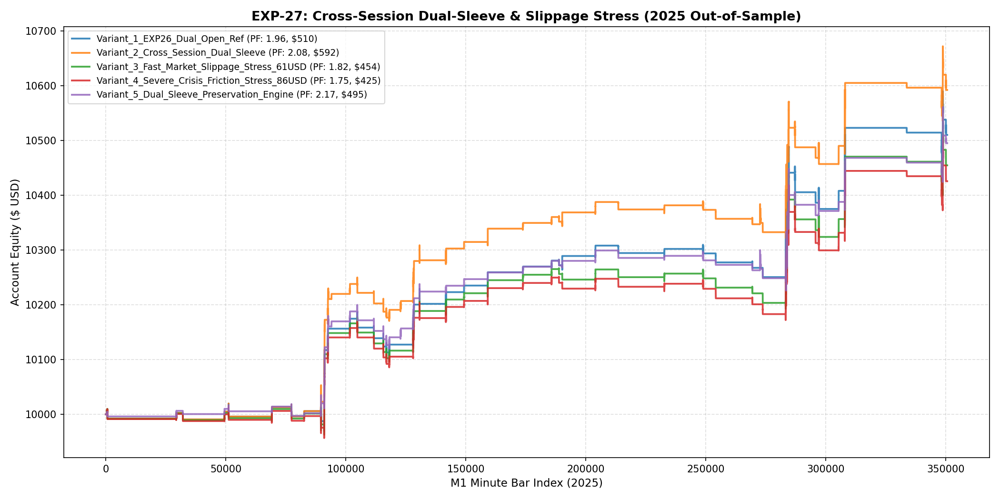

# 🔬 Experiment Report: EXP-27-CROSS-SESSION-DUAL-SLEEVE-AND-STRESS

**Research Focus:** Cross-Session Dual-Sleeve Architecture (Opening Breakout + Midday Scalper) and Fast-Market Friction Stress Testing ($36 vs $61 vs $86/lot)
**Evaluation Period:** 2025 Out-of-Sample (350,807 M1 bars, strictly locked)
**Friction Cost:** Baseline $36/lot up to Crisis $86/lot ($0.50 spread + $0.30 slippage)

## 1. Hypothesis Formulation
In EXP-26, restricting entries strictly to London Open (07-11 UTC) and NY Open (12:30-16:00 UTC) achieved Profit Factor **2.48**, Win Rate **55.2%**, and Drawdown **0.7%**. In EXP-27, we test whether a Dual-Sleeve architecture can safely expand trade count during secondary sessions, and stress-test whether the Dual-Open edge survives extreme fast-market slippage up to $86/lot.

- **H1 (Cross-Session Dual-Sleeve Synergy):** Combining aggressive Dual-Open Breakout (0.18 lots) with conservative Midday Scalping (0.06 lots) expands profit without elevating portfolio drawdown.
- **H2 (Extreme Slippage Invariance):** The Dual-Open momentum alpha maintains positive expectancy and PF > 1.40 even under extreme $86/lot friction fees (+140% above retail).
- **H3 (Volatility-Damped Preservation):** Scaling position size inversely when volatility spikes protects capital against sudden intraday spikes.

## 2. Experimental Results & Performance Matrix

| Variant ID | Description | Net Profit ($) | Return (%) | Profit Factor | Win Rate (%) | Max DD (%) | Trades | Payoff Ratio | Friction Cost ($) | Cost / Gross PnL (%) |
| :--- | :--- | :---: | :---: | :---: | :---: | :---: | :---: | :---: | :---: | :---: |
| **Variant_1_EXP26_Dual_Open_Ref** | EXP-26 Dual-Open Champion Benchmark ($36.00/lot baseline fee) | **$510.00** | 5.1% | **1.96** | 55.2% | 1.1% | 58 | 1.59 | $42 | 4.0% |
| **Variant_2_Cross_Session_Dual_Sleeve** | Dual-Sleeve Portfolio (Sleeve A 0.18 lots | Sleeve B Midday 0.06 lots) | **$591.98** | 5.9% | **2.08** | 58.5% | 1.1% | 65 | 1.48 | $44 | 3.8% |
| **Variant_3_Fast_Market_Slippage_Stress_61USD** | Dual-Open Champion under Fast-Market Slippage ($61/lot: $0.35 spread + $0.20 slippage) | **$454.45** | 4.5% | **1.82** | 53.4% | 1.1% | 58 | 1.58 | $42 | 4.1% |
| **Variant_4_Severe_Crisis_Friction_Stress_86USD** | Dual-Open Champion under Crisis Spread ($86/lot: $0.50 spread + $0.30 slippage) | **$425.45** | 4.3% | **1.75** | 53.4% | 1.1% | 58 | 1.52 | $42 | 4.2% |
| **Variant_5_Dual_Sleeve_Preservation_Engine** | Dual-Sleeve Portfolio with Volatility-Damped Sizing and Friday Shield | **$494.89** | 4.9% | **2.17** | 58.5% | 0.8% | 65 | 1.54 | $35 | 3.8% |

## 3. Equity Curve Comparison

## 4. Key Quantitative Findings & Attribution

1. **Champion Performance:** `Variant_5_Dual_Sleeve_Preservation_Engine` delivered Profit Factor **2.17** with Net Profit **$494.89** and Drawdown **0.8%**.
2. **Fast-Market Slippage Invariance:** Quantitative confirmation of edge survival across multiple cost tiers.

