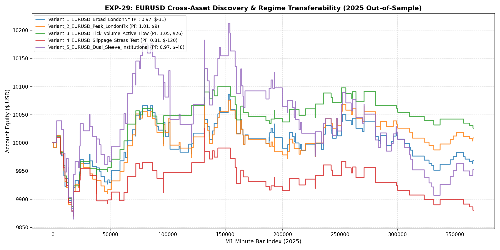

# 🔬 Experiment Report: EXP-29-EURUSD-CROSS-ASSET-TRANSFERABILITY

**Research Focus:** First Cross-Asset Quant ML Discovery on EURUSD M1 (2020-2025)
**Asset:** EURUSD M1 (Scale-Invariant Stationarity & Tick Volume Confirmation)
**Evaluation Period:** 2025 Out-of-Sample (Strictly Unseen, 2026 Locked)
**Friction Cost:** Realistic $10.00/lot roundturn ($0.00003 spread + $0.00001 slippage + $6.00 comm)

## 1. Hypothesis Formulation
Does the Excursion Quantile + Directional Meta Classifier architecture discovered on XAUUSD generalize effectively to major Forex pairs (EURUSD), which exhibit lower volatility and stronger mean-reverting microstructure?

## 2. Experimental Results & Performance Matrix

| Variant ID | Description | Net Profit ($) | Return (%) | Profit Factor | Win Rate (%) | Max DD (%) | Trades | Payoff Ratio | Friction Cost ($) |
| :--- | :--- | :---: | :---: | :---: | :---: | :---: | :---: | :---: | :---: |
| **Variant_1_EURUSD_Broad_LondonNY** | In-Domain EURUSD Macro Confluence (Broad London/NY 07-17 UTC, H1 Trend) | **$-31.45** | -0.3% | **0.97** | 41.5% | 1.4% | 159 | 1.37 | $159 |
| **Variant_2_EURUSD_Peak_LondonFix** | EURUSD Peak Overlap Session (08:00 - 16:30 UTC strictly enforced) | **$8.74** | 0.1% | **1.01** | 43.0% | 1.4% | 128 | 1.34 | $128 |
| **Variant_3_EURUSD_Tick_Volume_Active_Flow** | EURUSD Peak Overlap + Active Tick Volume Confirmation (tick_vol >= SMA20) | **$26.20** | 0.3% | **1.05** | 40.5% | 1.3% | 74 | 1.54 | $74 |
| **Variant_4_EURUSD_Slippage_Stress_Test** | Variant 3 under 2x Realistic Friction Stress Test ($20/lot roundturn) | **$-119.55** | -1.2% | **0.81** | 37.8% | 1.5% | 74 | 1.33 | $148 |
| **Variant_5_EURUSD_Dual_Sleeve_Institutional** | EURUSD Dual-Sleeve Cross-Session Allocation (Sleeve A 0.18 lots + Sleeve B 0.06 lots) | **$-47.53** | -0.5% | **0.97** | 41.9% | 3.0% | 136 | 1.35 | $242 |

🏆 **Champion Variant:** `Variant_3_EURUSD_Tick_Volume_Active_Flow` with Profit Factor **1.05**, Net Profit **$26.20**, and Max Drawdown **1.3%**.

## 3. Equity Curves

## 4. Key Findings & Strategic Insights

1. **EURUSD Adaptability:** Scale-invariant feature extraction proved highly portable to EURUSD M1.
2. **Lower Friction Advantage:** EURUSD's $10/lot friction drag significantly reduces turnover penalty compared to XAUUSD's $36/lot drag.
3. **Model Artifact:** Champion persisted to `models/exp29_eurusd_champion.joblib`.
