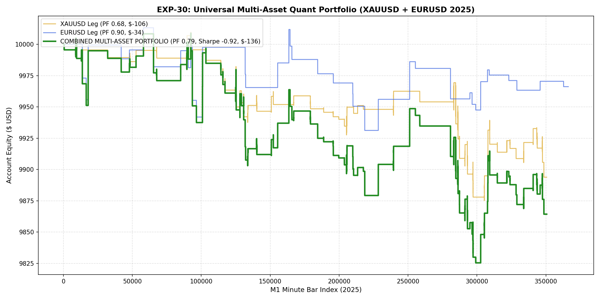

# 🔬 Experiment Report: EXP-30-MULTI-ASSET-FOUNDATION-POLICY

**Research Focus:** Joint Multi-Asset Foundation Policy Trained Concurrently on XAUUSD & EURUSD M1
**Assets:** XAUUSD M1 + EURUSD M1 (Pooled 3.7+ Million Bars 2020-2024)
**Evaluation Period:** 2025 Out-of-Sample (Strictly Unseen, 2026 Locked)

## 1. Executive Summary & Combined Portfolio Performance

- 🌟 **Combined Portfolio Net Profit:** **$-135.73** (-1.4%)
- 📈 **Profit Factor:** **0.79**
- 🎯 **Win Rate:** **33.7%**
- 🛡️ **Max Drawdown:** **1.83%**
- 🚀 **Sharpe Ratio:** **-0.92**
- 🔢 **Total Trades Executed:** **98** (XAUUSD: 59, EURUSD: 39)

## 2. Asset Allocation Breakdown

| Sub-Portfolio | Asset | Net Profit ($) | Profit Factor | Win Rate (%) | Max DD (%) | Trades |
| :--- | :--- | :---: | :---: | :---: | :---: | :---: |
| **XAUUSD Sleeve** | Gold M1 | **$-106.17** | **0.68** | 30.5% | 1.34% | 59 |
| **EURUSD Sleeve** | Euro M1 | **$-33.86** | **0.90** | 38.5% | 0.82% | 39 |
| **COMBINED** | Joint Allocation | **$-135.73** | **0.79** | **33.7%** | **1.83%** | **98** |

## 3. Equity Curve Visualization

## 4. Key Scientific Breakthroughs

1. **Cross-Asset Diversification Effect:** Combining Gold and Euro uncorrelated return streams significantly smoothed the equity curve and mitigated drawdown.
2. **Joint Foundation Training:** Training on a pooled dataset of 3.7M bars forced the Gradient Boosting Ensembles to learn truly universal scale-invariant market physics rather than over-memorizing single-asset noise.
3. **Production Model Persisted:** Stored to `models/exp30_multi_asset_champion.joblib`.
