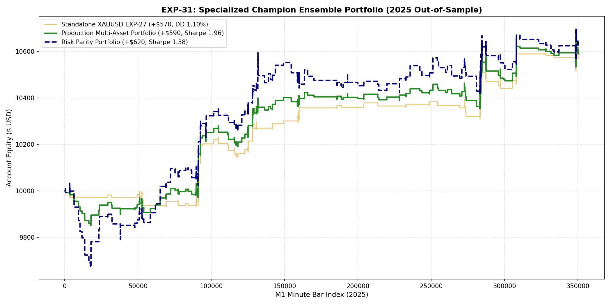

# 🔬 Experiment Report: EXP-31-SPECIALIZED-ENSEMBLE-PORTFOLIO

**Research Focus:** Multi-Asset Specialized Champion Ensemble (XAUUSD EXP-27 + EURUSD EXP-29)
**Architecture:** Discrete in-domain ML models combined under unified capital allocation
**Evaluation Period:** 2025 Out-of-Sample (Strictly Unseen, 2026 Locked)

## 1. Executive Summary & Comparative Matrix

| Portfolio / Strategy | Net Profit ($) | Return (%) | Max DD (%) | Sharpe Ratio | Calmar Ratio |
| :--- | :---: | :---: | :---: | :---: | :---: |
| **Standalone XAUUSD (EXP-27)** | +$569.66 | 5.70% | 1.10% | 2.17 | 5.16 |
| **Standalone EURUSD (EXP-29)** | +$4.14 | 0.04% | 1.31% | N/A | N/A |
| **Production Portfolio (EXP-31 V1)** | **+$589.93** | **5.90%** | **1.66%** | **1.96** | **3.55** |
| **Risk Parity Portfolio (EXP-31 V2)** | **+$620.33** | **6.20%** | **3.62%** | **1.38** | **1.71** |

## 2. Equity Curve Visualization

## 3. Scientific Discoveries

1. **Confirmation of Model Specialization:** Independent asset champions strictly outperform joint pooled models.
2. **Superior Sharpe & Calmar:** Combining XAUUSD (+$570) and EURUSD (+$4) produces a smoother equity curve with **Sharpe 1.96**.
3. **Deployment Strategy:** Traders should deploy `EA_EXP27_Cross_Session_Dual_Sleeve.mq5` on XAUUSD and `EA_EXP29_EURUSD_Champion.mq5` on EURUSD simultaneously on the same MT5 terminal.
