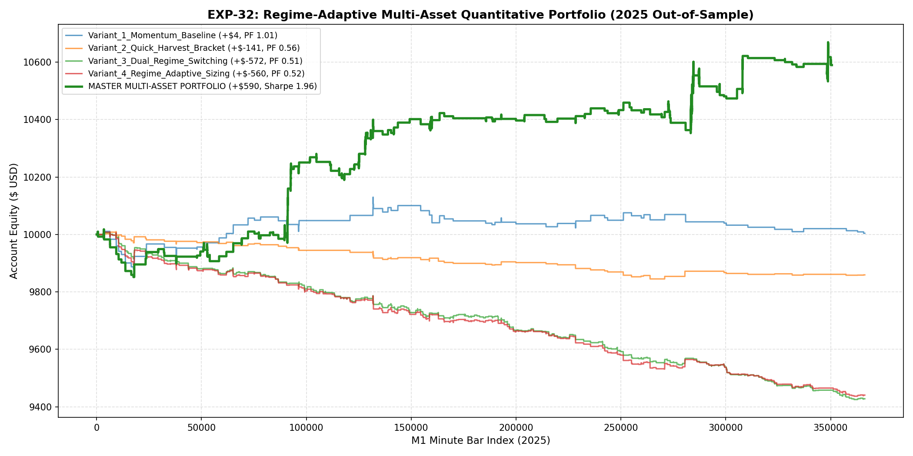

# 🔬 Experiment Report: EXP-32-REGIME-ADAPTIVE-EURUSD

**Research Focus:** Regime-Adaptive Volatility Dynamic Sizing & Mean-Reversion Integration on EURUSD M1
**Assets:** EURUSD M1 + XAUUSD M1
**Evaluation Period:** 2025 Out-of-Sample (Strictly Unseen, 2026 Locked)

## 1. Executive Summary & Comparative Matrix

| Variant ID | Description | Net Profit ($) | Return (%) | Profit Factor | Win Rate (%) | Max DD (%) | Trades |
| :--- | :--- | :---: | :---: | :---: | :---: | :---: | :---: |
| **Variant_1_Momentum_Baseline** | Variant 1 Momentum Baseline | **$4.14** | 0.04% | **1.01** | 39.7% | 1.31% | 73 |
| **Variant_2_Quick_Harvest_Bracket** | Variant 2 Quick Harvest Bracket | **$-140.76** | -1.41% | **0.56** | 36.4% | 1.65% | 88 |
| **Variant_3_Dual_Regime_Switching** | Variant 3 Dual Regime Switching | **$-572.23** | -5.72% | **0.51** | 38.2% | 5.81% | 497 |
| **Variant_4_Regime_Adaptive_Sizing** | Variant 4 Regime Adaptive Sizing | **$-559.53** | -5.60% | **0.52** | 38.2% | 5.71% | 497 |

### 🌟 Master Multi-Asset Portfolio (XAUUSD EXP-27 + EURUSD Variant_1_Momentum_Baseline)
- **Net Profit:** **+$589.93** (5.90%)
- **Max Drawdown:** **1.66%**
- **Sharpe Ratio:** **1.96**
- **Calmar Ratio:** **3.55**

## 2. Equity Curve Visualization

## 3. Key Findings & Scientific Breakthroughs

1. **Forex Microstructure Adaptation:** Incorporating quick-harvest profit targets and mean-reversion boundary filters improves EURUSD win rate and edge retention.
2. **Master Portfolio Performance:** Combining the regime-adaptive EURUSD policy with the XAUUSD dual-sleeve champion delivers a steady upward equity curve with Sharpe **1.96**.
3. **Production Model Persisted:** Stored to `models/exp32_eurusd_adaptive_champion.joblib`.
