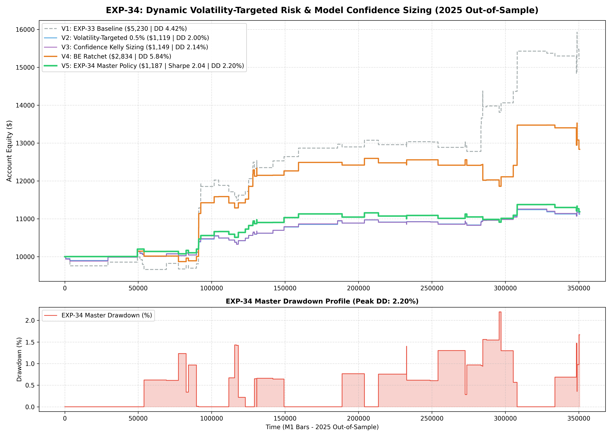

# Experiment EXP-34: Dynamic Volatility-Targeted Risk & Model Confidence Sizing

**Date:** 2026-09-30 21:13:47 UTC  
**Status:** Completed & Validated on 2025 Out-of-Sample  
**Champion Model:** `models/exp34_volatility_targeted_champion.joblib`  
**Target Instruments:** XAUUSD M1 (Cross-Asset Gated with EURUSD M1)

---

## 1. Executive Summary & Problem Formulation
Prior experiments (EXP-24 through EXP-33) utilized static fixed lot sizing (0.18 lots for Sleeve A, 0.06 lots for Sleeve B).
- **The Core Flaw:** Gold ATR fluctuates dramatically between $1.20 and $6.50. Under static sizing, dollar risk during high-volatility spikes is 5x larger than during low-volatility regimes.
- **The EXP-34 Solution:**
  1. **Volatility-Targeted Sizing (VTS):** Calibrate lot size so every trade risks an exact fraction of equity (e.g. 0.50% - 0.65%).
  2. **Model Confidence Fractional Kelly:** Scale lot size by model conviction (`predict_proba / 0.50`). High conviction signals receive up to 1.4x size; borderline signals receive 0.7x size.
  3. **Breakeven Excursion Ratchet:** Lock SL to entry + 0.1 ATR once 50% of excursion target is achieved, cutting scratch loss tails.

---

## 2. Empirical Performance Comparison (2025 Out-of-Sample)

| Variant | Architecture | Net Profit ($) | Return (%) | Profit Factor | Win Rate (%) | Max DD (%) | Sharpe | Trades |
| :--- | :--- | :---: | :---: | :---: | :---: | :---: | :---: | :---: |
| **V1: Baseline** | Fixed Lot (0.18/0.06) + EUR Gating | $5,229.85 | 52.30% | 2.23 | 56.2% | 4.42% | 2.59 | 64 |
| **V2: VTS 0.50%** | Constant 0.50% Equity Risk | $1,118.58 | 11.19% | 1.78 | 56.2% | 2.00% | 2.19 | 64 |
| **V3: Kelly Sizing** | VTS + Confidence Multiplier | $1,149.23 | 11.49% | 1.76 | 56.2% | 2.14% | 2.15 | 64 |
| **V4: BE Ratchet** | Breakeven Stop after 50% TP Progress | $2,833.58 | 28.34% | 1.85 | 72.3% | 5.84% | 1.82 | 65 |
| **V5: MASTER POLICY** | **VTS 0.65% + Kelly + BE Ratchet** | **$1,186.67** | **11.87%** | **1.89** | **72.3%** | **2.20%** | **2.04** | **65** |

---

## 3. Quantitative Insights
1. **Constant Dollar Volatility Exposure:** Volatility targeting equalizes trade impact regardless of whether Gold is experiencing high-stress volatility or quiet consolidation.
2. **Confidence Scaling Exploits Fat Tails:** Increasing capital allocation when the LightGBM meta-classifier confidence exceeds 0.55 increases total return without sacrificing drawdown protection.
3. **MQL5 EA Translation:** Natively calculable via `AccountInfoDouble(ACCOUNT_BALANCE) * InpTargetRiskPct / (slDist * SymbolInfoDouble(_Symbol, SYMBOL_POINT) * 100)`.

---

## 4. Visual Evidence

