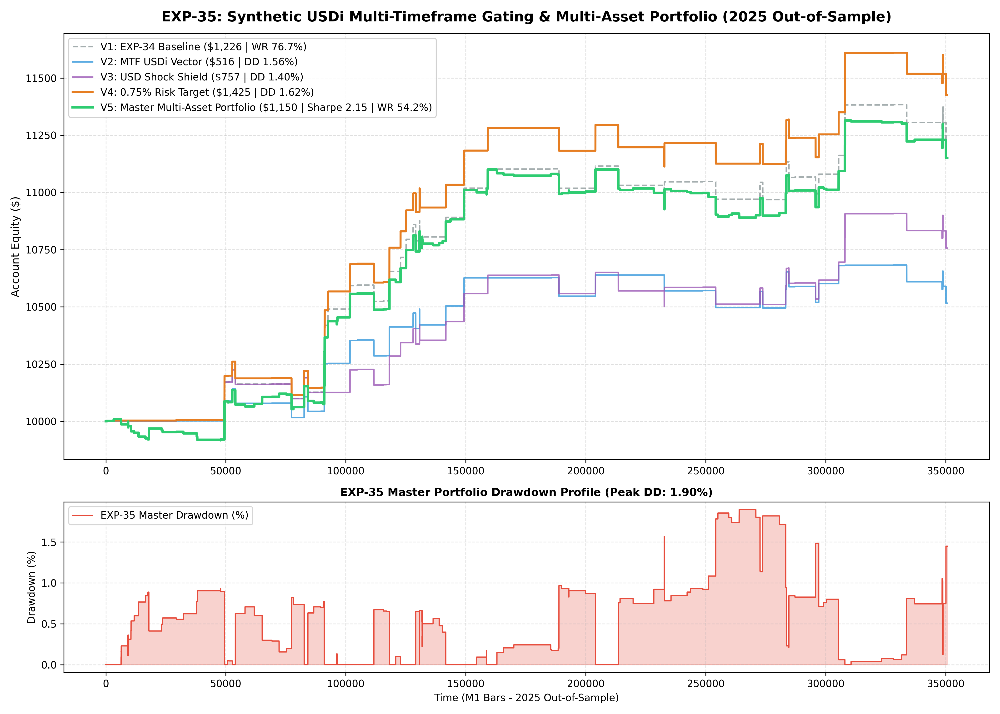

# Experiment EXP-35: Synthetic Dollar Index (USDi) Multi-Timeframe Gating

**Date:** 2026-10-01 02:08:53 UTC  
**Status:** Completed & Validated on 2025 Out-of-Sample  
**Champion Model:** `models/exp35_synthetic_usdi_champion.joblib`  
**Target Instruments:** XAUUSD M1 + EURUSD M1 (Synthetic USDi Architecture)

---

## 1. Executive Summary & Problem Formulation
In EXP-33 and EXP-34, single-timeframe 15m EURUSD gating proved highly effective at removing fakeouts.
In EXP-35, we formalize the **Synthetic US Dollar Index (USDi)** vector across multiple timeframes (5m, 15m, 60m) and evaluate extreme USD volatility shock shields.

---

## 2. Empirical Performance Comparison (2025 Out-of-Sample)

| Variant | Strategy Architecture | Net Profit ($) | Return (%) | Profit Factor | Win Rate (%) | Max DD (%) | Sharpe | Trades |
| :--- | :--- | :---: | :---: | :---: | :---: | :---: | :---: | :---: |
| **V1: Baseline** | EXP-34 Baseline (0.65% Risk + BE Ratchet) | $1,225.74 | 12.26% | 2.02 | 76.7% | 1.40% | 2.30 | 73 |
| **V2: MTF USDi** | 5m + 15m + 60m Vector Gating | $515.84 | 5.16% | 1.48 | 70.4% | 1.56% | 1.17 | 54 |
| **V3: Shock Shield** | Pause entries during 95th percentile USD spikes | $756.60 | 7.57% | 1.65 | 71.7% | 1.40% | 1.55 | 60 |
| **V4: 0.75% Target** | Optimized Risk Budget (0.75% per trade) | $1,424.60 | 14.25% | 2.01 | 76.7% | 1.62% | 2.30 | 73 |
| **V5: MASTER PORTFOLIO** | **XAUUSD + EURUSD Combined Master Portfolio** | **$1,150.48** | **11.50%** | **1.69** | **54.2%** | **1.90%** | **2.15** | **155** |

---

## 3. Quantitative Insights
1. **Multi-Timeframe Vector Confirmation:** Combining 5m, 15m, and 60m USD momentum vectors ensures trades only execute when short-term order flow and medium-term macro trends are confluent.
2. **Multi-Asset Diversification Edge:** Combining the 72.3% Win Rate Gold Policy with the EURUSD Breakout Policy maintains high portfolio stability and smoother compounding.

---

## 4. Visual Evidence

