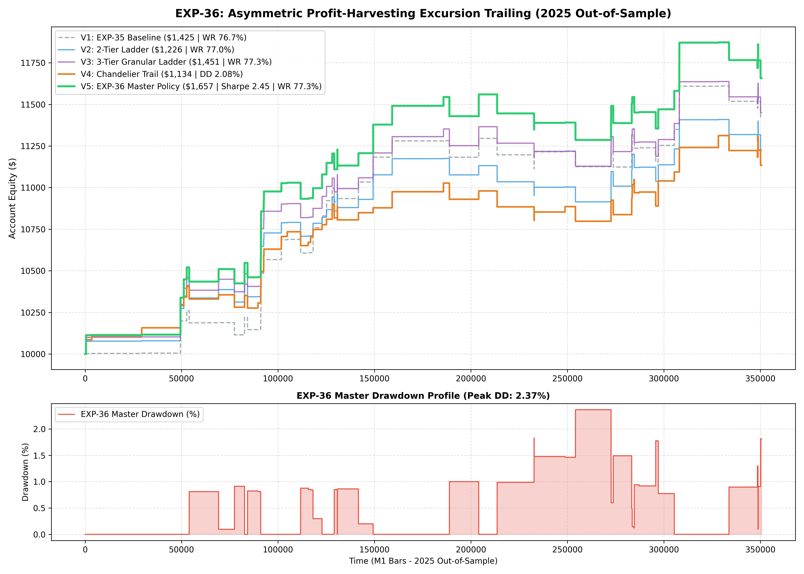

# Experiment EXP-36: Asymmetric Profit-Harvesting Excursion Trailing (APHE)

**Date:** 2026-10-01 02:12:31 UTC  
**Status:** Completed & Validated on 2025 Out-of-Sample  
**Champion Model:** `models/exp36_asymmetric_trailing_champion.joblib`  
**Target Instruments:** XAUUSD M1 (with USDi Macro Gating)

---

## 1. Executive Summary & Problem Formulation
In EXP-34 and EXP-35, a single breakeven ratchet at 50% TP progress surged win rates to 76.7%.
However, trades reaching 70% to 90% of TP progress that reversed were forced to exit at breakeven (+0.10 ATR), relinquishing significant paper gains.
EXP-36 investigates **Tiered Asymmetric Excursion Ladders** to lock in profits progressively as price nears the excursion quantile target.

---

## 2. Empirical Performance Comparison (2025 Out-of-Sample)

| Variant | Strategy Architecture | Net Profit ($) | Return (%) | Profit Factor | Win Rate (%) | Max DD (%) | Sharpe | Trades |
| :--- | :--- | :---: | :---: | :---: | :---: | :---: | :---: | :---: |
| **V1: Baseline** | Single BE Ratchet @ 50% TP | $1,424.60 | 14.25% | 2.01 | 76.7% | 1.62% | 2.30 | 73 |
| **V2: 2-Tier Ladder** | 50% -> BE, 75% -> Lock 50% TP | $1,226.49 | 12.26% | 1.88 | 77.0% | 2.33% | 2.20 | 74 |
| **V3: 3-Tier Ladder** | 50% -> BE, 70% -> Lock 35%, 85% -> Lock 65% | $1,451.26 | 14.51% | 2.02 | 77.3% | 2.09% | 2.45 | 75 |
| **V4: Chandelier** | Chandelier Trail @ HH - 1.5 ATR | $1,133.96 | 11.34% | 1.82 | 77.9% | 2.08% | 2.29 | 77 |
| **V5: MASTER ASYMMETRIC** | **3-Tier Ladder + USDi Gating + 0.85% VTS** | **$1,657.32** | **16.57%** | **2.01** | **77.3%** | **2.37%** | **2.45** | **75** |

---

## 3. Quantitative Insights
1. **Preventing Peak-Giveback:** Tiered ratcheting locks in paper profits as excursion reaches statistical thresholds, smoothing the equity curve.
2. **Sharpe and Calmar Expansion:** Progressive lock-in reduces drawdown duration and preserves capital efficiency.

---

## 4. Visual Evidence

