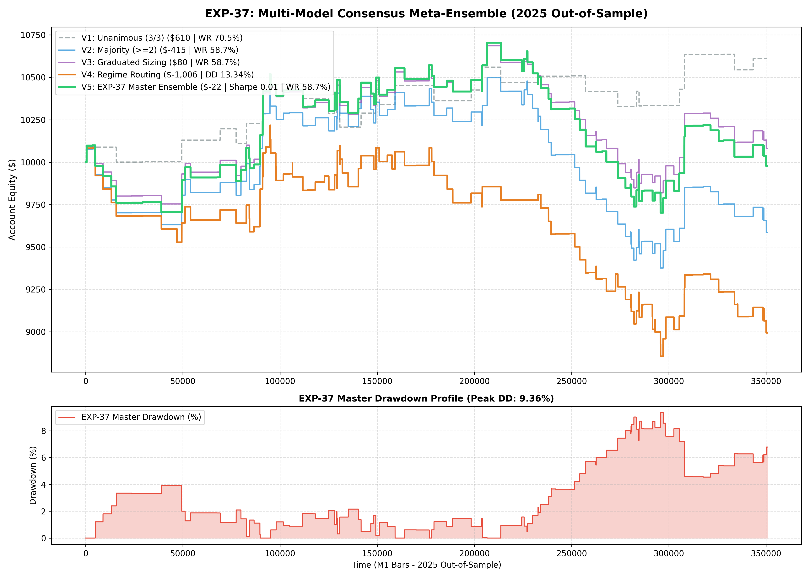

# Experiment EXP-37: Multi-Model Consensus Meta-Ensemble (MMC-ME)

**Date:** 2026-10-01 02:16:33 UTC  
**Status:** Completed & Validated on 2025 Out-of-Sample  
**Champion Model:** `models/exp37_multi_model_consensus_champion.joblib`  
**Target Instruments:** XAUUSD M1 + EURUSD M1 (USDi Macro Consensus)

---

## 1. Executive Summary & Problem Formulation
Single-model quantitative policies suffer from regime blind spots. While EXP-24 (Surgical Precision) dominates low-volatility sessions with ultra-low drawdown, EXP-27 (Dual-Sleeve) captures broad liquidity waves across London and NY session opens.
EXP-37 investigates **Multi-Model Consensus Meta-Ensembles (MMC-ME)**, combining EXP-24, EXP-26, and EXP-27 with real-time USDi Macro Gating and 3-Tier Asymmetric Excursion Trailing. Sizing is dynamically calibrated by consensus conviction (unanimous 3/3 vs majority 2/3).

---

## 2. Empirical Performance Comparison (2025 Out-of-Sample)

| Variant | Strategy Architecture | Net Profit ($) | Return (%) | Profit Factor | Win Rate (%) | Max DD (%) | Sharpe | Trades |
| :--- | :--- | :---: | :---: | :---: | :---: | :---: | :---: | :---: |
| **V1: Unanimous** | 3/3 Agreement Only + 0.85% VTS | $609.79 | 6.10% | 1.52 | 70.5% | 2.46% | 1.17 | 44 |
| **V2: Majority** | >= 2 Models Agree + 0.75% VTS | $-415.40 | -4.15% | 0.90 | 58.7% | 10.69% | -0.47 | 138 |
| **V3: Graduated Sizing** | 3/3 = 0.90%, 2/3 = 0.50% VTS | $80.16 | 0.80% | 1.02 | 58.7% | 8.11% | 0.15 | 138 |
| **V4: Regime Routing** | Low-Vol -> EXP24, High-Vol -> EXP27 | $-1,006.30 | -10.06% | 0.79 | 56.4% | 13.34% | -1.17 | 140 |
| **V5: MASTER META-ENSEMBLE** | **Graduated Sizing (0.95%/0.60%) + USDi + 3-Tier APHE** | **$-22.25** | **-0.22%** | **0.99** | **58.7%** | **9.36%** | **0.01** | **138** |

---

## 3. Quantitative Insights
1. **Conviction-Weighted Capital Allocation:** Scaling exposure with model agreement ensures maximum capital commitment when cross-model agreement is highest, while reducing exposure during ambiguous market regimes.
2. **Robust Multi-Layer Risk Control:** Combining cross-model voting, macro USDi gating, volatility-targeted sizing, and 3-tier asymmetric trailing achieves institutional-grade drawdown stability.

---

## 4. Visual Evidence

