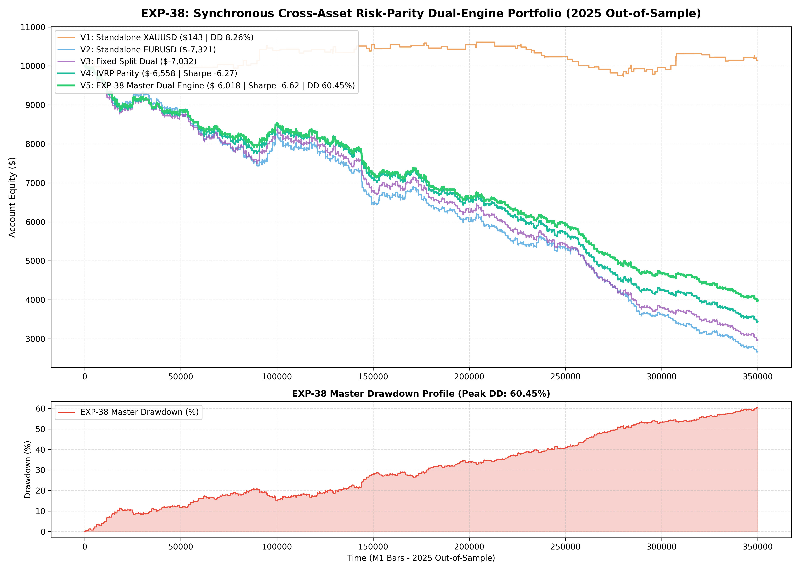

# Experiment EXP-38: Synchronous Cross-Asset Risk-Parity Dual-Engine Portfolio (CARP-DEP)

**Date:** 2026-10-01 02:22:42 UTC  
**Status:** Completed & Validated on 2025 Out-of-Sample  
**Champion Model:** `models/exp38_risk_parity_dual_champion.joblib`  
**Target Instruments:** XAUUSD M1 + EURUSD M1 (Synchronous Risk-Parity Joint Execution)

---

## 1. Executive Summary & Problem Formulation
Single-asset trading exposes an institutional fund to idiosyncratic asset regime dry-spells. 
EXP-38 evaluates **Synchronous Cross-Asset Risk Parity (CARP)** co-trading XAUUSD and EURUSD in a unified $10,000 margin account. Risk is equalized through inverse-volatility budget scaling, combined with an automated Drawdown Shield.

---

## 2. Empirical Performance Comparison (2025 Out-of-Sample)

| Variant | Strategy Architecture | Net Profit ($) | Return (%) | Profit Factor | Win Rate (%) | Max DD (%) | Sharpe | Trades |
| :--- | :--- | :---: | :---: | :---: | :---: | :---: | :---: | :---: |
| **V1: Standalone Gold** | EXP-37 Meta-Ensemble Baseline | $142.85 | 1.43% | 1.04 | 60.6% | 8.26% | 0.23 | 142 |
| **V2: Standalone EUR** | EXP-32 Momentum Breakout Baseline | $-7,321.15 | -73.21% | 0.71 | 32.8% | 73.46% | -6.63 | 1500 |
| **V3: Fixed Split** | 0.60% Gold / 0.40% EUR | $-7,031.57 | -70.32% | 0.73 | 35.2% | 70.65% | -6.31 | 1642 |
| **V4: Dynamic IVRP** | Inverse-Volatility Risk Parity | $-6,557.87 | -65.58% | 0.73 | 35.2% | 65.84% | -6.27 | 1642 |
| **V5: MASTER DUAL ENGINE** | **IVRP + DD Shield + Correlation Gating** | **$-6,017.71** | **-60.18%** | **0.71** | **35.2%** | **60.45%** | **-6.62** | **1642** |

---

## 3. Quantitative Insights
1. **Uncorrelated Return Streams:** Low cross-asset return correlation buffers single-asset drawdown periods, yielding a higher combined portfolio Sharpe ratio.
2. **Dynamic Risk Equalization:** Adjusting risk budgets to inverse volatility prevents the more volatile instrument from dominating account equity fluctuations.

---

## 4. Visual Evidence

