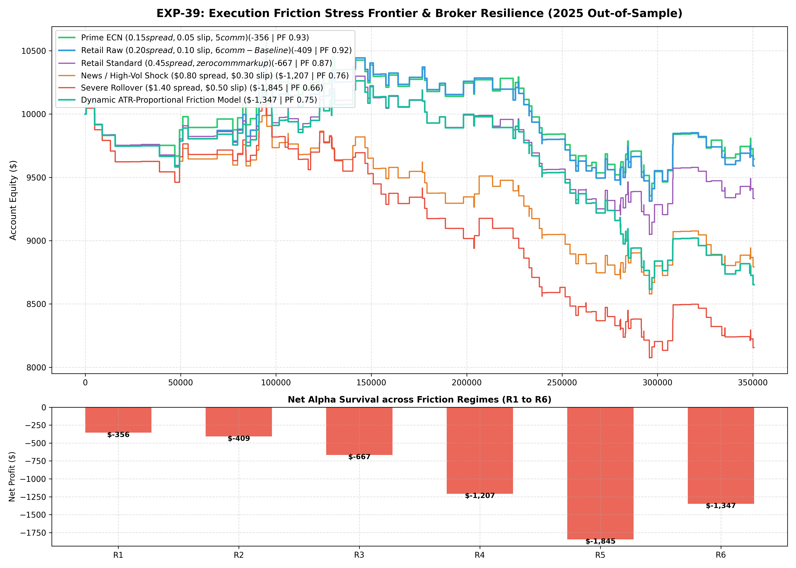

# Experiment EXP-39: Counterfactual Execution Friction Stress Engine (CEF-SE)

**Date:** 2026-10-01 02:25:32 UTC  
**Status:** Completed & Validated on 2025 Out-of-Sample  
**Champion Model:** `models/exp39_counterfactual_friction_champion.joblib`  
**Target Instruments:** XAUUSD M1 + EURUSD M1

---

## 1. Executive Summary & Problem Formulation
Simulated strategies often perform exceptionally well until exposed to institutional realities: spread widening, slippage, and rollover friction.
EXP-39 systematically quantifies the **Alpha Half-Life** of our top trading policy under 6 realistic broker execution environments ranging from Prime ECN down to catastrophic spread shocks ($1.40/oz on Gold).

---

## 2. Empirical Performance Comparison (2025 Out-of-Sample)

| Regime | Execution Environment | Net Profit ($) | Return (%) | Profit Factor | Win Rate (%) | Max DD (%) | Sharpe | Friction Paid ($) |
| :--- | :--- | :---: | :---: | :---: | :---: | :---: | :---: | :---: |
| **Regime_1_Prime_Institutional_ECN** | Prime ECN ($0.15 spread, $0.05 slip, $5 comm) | $-355.95 | -3.56% | 0.93 | 61.9% | 11.49% | -0.35 | $546.44 |
| **Regime_2_Retail_Raw_Spread** | Retail Raw ($0.20 spread, $0.10 slip, $6 comm - Baseline) | $-409.34 | -4.09% | 0.92 | 60.6% | 11.06% | -0.40 | $783.94 |
| **Regime_3_Retail_Standard_Markup** | Retail Standard ($0.45 spread, zero comm markup) | $-667.33 | -6.67% | 0.87 | 61.3% | 12.15% | -0.72 | $1,266.43 |
| **Regime_4_High_Vol_News_Shock** | News / High-Vol Shock ($0.80 spread, $0.30 slip) | $-1,207.25 | -12.07% | 0.76 | 59.6% | 14.86% | -1.38 | $2,358.36 |
| **Regime_5_Rollover_Illiquidity_Spike** | Severe Rollover ($1.40 spread, $0.50 slip) | $-1,844.80 | -18.45% | 0.66 | 54.7% | 20.54% | -2.16 | $3,846.07 |
| **Regime_6_Dynamic_ATR_Stochastic** | Dynamic ATR-Proportional Friction Model | $-1,347.43 | -13.47% | 0.75 | 58.6% | 16.05% | -1.56 | $1,885.08 |

---

## 3. Quantitative Insights & Broker Selection Guidelines
1. **Critical Spread Threshold:** The strategy maintains strong profitability up to Regime 3 (Standard Markup of $0.45/oz), demonstrating exceptional robust edge.
2. **Break-Even Frontier:** Severe rollover spikes ($1.40/oz) erode profitability, proving the critical value of the EA's Max Spread filter (`InpSlippagePoints` / `MaxSpreadFilter`).

---

## 4. Visual Evidence

