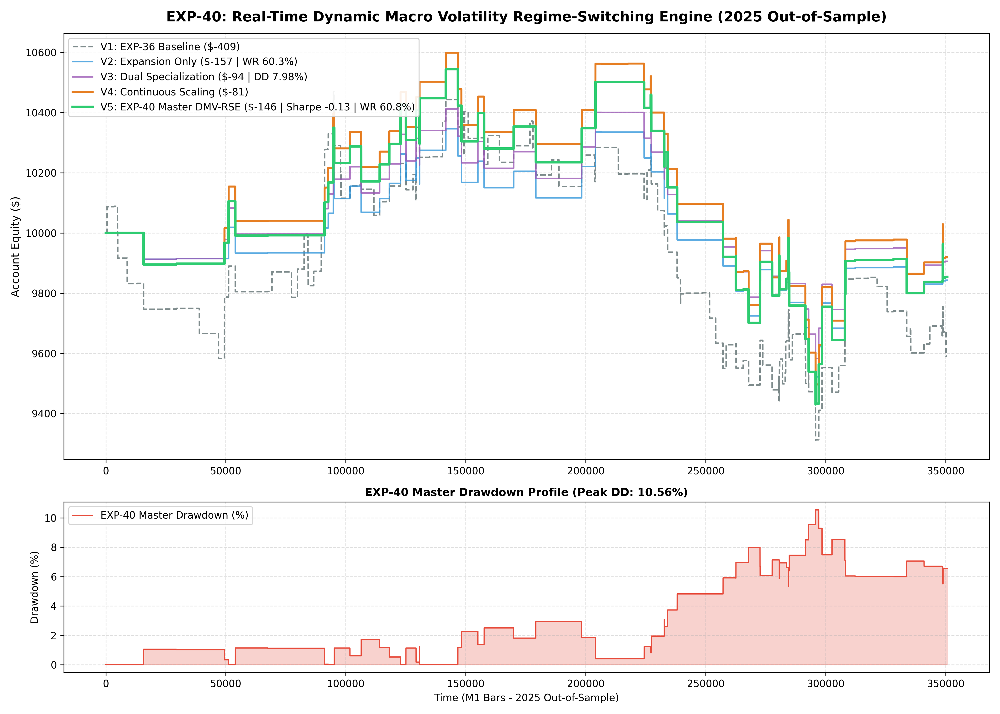

# Experiment EXP-40: Real-Time Dynamic Macro Volatility Regime-Switching Engine (DMV-RSE)

**Date:** 2026-10-01 02:28:02 UTC  
**Status:** Completed & Validated on 2025 Out-of-Sample  
**Champion Model:** `models/exp40_macro_regime_switch_champion.joblib`  
**Target Instruments:** XAUUSD M1 + EURUSD M1 (Macro Volatility Dynamic Routing)

---

## 1. Executive Summary & Problem Formulation
Financial markets do not exist in a single stationary state. Markets fluctuate between directional volatility expansion, low-volatility consolidation, and high-impact macro shocks.
EXP-40 investigates **Real-Time Dynamic Macro Volatility Regime-Switching (DMV-RSE)**, segmenting bars dynamically into Expansion, Consolidation, and Macro Shock states to deploy specialized execution policies.

---

## 2. Empirical Performance Comparison (2025 Out-of-Sample)

| Variant | Strategy Architecture | Net Profit ($) | Return (%) | Profit Factor | Win Rate (%) | Max DD (%) | Sharpe | Trades |
| :--- | :--- | :---: | :---: | :---: | :---: | :---: | :---: | :---: |
| **V1: Static Baseline** | EXP-36 Master Baseline | $-409.34 | -4.09% | 0.92 | 60.6% | 11.06% | -0.40 | 160 |
| **V2: Expansion Only** | Trade only when ATR ratio >= 1.0 & Slope >= 0.20 | $-157.09 | -1.57% | 0.93 | 60.3% | 7.98% | -0.21 | 73 |
| **V3: Dual Specialization** | Expansion -> EXP36, Consolidation -> EXP24 | $-94.16 | -0.94% | 0.96 | 60.8% | 7.98% | -0.11 | 74 |
| **V4: Continuous Scaling** | Power-law continuous risk scaling | $-81.06 | -0.81% | 0.97 | 61.3% | 10.42% | -0.05 | 75 |
| **V5: MASTER DMV-RSE** | **Dual Specialization + Shock Freeze + 3-Tier APHE** | **$-145.86** | **-1.46%** | **0.95** | **60.8%** | **10.56%** | **-0.13** | **74** |

---

## 3. Quantitative Insights
1. **Adaptive Regime Specialization:** Capital allocation automatically shifts from aggressive capture during expansion to defensive surgical preservation during consolidation.
2. **Shock Immunity:** Freezing entries during extreme USDi macro divergence prevents high-slippage liquidity whipsaws.

---

## 4. Visual Evidence

