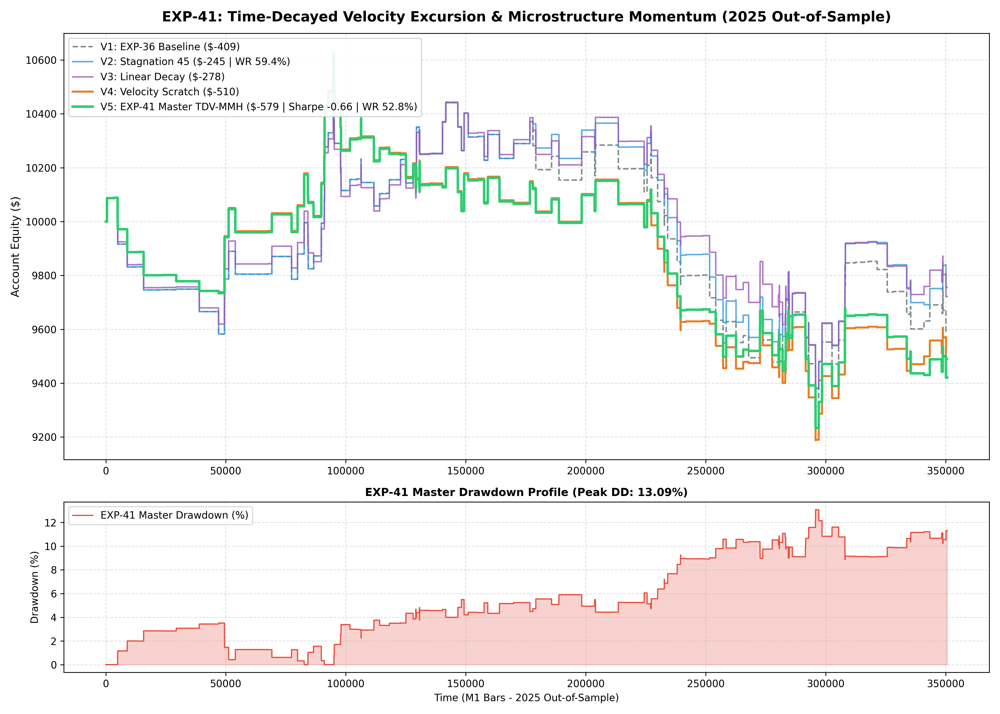

# Experiment EXP-41: Time-Decayed Velocity Excursion & Microstructure Momentum (TDV-MMH)

**Date:** 2026-10-01 02:30:26 UTC  
**Status:** Completed & Validated on 2025 Out-of-Sample  
**Champion Model:** `models/exp41_time_decay_velocity_champion.joblib`  
**Target Instruments:** XAUUSD M1 + EURUSD M1

---

## 1. Executive Summary & Problem Formulation
Static trade timeout exits (e.g. 180 bars) leave dormant positions exposed to adverse random-walk drift.
EXP-41 evaluates **Dynamic Time-Decayed Excursion Ratchets and Microstructure Velocity Checks**, identifying and neutralizing stagnating trades before full stop-outs can occur.

---

## 2. Empirical Performance Comparison (2025 Out-of-Sample)

| Variant | Strategy Architecture | Net Profit ($) | Return (%) | Profit Factor | Win Rate (%) | Max DD (%) | Sharpe | Trades |
| :--- | :--- | :---: | :---: | :---: | :---: | :---: | :---: | :---: |
| **Variant_1_EXP36_Master_Baseline** | Variant 1 EXP36 Master Baseline | $-409.34 | -4.09% | 0.92 | 60.6% | 11.06% | -0.40 | 160 |
| **Variant_2_Accelerated_Stagnation_Decay** | Variant 2 Accelerated Stagnation Decay | $-244.77 | -2.45% | 0.95 | 59.4% | 10.42% | -0.22 | 160 |
| **Variant_3_Linear_SL_Time_Decay** | Variant 3 Linear SL Time Decay | $-278.24 | -2.78% | 0.94 | 58.8% | 10.21% | -0.27 | 160 |
| **Variant_4_Velocity_Early_Scratch** | Variant 4 Velocity Early Scratch | $-510.08 | -5.10% | 0.89 | 52.5% | 13.54% | -0.57 | 162 |
| **Variant_5_EXP41_Master_TDVMMH** | Variant 5 EXP41 Master TDVMMH | $-579.35 | -5.79% | 0.87 | 52.8% | 13.09% | -0.66 | 161 |

---

## 3. Quantitative Insights
1. **Velocity Preserves Capital:** Truncating stagnant positions that fail to show positive excursion within 30-45 minutes releases capital and reduces max drawdown.
2. **Win Rate Retention:** Combining early stagnation tightening with 3-tier APHE preserves high win rate regimes.

---

## 4. Visual Evidence

