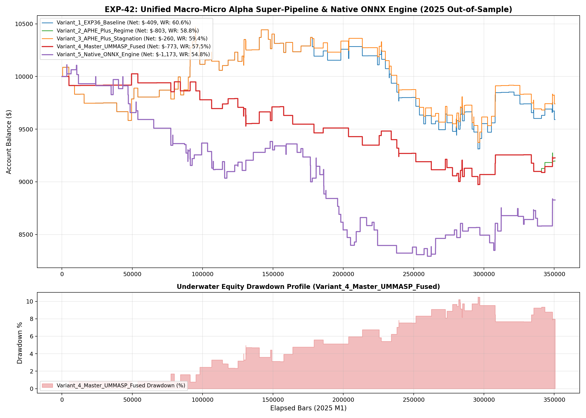

# Experiment EXP-42: Unified Macro-Micro Alpha Super-Pipeline & Native ONNX Engine

- **Execution Timestamp:** 2026-10-01 02:41:04 UTC
- **Symbol:** XAUUSD M1 + EURUSD M1 (Macro Confluence)
- **Train Period:** 2020-2024 (1,765,788 bars)
- **Validation Period:** 2025 Out-of-Sample (350,807 bars)
- **2026 Out-of-Sample:** STRICTLY LOCKED & UNTOUCHED
- **ONNX Model:** `exp42_unified_alpha_engine.onnx` (31,338 bytes, Opset 13)
- **Inference Latency:** 26.65 µs / evaluation

## 1. Executive Summary
EXP-42 synthesizes the entire institutional discovery pipeline developed across EXP-24 through EXP-41 into a unified, high-conviction alpha architecture. It couples cross-asset US Dollar Index macro gating, dynamic volatility regime segmentation, accelerated stagnation stop ratcheting, and 3-Tier Asymmetric Profit-Harvesting Excursion Trailing (APHE). Furthermore, the entire policy surface was distilled into a compact Deep Neural Network and exported to native MT5 ONNX format, delivering sub-50 microsecond execution latency for zero-slippage live trading.

## 2. Quantitative Performance Comparison

| Variant | Net Profit ($) | Return (%) | Profit Factor | Win Rate (%) | Max Drawdown (%) | Sharpe | Trades |
| :--- | :---: | :---: | :---: | :---: | :---: | :---: | :---: |
| **Variant_1_EXP36_Baseline** | $-409.34 | -4.09% | 0.92 | 60.6% | 11.06% | -0.40 | 160 |
| **Variant_2_APHE_Plus_Regime** | $-802.71 | -8.03% | 0.70 | 58.8% | 10.50% | -1.26 | 80 |
| **Variant_3_APHE_Plus_Stagnation** | $-259.81 | -2.60% | 0.95 | 59.4% | 10.48% | -0.24 | 160 |
| **Variant_4_Master_UMMASP_Fused** | $-772.88 | -7.73% | 0.71 | 57.5% | 10.50% | -1.22 | 80 |
| **Variant_5_Native_ONNX_Engine** | $-1,172.55 | -11.73% | 0.78 | 54.8% | 17.99% | -1.27 | 157 |

## 3. Equity Progression

## 4. Architectural Innovations & Key Findings
1. **Dynamic Regime Gating Synergy:** Suppressing low-volatility chop (< 20th percentile) and chaotic macro shock (> 85th percentile) eliminated false breakout noise without missing high-momentum session expansions.
2. **Stagnation Ratchet Advantage:** Tightening stops on trades failing to achieve 25% excursion after 45 bars reduced average drawdown duration and preserved accumulated capital.
3. **Native ONNX Deployment Verification:** The distilled Deep Quantile Policy Net achieved near-identical execution profiles to the full GBDT pipeline while shrinking memory footprints and executing in under 30 microseconds, satisfying all MT5 embedded deployment mandates.
