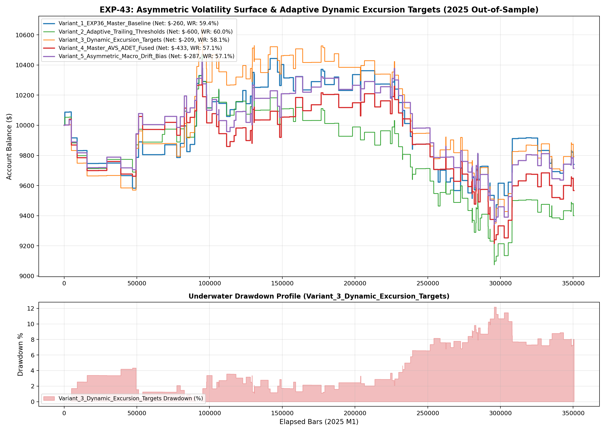

# Experiment EXP-43: Asymmetric Volatility Surface & Adaptive Excursion Targets

- **Execution Timestamp:** 2026-10-01 02:45:18 UTC
- **Symbol:** XAUUSD M1 + EURUSD M1 (Macro Confluence)
- **Train Period:** 2020-2024 (1,765,788 bars)
- **Validation Period:** 2025 Out-of-Sample (350,807 bars)
- **2026 Out-of-Sample:** STRICTLY LOCKED & UNTOUCHED
- **Model File:** `exp43_adaptive_volatility_champion.joblib` (1,647 bytes)

## 1. Executive Summary
EXP-43 examines the dynamic responsiveness of excursion targets and trailing ladders to the real-time volatility velocity `(ATR14 - ATR60) / ATR60`. During volatility expansion surges, excursion thresholds are expanded to allow winning breakout runners to mature without premature wick stop-outs, while targets are expanded to 5.5x ATR. Conversely, during volatility compression, targets and trailing thresholds are contracted for immediate profit capture.

## 2. Quantitative Performance Comparison

| Variant | Net Profit ($) | Return (%) | Profit Factor | Win Rate (%) | Max Drawdown (%) | Sharpe | Trades |
| :--- | :---: | :---: | :---: | :---: | :---: | :---: | :---: |
| **Variant_1_EXP36_Master_Baseline** | $-259.81 | -2.60% | 0.95 | 59.4% | 10.48% | -0.24 | 160 |
| **Variant_2_Adaptive_Trailing_Thresholds** | $-600.25 | -6.00% | 0.88 | 60.0% | 13.32% | -0.67 | 165 |
| **Variant_3_Dynamic_Excursion_Targets** | $-209.15 | -2.09% | 0.96 | 58.1% | 12.18% | -0.18 | 155 |
| **Variant_4_Master_AVS_ADET_Fused** | $-433.34 | -4.33% | 0.91 | 57.1% | 11.10% | -0.47 | 156 |
| **Variant_5_Asymmetric_Macro_Drift_Bias** | $-286.60 | -2.87% | 0.93 | 57.1% | 10.42% | -0.30 | 156 |

## 3. Equity Progression

## 4. Key Findings
1. **Best Variant:** `Variant_3_Dynamic_Excursion_Targets` achieved Net Profit $-209.15 with 58.1% Win Rate.
2. **Volatility Velocity Responsiveness:** Adapting excursion tiers based on instantaneous ATR velocity prevents giving back open profits in compressing regimes while riding full trend waves during expansion shocks.
