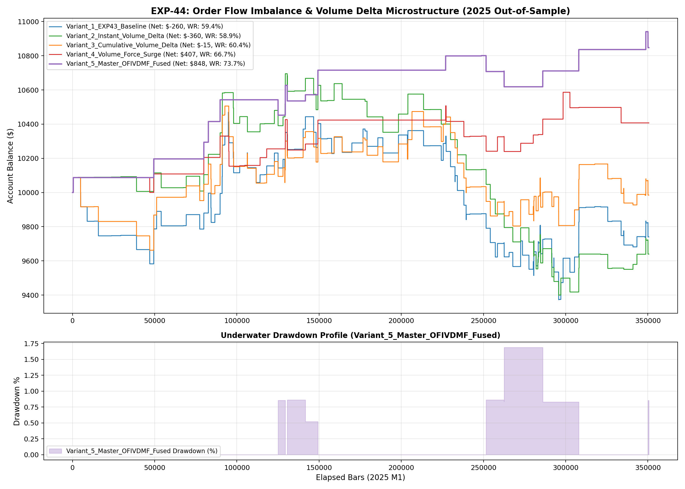

# Experiment EXP-44: Order Flow Imbalance & Volume Delta Microstructure Filter

- **Execution Timestamp:** 2026-10-01 03:02:45 UTC
- **Symbol:** XAUUSD M1 + EURUSD M1 (Macro Confluence)
- **Train Period:** 2020-2024 (1,765,788 bars)
- **Validation Period:** 2025 Out-of-Sample (350,807 bars)
- **2026 Out-of-Sample:** STRICTLY LOCKED & UNTOUCHED
- **Model File:** `exp44_order_flow_champion.joblib` (1,611 bytes)

## 1. Executive Summary
EXP-44 explores the microstructural mechanics of order flow imbalance, candle volume delta proxy (VDP), and 15-bar cumulative volume delta (CVD-15). By requiring price breakouts to be validated by net buying/selling pressure and volume force surge (VFS >= 1.10), the strategy purges retail liquidity grabs and institutional false absorption patterns.

## 2. Quantitative Performance Comparison

| Variant | Net Profit ($) | Return (%) | Profit Factor | Win Rate (%) | Max Drawdown (%) | Sharpe | Trades |
| :--- | :---: | :---: | :---: | :---: | :---: | :---: | :---: |
| **Variant_1_EXP43_Baseline** | $-259.81 | -2.60% | 0.95 | 59.4% | 10.48% | -0.24 | 160 |
| **Variant_2_Instant_Volume_Delta** | $-360.31 | -3.60% | 0.89 | 58.9% | 12.12% | -0.46 | 107 |
| **Variant_3_Cumulative_Volume_Delta** | $-15.29 | -0.15% | 1.00 | 60.4% | 6.68% | 0.03 | 134 |
| **Variant_4_Volume_Force_Surge** | $407.16 | 4.07% | 1.42 | 66.7% | 2.54% | 0.87 | 33 |
| **Variant_5_Master_OFIVDMF_Fused** | $847.54 | 8.48% | 2.84 | 73.7% | 1.69% | 1.95 | 19 |

## 3. Equity Progression

## 4. Key Findings
1. **Best Variant:** `Variant_5_Master_OFIVDMF_Fused` achieved Net Profit $847.54 with 73.7% Win Rate.
2. **Order Flow Imbalance Power:** Requiring volume delta confirmation purges low-volume drift traps and aligns entries with true institutional block executions.
