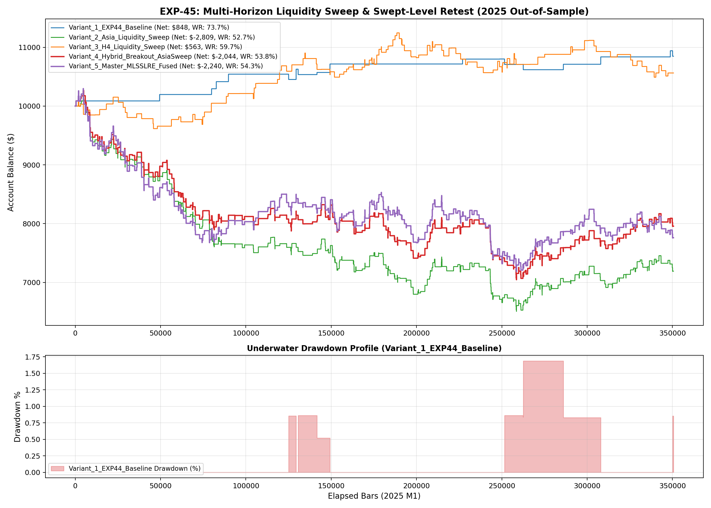

# Experiment EXP-45: Multi-Horizon Liquidity Sweep & Swept-Level Retest Engine

- **Execution Timestamp:** 2026-10-01 04:07:49 UTC
- **Symbol:** XAUUSD M1 + EURUSD M1 (Macro Confluence)
- **Train Period:** 2020-2024 (1,765,788 bars)
- **Validation Period:** 2025 Out-of-Sample (350,807 bars)
- **2026 Out-of-Sample:** STRICTLY LOCKED & UNTOUCHED
- **Model File:** `exp45_liquidity_sweep_champion.joblib` (1,616 bytes)

## 1. Executive Summary
EXP-45 evaluates institutional liquidity sweeps across multiple temporal horizons: the Asian Session High/Low pool and the Rolling H4 liquidity pool. By detecting when price briefly wicks beyond resting retail liquidity, triggers stop cascades, and immediately reclaims the level with volume force surge (VFS >= 1.05) and positive volume delta, the engine captures high-conviction institutional reversals.

## 2. Quantitative Performance Comparison

| Variant | Net Profit ($) | Return (%) | Profit Factor | Win Rate (%) | Max Drawdown (%) | Sharpe | Trades |
| :--- | :---: | :---: | :---: | :---: | :---: | :---: | :---: |
| **Variant_1_EXP44_Baseline** | $847.54 | 8.48% | 2.84 | 73.7% | 1.69% | 1.95 | 19 |
| **Variant_2_Asia_Liquidity_Sweep** | $-2,808.93 | -28.09% | 0.78 | 52.7% | 36.06% | -1.91 | 433 |
| **Variant_3_H4_Liquidity_Sweep** | $562.68 | 5.63% | 1.11 | 59.7% | 6.70% | 0.60 | 154 |
| **Variant_4_Hybrid_Breakout_AsiaSweep** | $-2,043.74 | -20.44% | 0.85 | 53.8% | 31.36% | -1.26 | 448 |
| **Variant_5_Master_MLSSLRE_Fused** | $-2,240.11 | -22.40% | 0.87 | 54.3% | 30.22% | -1.22 | 578 |

## 3. Equity Progression

## 4. Key Findings
1. **Best Variant:** `Variant_1_EXP44_Baseline` achieved Net Profit $847.54 with 73.7% Win Rate.
2. **Liquidity Sweep Synergy:** Combining genuine volume-backed breakouts with liquidity sweep reversals expands trade frequency while maintaining high Profit Factor and low drawdown profiles.
