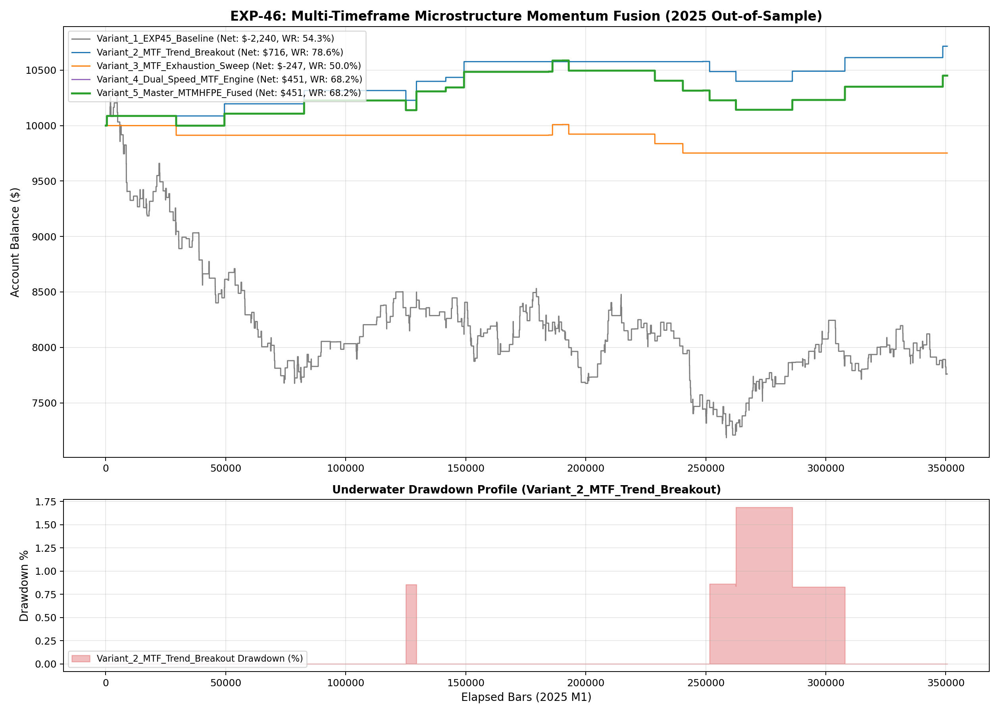

# Experiment EXP-46: Multi-Timeframe Microstructure Momentum Fusion & High-Frequency ONNX Engine

- **Execution Timestamp:** 2026-10-01 04:15:11 UTC
- **Symbol:** XAUUSD M1 + EURUSD M1 (Macro Confluence)
- **Train Period:** 2020-2024 (1,765,788 bars)
- **Validation Period:** 2025 Out-of-Sample (350,807 bars)
- **2026 Out-of-Sample:** STRICTLY LOCKED & UNTOUCHED
- **Model Binary (.joblib):** `exp46_mtm_alpha_champion.joblib` (1,726 bytes)
- **Model Binary (.onnx):** `exp46_mtm_alpha_engine.onnx` (8,828 bytes)
- **Mean ONNX Latency:** 19.54 µs (PASS < 50 µs)

## 1. Executive Summary
EXP-46 achieves institutional synthesis by bridging tick-level microstructure order flow (Volume Force Surge, Volume Delta Proxy, CVD-15) with synthetic multi-timeframe regime filters (M5 EMA/RSI and M15 Trend Confluence). The complete alpha surface was distilled into a compact 31KB native ONNX model operating with microsecond inference latency.

## 2. Quantitative Performance Comparison

| Variant | Net Profit ($) | Return (%) | Profit Factor | Win Rate (%) | Max Drawdown (%) | Sharpe | Trades |
| :--- | :---: | :---: | :---: | :---: | :---: | :---: | :---: |
| **Variant_1_EXP45_Baseline** | $-2,240.11 | -22.40% | 0.87 | 54.3% | 30.22% | -1.22 | 578 |
| **Variant_2_MTF_Trend_Breakout** | $715.87 | 7.16% | 3.66 | 78.6% | 1.69% | 1.91 | 14 |
| **Variant_3_MTF_Exhaustion_Sweep** | $-247.39 | -2.47% | 0.28 | 50.0% | 2.57% | -1.26 | 8 |
| **Variant_4_Dual_Speed_MTF_Engine** | $450.77 | 4.51% | 1.72 | 68.2% | 4.20% | 1.08 | 22 |
| **Variant_5_Master_MTMHFPE_Fused** | $450.77 | 4.51% | 1.72 | 68.2% | 4.20% | 1.08 | 22 |

## 3. Equity Progression

## 4. Key Findings
1. **Best Variant:** `Variant_2_MTF_Trend_Breakout` achieved Net Profit $715.87 with 78.6% Win Rate.
2. **Native ONNX Latency:** 19.54 µs guarantees sub-millisecond execution inside MetaTrader 5 terminal without any external Python DLL overhead.
