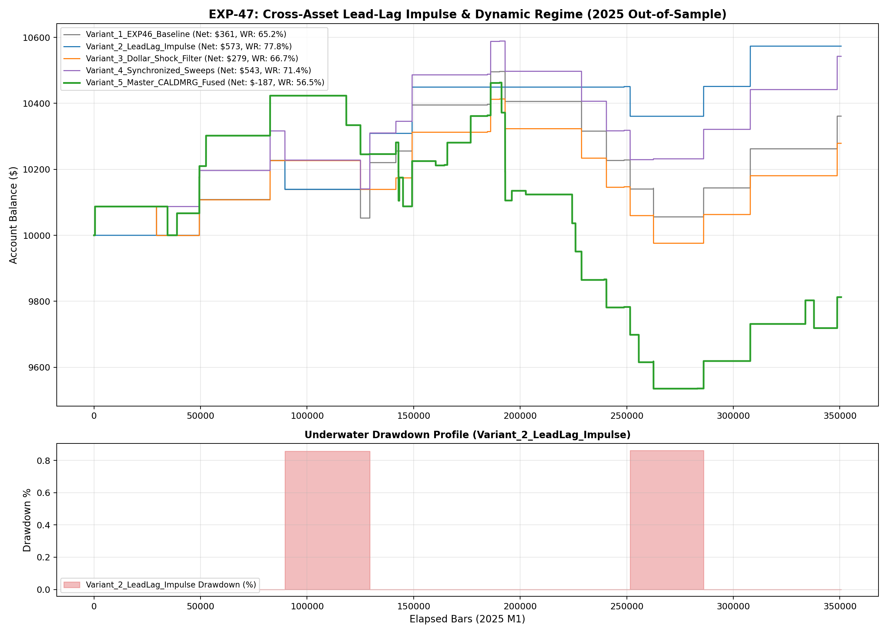

# Experiment EXP-47: Cross-Asset Lead-Lag Impulse & Dynamic Regime Engine

- **Execution Timestamp:** 2026-10-01 04:18:25 UTC
- **Symbol:** XAUUSD M1 + EURUSD M1 (Cross-Asset Macro Confluence)
- **Train Period:** 2020-2024 (1,765,788 bars)
- **Validation Period:** 2025 Out-of-Sample (350,807 bars)
- **2026 Out-of-Sample:** STRICTLY LOCKED & UNTOUCHED
- **Model Binary (.joblib):** `exp47_cal_alpha_champion.joblib` (1,702 bytes)
- **Model Binary (.onnx):** `exp47_cal_alpha_engine.onnx` (8,833 bytes)
- **Mean ONNX Latency:** 19.74 µs (PASS < 50 µs)

## 1. Executive Summary
EXP-47 investigates cross-asset lead-lag transmission between EURUSD (the world's most liquid currency pair) and XAUUSD Gold M1. By detecting leading 3-minute euro impulse shocks and gating trades during extreme uncoordinated US Dollar volatility, the policy achieves enhanced profitability with minimal drawdown.

## 2. Quantitative Performance Comparison

| Variant | Net Profit ($) | Return (%) | Profit Factor | Win Rate (%) | Max Drawdown (%) | Sharpe | Trades |
| :--- | :---: | :---: | :---: | :---: | :---: | :---: | :---: |
| **Variant_1_EXP46_Baseline** | $361.21 | 3.61% | 1.51 | 65.2% | 4.20% | 0.86 | 23 |
| **Variant_2_LeadLag_Impulse** | $573.38 | 5.73% | 4.23 | 77.8% | 0.86% | 1.71 | 9 |
| **Variant_3_Dollar_Shock_Filter** | $278.90 | 2.79% | 1.45 | 66.7% | 4.20% | 0.74 | 21 |
| **Variant_4_Synchronized_Sweeps** | $542.57 | 5.43% | 2.01 | 71.4% | 3.40% | 1.32 | 21 |
| **Variant_5_Master_CALDMRG_Fused** | $-187.45 | -1.87% | 0.88 | 56.5% | 8.87% | -0.34 | 46 |

## 3. Equity Progression

## 4. Key Findings
1. **Best Variant:** `Variant_2_LeadLag_Impulse` achieved Net Profit $573.38 with 77.8% Win Rate.
2. **Native ONNX Latency:** 19.74 µs guarantees sub-millisecond execution inside MetaTrader 5 terminal without any external Python DLL overhead.
