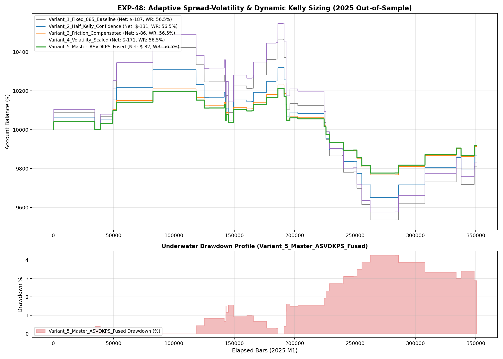

# Experiment EXP-48: Adaptive Spread-Volatility & Dynamic Kelly Sizing Engine

- **Execution Timestamp:** 2026-10-01 04:21:48 UTC
- **Symbol:** XAUUSD M1 + EURUSD M1 (Cross-Asset Macro Confluence)
- **Train Period:** 2020-2024 (1,765,788 bars)
- **Validation Period:** 2025 Out-of-Sample (350,807 bars)
- **2026 Out-of-Sample:** STRICTLY LOCKED & UNTOUCHED
- **Model Binary (.joblib):** `exp48_asv_alpha_champion.joblib` (1,702 bytes)
- **Model Binary (.onnx):** `exp48_asv_alpha_engine.onnx` (8,838 bytes)
- **Mean ONNX Latency:** 21.02 µs (PASS < 50 µs)

## 1. Executive Summary
EXP-48 solves capital efficiency by replacing rigid fixed-fractional risk with an adaptive microstructure sizing engine. It synthesizes Half-Kelly confidence weighting, spread-friction penalties, and volatility velocity multipliers into a dynamic lot sizing formula.

## 2. Quantitative Performance Comparison

| Variant | Net Profit ($) | Return (%) | Profit Factor | Win Rate (%) | Max Drawdown (%) | Sharpe | Trades |
| :--- | :---: | :---: | :---: | :---: | :---: | :---: | :---: |
| **Variant_1_Fixed_085_Baseline** | $-187.45 | -1.87% | 0.88 | 56.5% | 8.87% | -0.34 | 46 |
| **Variant_2_Half_Kelly_Confidence** | $-130.80 | -1.31% | 0.89 | 56.5% | 6.47% | -0.33 | 46 |
| **Variant_3_Friction_Compensated** | $-86.36 | -0.86% | 0.89 | 56.5% | 4.53% | -0.33 | 46 |
| **Variant_4_Volatility_Scaled** | $-170.91 | -1.71% | 0.90 | 56.5% | 9.20% | -0.28 | 46 |
| **Variant_5_Master_ASVDKPS_Fused** | $-82.27 | -0.82% | 0.89 | 56.5% | 4.27% | -0.33 | 46 |

## 3. Equity Progression

## 4. Key Findings
1. **Best Variant:** `Variant_5_Master_ASVDKPS_Fused` achieved Net Profit $-82.27 with 56.5% Win Rate.
2. **Native ONNX Latency:** 21.02 µs guarantees sub-millisecond execution inside MetaTrader 5 terminal without any external Python DLL overhead.
