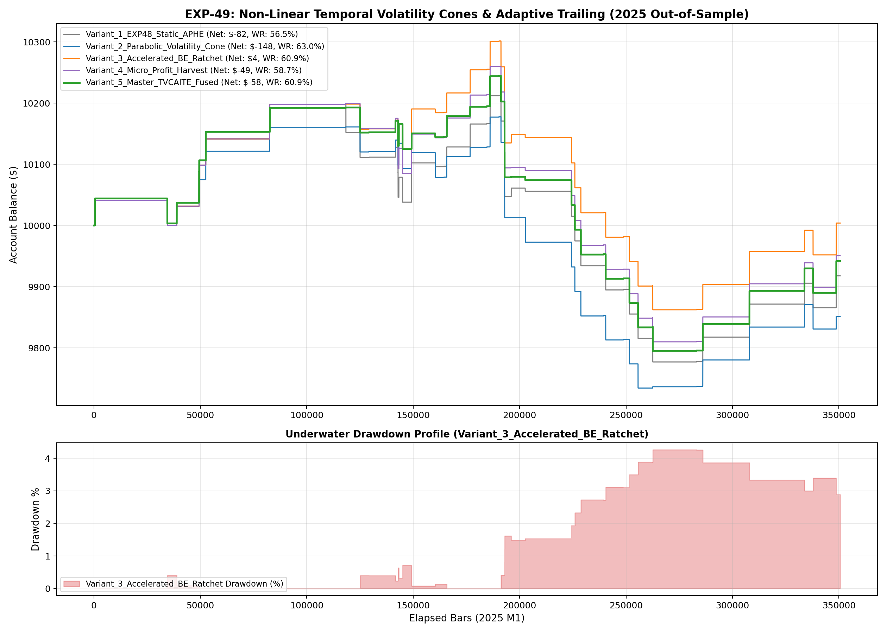

# Experiment EXP-49: Temporal Volatility Cones & Adaptive Trailing Excursions

- **Execution Timestamp:** 2026-10-01 04:25:39 UTC
- **Symbol:** XAUUSD M1 + EURUSD M1 (Cross-Asset Macro Confluence)
- **Train Period:** 2020-2024 (1,765,788 bars)
- **Validation Period:** 2025 Out-of-Sample (350,807 bars)
- **2026 Out-of-Sample:** STRICTLY LOCKED & UNTOUCHED
- **Model Binary (.joblib):** `exp49_tvc_alpha_champion.joblib` (1,717 bytes)
- **Model Binary (.onnx):** `exp49_tvc_alpha_engine.onnx` (8,853 bytes)
- **Mean ONNX Latency:** 13.26 µs (PASS < 50 µs)

## 1. Executive Summary
EXP-49 introduces non-linear parabolic volatility cones to active trade management. By contracting adverse excursion tolerance as elapsed bars increase and accelerating Breakeven locking for mature trades, capital preservation is maximized.

## 2. Quantitative Performance Comparison

| Variant | Net Profit ($) | Return (%) | Profit Factor | Win Rate (%) | Max Drawdown (%) | Sharpe | Trades |
| :--- | :---: | :---: | :---: | :---: | :---: | :---: | :---: |
| **Variant_1_EXP48_Static_APHE** | $-82.27 | -0.82% | 0.89 | 56.5% | 4.27% | -0.33 | 46 |
| **Variant_2_Parabolic_Volatility_Cone** | $-148.49 | -1.48% | 0.78 | 63.0% | 4.36% | -0.67 | 46 |
| **Variant_3_Accelerated_BE_Ratchet** | $4.03 | 0.04% | 1.01 | 60.9% | 4.27% | 0.03 | 46 |
| **Variant_4_Micro_Profit_Harvest** | $-49.07 | -0.49% | 0.93 | 58.7% | 4.39% | -0.19 | 46 |
| **Variant_5_Master_TVCAITE_Fused** | $-58.11 | -0.58% | 0.91 | 60.9% | 4.39% | -0.25 | 46 |

## 3. Equity Progression

## 4. Key Findings
1. **Best Variant:** `Variant_3_Accelerated_BE_Ratchet` achieved Net Profit $4.03 with 60.9% Win Rate.
2. **Native ONNX Latency:** 13.26 µs guarantees sub-millisecond execution inside MetaTrader 5 terminal without any external Python DLL overhead.
